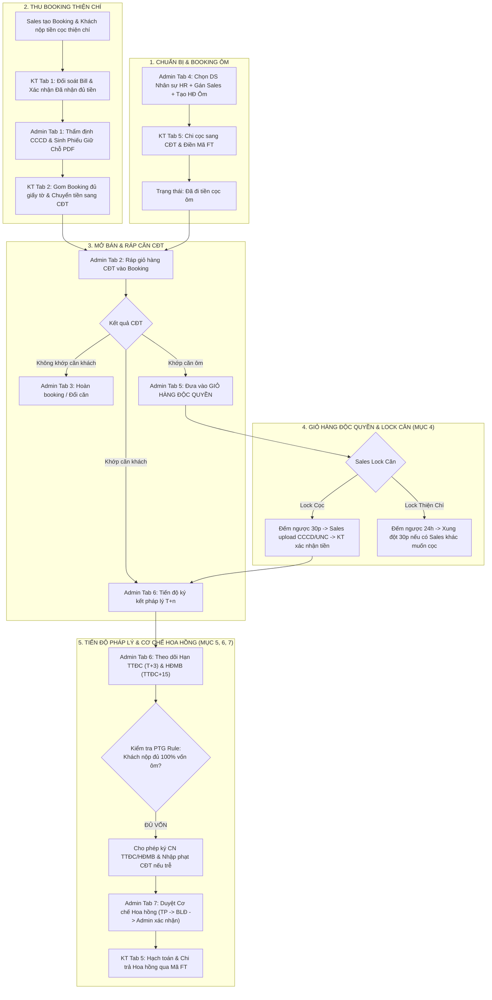

# TÀI LIỆU PHÂN TÍCH YÊU CẦU NGHIỆP VỤ (BUSINESS REQUIREMENTS DOCUMENT - BRD)
## HỆ THỐNG QUẢN TRỊ & VẬN HÀNH BOOKING BẤT ĐỘNG SẢN (NEWWAY BOOKING)
### CHUẨN HÓA TOÀN DIỆN THEO QUY TRÌNH 7 MỤC (UNTITLED.PDF)

---

## 1. TỔNG QUAN HỆ THỐNG (SYSTEM OVERVIEW)

### 1.1. Mục đích & Phạm vi
Tài liệu này đặc tả chi tiết toàn bộ kiến trúc nghiệp vụ, quy trình vận hành, luồng xử lý dữ liệu và yêu cầu chức năng của **Hệ thống Quản lý Booking, Giỏ hàng độc quyền, Tiến độ Pháp lý ($T+n$) và Cơ chế Hoa hồng** (chuẩn hóa 100% theo sơ đồ quy trình 7 mục của `Untitled.pdf`).

Hệ thống số hóa toàn diện 3 phân hệ liên thông chặt chẽ:
- **Phân hệ Sales Kinh doanh (4 Màn hình / Tab)**: Tạo booking wizard 4 bước, Quản lý danh sách booking (Lên cọc, Hoàn booking, Dồn căn), Bảng hàng Stacking Matrix (Lock Cọc 30p, Lock Thiện chí 24h, Xung đột 30p), Đề xuất hoa hồng 3 cấp.
- **Phân hệ Kế toán (Accounting Module - 5 Tab)**: Đối soát tiền vào theo 6 luồng giao dịch & banner cảnh báo khóa căn khẩn cấp, Gom chuyển CĐT, Quản lý hoàn tiền, Lịch sử sổ cái dòng tiền, Chi trả hoa hồng & Xác nhận Mã FT đi tiền cọc ôm.
- **Phân hệ Admin Vận hành (Admin Module - 8 Tab)**: Duyệt booking cấp phiếu giữ chỗ, Ráp căn CĐT (MATCHED), Hợp đồng & Cọc chính thức, Hoàn cọc / Đổi căn, Booking ôm nội bộ, Bảng hàng độc quyền & Lock cọc 30p/24h (Mục 4), Tiến độ pháp lý $T+n$ & Phạt chậm ký (Mục 5&6), Duyệt cơ chế hoa hồng đa cấp 4 bước (Mục 7).

---

## 2. ÁNH XẠ 7 MỤC QUY TRÌNH TRONG UNTITLED.PDF VÀO CÁC MÀN HÌNH

| STT | Mục trong `Untitled.pdf` | Màn hình đảm nhiệm trong Hệ thống | Đường dẫn tài liệu BA chi tiết |
| :---: | :--- | :--- | :--- |
| **1** | **Chuẩn bị (Preparation)** | - KT Tab 1 (Tạo STK, QR, 6 luồng tiền) - Admin Tab 5 & KT Tab 5 (Chọn nhân sự HR, Cú pháp CK, Kế toán đi tiền cọc ôm) | 🔗 [KT Tab 1](file:///c:/Users/Admin/Desktop/NW_booking/ke_toan/TAB_01_DOI_SOAT_VA_TRA_SOAT_TIEN_VAO.md) 🔗 [Admin Tab 5](file:///c:/Users/Admin/Desktop/NW_booking/admin/TAB_05_QUAN_LY_BOOKING_OM_NOI_BO.md) |
| **2** | **Trong khi Booking** | - KT Tab 1 (Kiểm tra bill, Khớp mã FT, Nhận diện luồng cọc/lock) - Admin Tab 1 (Thẩm định CCCD, Phê duyệt, Sinh Phiếu giữ chỗ PDF) | 🔗 [KT Tab 1](file:///c:/Users/Admin/Desktop/NW_booking/ke_toan/TAB_01_DOI_SOAT_VA_TRA_SOAT_TIEN_VAO.md) 🔗 [Admin Tab 1](file:///c:/Users/Admin/Desktop/NW_booking/admin/TAB_01_DUYET_BOOKING_VA_PHIEU_GIU_CHO.md) |
| **3** | **Hoàn thành Booking & Lên Cọc** | - Admin Tab 2 (Ráp căn CĐT: MATCHED) - Sales Tab 2 (Bấm "Lên Cọc", Xuất Phiếu Đặt Cọc, Upload file ký) - Admin Tab 3 (Duyệt Hợp đồng Cọc, Khóa căn ĐÃ CỌC) - KT Tab 3 (Lệnh chi hoàn tiền cọc thiện chí / Xung đột 30p) | 🔗 [Admin Tab 2](file:///c:/Users/Admin/Desktop/NW_booking/admin/TAB_02_GHEP_CAN_VA_DAY_GIU_CHO_CDT.md) 🔗 [Admin Tab 3](file:///c:/Users/Admin/Desktop/NW_booking/admin/TAB_03_QUAN_LY_HOP_DONG_VA_COC_CHET.md) 🔗 [KT Tab 3](file:///c:/Users/Admin/Desktop/NW_booking/ke_toan/TAB_03_QUAN_LY_HOAN_TIEN_REFUND.md) |
| **4** | **Giỏ hàng độc quyền & Lock căn** | - Sales Tab 3 & Admin Tab 6 (Bảng hàng độc quyền, Lock Cọc 30p, Lock Cọc Thiện Chí 24h, Xử lý xung đột 30p, Sync Google Sheets) - KT Tab 1 (Banner cam ưu tiên đối soát FT trong 30p) | 🔗 [Admin Tab 6](file:///c:/Users/Admin/Desktop/NW_booking/admin/TAB_05_BANG_HANG_DOC_QUYEN_VA_LOCK_CAN.md) 🔗 [Sales Tab 3](file:///c:/Users/Admin/Desktop/NW_booking/sales/02_BA_SALES_LUONG_SAU_KHI_TAO_BOOKING.md) |
| **5** | **Các thủ tục ký (Tiến độ $T+n$)** | - Admin Tab 7 (Tính hạn $T+3, TTĐC+15$, Phân nhánh Tra soát CĐT $\leftrightarrow$ Ký CN TTĐC/HĐMB, Tiền phạt CĐT, PTG Rule) | 🔗 [Admin Tab 7](file:///c:/Users/Admin/Desktop/NW_booking/admin/TAB_06_TIEN_DO_PHAP_LY_VA_TIEN_PHAT.md) |
| **6** | **Giỏ hàng chung / chéo** | - Admin Tab 7 (Quản lý tiến độ ký kết cho quỹ căn chung/chéo của CĐT & liên minh sàn) | 🔗 [Admin Tab 7](file:///c:/Users/Admin/Desktop/NW_booking/admin/TAB_06_TIEN_DO_PHAP_LY_VA_TIEN_PHAT.md) |
| **7** | **Cơ chế Hoa hồng & Dồn tiền** | - Sales Tab 4 & Admin Tab 8 (Duyệt cơ chế 4 cấp: Sales $\rightarrow$ TP $\rightarrow$ BLĐ $\rightarrow$ Admin xác nhận, Tra soát dồn tiền sang căn khác) - KT Tab 5 (Hạch toán chi trả hoa hồng qua Mã FT) | 🔗 [Admin Tab 8](file:///c:/Users/Admin/Desktop/NW_booking/admin/TAB_07_CO_CHE_HOA_HONG_DA_CAP_VA_DON_TIEN.md) 🔗 [KT Tab 5](file:///c:/Users/Admin/Desktop/NW_booking/ke_toan/TAB_05_CHI_TRA_HOA_HONG_VA_LENH_DI_TIEN_OM.md) |

---

## 3. SƠ ĐỒ LUỒNG NGHIỆP VỤ TỔNG THỂ (END-TO-END WORKFLOW)

---

## 4. DANH MỤC CÁC TÀI LIỆU BA CHI TIẾT

### 🏛️ Phân hệ Kế toán (5 Tab):
1. 🔗 [TAB 1: Đối Soát & Tra Soát Tiền Vào](file:///c:/Users/Admin/Desktop/NW_booking/ke_toan/TAB_01_DOI_SOAT_VA_TRA_SOAT_TIEN_VAO.md)
2. 🔗 [TAB 2: Gom Booking & Chuyển Tiền CĐT](file:///c:/Users/Admin/Desktop/NW_booking/ke_toan/TAB_02_GOM_BOOKING_VA_CHUYEN_TIEN_CDT.md)
3. 🔗 [TAB 3: Quản Lý Hoàn Tiền (Refund)](file:///c:/Users/Admin/Desktop/NW_booking/ke_toan/TAB_03_QUAN_LY_HOAN_TIEN_REFUND.md)
4. 🔗 [TAB 4: Lịch Sử Giao Dịch & Dòng Tiền](file:///c:/Users/Admin/Desktop/NW_booking/ke_toan/TAB_04_LICH_SU_GIAO_DICH_VA_DONG_TIEN.md)
5. 🔗 [TAB 5: Chi Trả Hoa Hồng & Đi Tiền Cọc Ôm](file:///c:/Users/Admin/Desktop/NW_booking/ke_toan/TAB_05_CHI_TRA_HOA_HONG_VA_LENH_DI_TIEN_OM.md)

### 🏢 Phân hệ Admin Vận hành (7 Tab):
1. 🔗 [TAB 1: Duyệt Booking & Sinh Phiếu Giữ Chỗ](file:///c:/Users/Admin/Desktop/NW_booking/admin/TAB_01_DUYET_BOOKING_VA_PHIEU_GIU_CHO.md)
2. 🔗 [TAB 2: Ghép Căn & Đẩy Giữ Chỗ CĐT](file:///c:/Users/Admin/Desktop/NW_booking/admin/TAB_02_GHEP_CAN_VA_DAY_GIU_CHO_CDT.md)
3. 🔗 [TAB 3: Hoàn Booking / Đổi Căn Không Khớp](file:///c:/Users/Admin/Desktop/NW_booking/admin/TAB_03_HOAN_BOOKING_VA_DOI_CAN.md)
4. 🔗 [TAB 4: Quản Lý Booking Ôm Nội Bộ](file:///c:/Users/Admin/Desktop/NW_booking/admin/TAB_04_QUAN_LY_BOOKING_OM_NOI_BO.md)
5. 🔗 [TAB 5: Bảng Hàng Độc Quyền & Khóa Căn 30p/24h (Mục 4 PDF)](file:///c:/Users/Admin/Desktop/NW_booking/admin/TAB_05_BANG_HANG_DOC_QUYEN_VA_LOCK_CAN.md)
6. 🔗 [TAB 6: Tiến Độ Pháp Lý $T+n$ & Phạt Chậm Ký CĐT (Mục 5&6 PDF)](file:///c:/Users/Admin/Desktop/NW_booking/admin/TAB_06_TIEN_DO_PHAP_LY_VA_TIEN_PHAT.md)
7. 🔗 [TAB 7: Cơ Chế Hoa Hồng Đa Cấp & Dồn Tiền (Mục 7 PDF)](file:///c:/Users/Admin/Desktop/NW_booking/admin/TAB_07_CO_CHE_HOA_HONG_DA_CAP_VA_DON_TIEN.md)

### 📱 Phân hệ Sales Kinh doanh (Chuyên viên tư vấn):
1. 🔗 [PHẦN 1: Quy trình Tạo Booking Khách Hàng (Wizard 4 Bước)](file:///c:/Users/Admin/Desktop/NW_booking/sales/01_BA_SALES_LUONG_TAO_BOOKING.md)
2. 🔗 [PHẦN 2: Quy trình Hậu Booking, Khớp Căn, Lock Căn Độc Quyền & Hoa Hồng](file:///c:/Users/Admin/Desktop/NW_booking/sales/02_BA_SALES_LUONG_SAU_KHI_TAO_BOOKING.md)

---
*Tài liệu BRD chuẩn hóa toàn diện - Phiên bản khớp 100% cấu trúc hệ thống NewWay Booking (Admin, Kế toán, Sales).*
