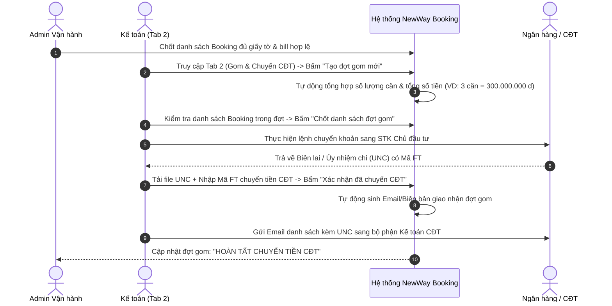
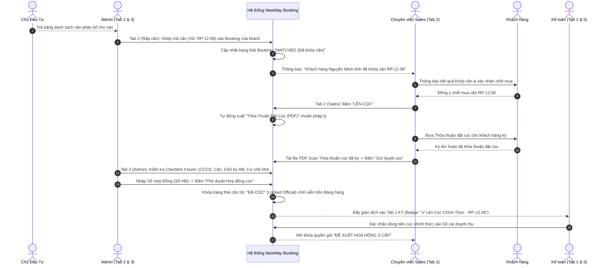
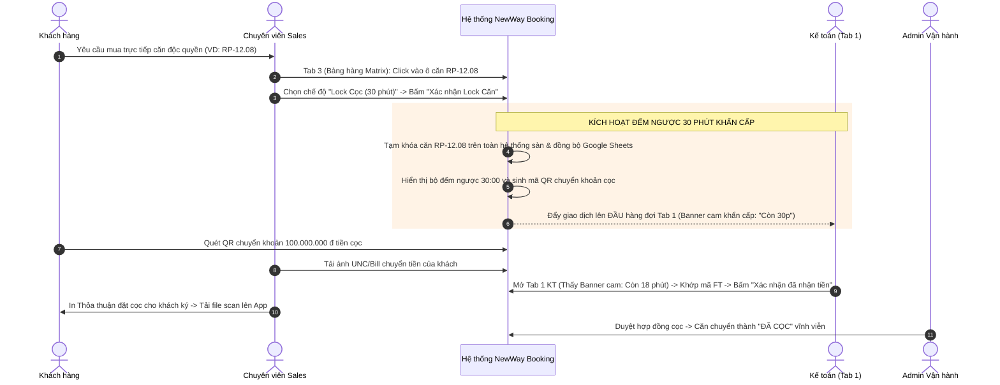
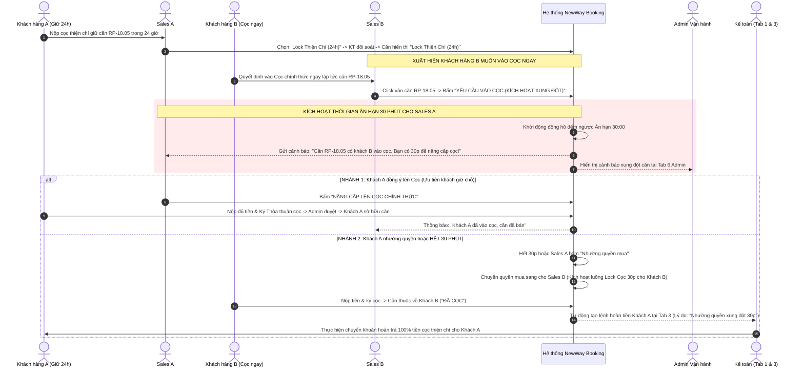
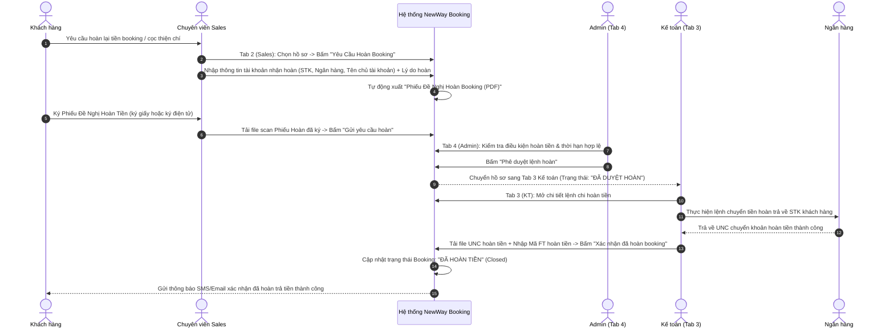
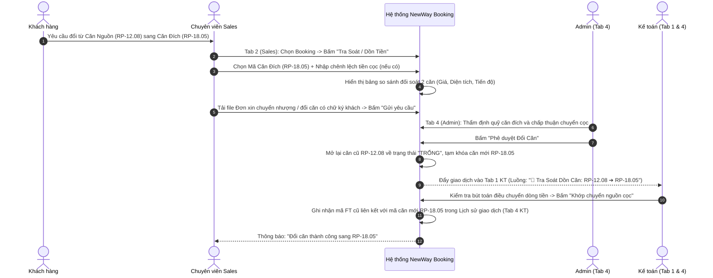
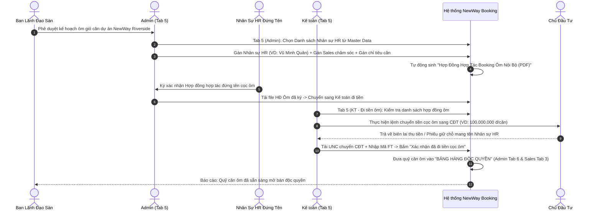
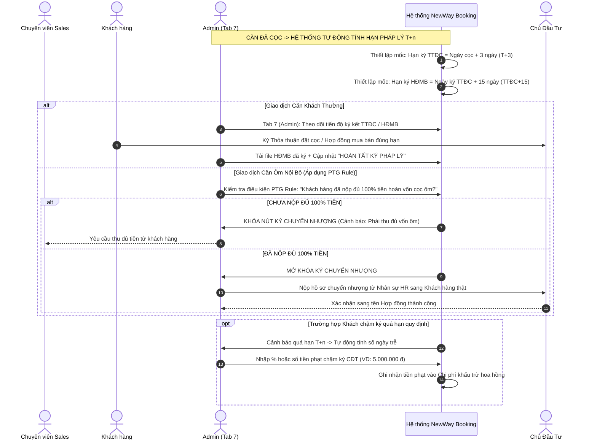
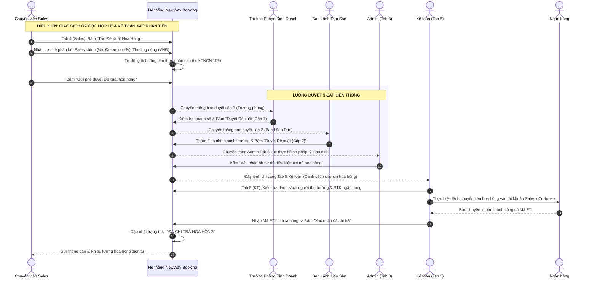

# TÀI LIỆU PHÂN TÍCH YÊU CẦU NGHIỆP VỤ (BUSINESS REQUIREMENTS DOCUMENT - BRD)
## HỆ THỐNG QUẢN TRỊ & VẬN HÀNH BOOKING BẤT ĐỘNG SẢN (NEWWAY BOOKING)
### CHUẨN HÓA TOÀN DIỆN THEO QUY TRÌNH 7 MỤC (UNTITLED.PDF) & CHI TIẾT SEQUENCE DIAGRAMS

---

## 1. TỔNG QUAN HỆ THỐNG (SYSTEM OVERVIEW)

### 1.1. Mục đích & Phạm vi
Tài liệu này đặc tả chi tiết toàn bộ kiến trúc nghiệp vụ, quy trình vận hành, luồng tương tác giữa các tác nhân và yêu cầu chức năng của **Hệ thống Quản lý Booking, Giỏ hàng độc quyền, Tiến độ Pháp lý ($T+n$) và Cơ chế Hoa hồng** (chuẩn hóa 100% theo sơ đồ quy trình 7 mục của `Untitled.pdf`).

Hệ thống số hóa toàn diện 3 phân hệ liên thông thời gian thực:
- **Phân hệ Sales Kinh doanh (4 Màn hình / Tab)**: Tạo booking wizard 4 bước, Quản lý danh sách booking (Lên cọc, Hoàn booking, Dồn căn), Bảng hàng Stacking Matrix (Lock Cọc 30p, Lock Thiện chí 24h, Xung đột 30p), Đề xuất hoa hồng 3 cấp.
- **Phân hệ Kế toán (Accounting Module - 5 Tab)**: Đối soát tiền vào theo 6 luồng giao dịch & banner cảnh báo khóa căn khẩn cấp, Gom chuyển CĐT, Quản lý hoàn tiền, Lịch sử sổ cái dòng tiền, Chi trả hoa hồng & Xác nhận Mã FT đi tiền cọc ôm.
- **Phân hệ Admin Vận hành (Admin Module - 8 Tab)**: Duyệt booking cấp phiếu giữ chỗ, Ráp căn CĐT (MATCHED), Hợp đồng & Cọc chính thức, Hoàn cọc / Đổi căn, Booking ôm nội bộ, Bảng hàng độc quyền & Lock cọc 30p/24h (Mục 4), Tiến độ pháp lý $T+n$ & Phạt chậm ký (Mục 5&6), Duyệt cơ chế hoa hồng đa cấp 4 bước (Mục 7).

---

## 2. ÁNH XẠ 7 MỤC QUY TRÌNH TRONG UNTITLED.PDF VÀO CÁC MÀN HÌNH

| STT | Mục trong `Untitled.pdf` | Màn hình đảm nhiệm trong Hệ thống | Đường dẫn tài liệu BA chi tiết |
| :---: | :--- | :--- | :--- |
| **1** | **Chuẩn bị (Preparation)** | - KT Tab 1 (Tạo STK, QR, 6 luồng tiền)<br>- Admin Tab 5 & KT Tab 5 (Chọn nhân sự HR, Cú pháp CK, Kế toán đi tiền cọc ôm) | 🔗 [KT Tab 1](./ke_toan/TAB_01_DOI_SOAT_VA_TRA_SOAT_TIEN_VAO.md)<br>🔗 [Admin Tab 5](./admin/TAB_05_QUAN_LY_BOOKING_OM_NOI_BO.md) |
| **2** | **Trong khi Booking** | - KT Tab 1 (Kiểm tra bill, Khớp mã FT, Nhận diện luồng cọc/lock)<br>- Admin Tab 1 (Thẩm định CCCD, Phê duyệt, Sinh Phiếu giữ chỗ PDF) | 🔗 [KT Tab 1](./ke_toan/TAB_01_DOI_SOAT_VA_TRA_SOAT_TIEN_VAO.md)<br>🔗 [Admin Tab 1](./admin/TAB_01_DUYET_BOOKING_VA_PHIEU_GIU_CHO.md) |
| **3** | **Hoàn thành Booking & Lên Cọc** | - Admin Tab 2 (Ráp căn CĐT: MATCHED)<br>- Sales Tab 2 (Bấm "Lên Cọc", Xuất Phiếu Đặt Cọc, Upload file ký)<br>- Admin Tab 3 (Duyệt Hợp đồng Cọc, Khóa căn ĐÃ CỌC)<br>- KT Tab 3 (Lệnh chi hoàn tiền cọc thiện chí / Xung đột 30p) | 🔗 [Admin Tab 2](./admin/TAB_02_GHEP_CAN_VA_DAY_GIU_CHO_CDT.md)<br>🔗 [Admin Tab 3](./admin/TAB_03_QUAN_LY_HOP_DONG_VA_COC_CHET.md)<br>🔗 [KT Tab 3](./ke_toan/TAB_03_QUAN_LY_HOAN_TIEN_REFUND.md) |
| **4** | **Giỏ hàng độc quyền & Lock căn** | - Sales Tab 3 & Admin Tab 6 (Bảng hàng độc quyền, Lock Cọc 30p, Lock Cọc Thiện Chí 24h, Xử lý xung đột 30p, Sync Google Sheets)<br>- KT Tab 1 (Banner cam ưu tiên đối soát FT trong 30p) | 🔗 [Admin Tab 6](./admin/TAB_05_BANG_HANG_DOC_QUYEN_VA_LOCK_CAN.md)<br>🔗 [Sales Tab 3](./sales/02_BA_SALES_LUONG_SAU_KHI_TAO_BOOKING.md) |
| **5** | **Các thủ tục ký (Tiến độ $T+n$)** | - Admin Tab 7 (Tính hạn $T+3, TTĐC+15$, Phân nhánh Tra soát CĐT $\leftrightarrow$ Ký CN TTĐC/HĐMB, Tiền phạt CĐT, PTG Rule) | 🔗 [Admin Tab 7](./admin/TAB_06_TIEN_DO_PHAP_LY_VA_TIEN_PHAT.md) |
| **6** | **Giỏ hàng chung / chéo** | - Admin Tab 7 (Quản lý tiến độ ký kết cho quỹ căn chung/chéo của CĐT & liên minh sàn) | 🔗 [Admin Tab 7](./admin/TAB_06_TIEN_DO_PHAP_LY_VA_TIEN_PHAT.md) |
| **7** | **Cơ chế Hoa hồng & Dồn tiền** | - Sales Tab 4 & Admin Tab 8 (Duyệt cơ chế 4 cấp: Sales $\rightarrow$ TP $\rightarrow$ BLĐ $\rightarrow$ Admin xác nhận, Tra soát dồn tiền sang căn khác)<br>- KT Tab 5 (Hạch toán chi trả hoa hồng qua Mã FT) | 🔗 [Admin Tab 8](./admin/TAB_07_CO_CHE_HOA_HONG_DA_CAP_VA_DON_TIEN.md)<br>🔗 [KT Tab 5](./ke_toan/TAB_05_CHI_TRA_HOA_HONG_VA_LENH_DI_TIEN_OM.md) |

---

## 3. CHI TIẾT CÁC SEQUENCE DIAGRAM THEO TỪNG LUỒNG NGHIỆP VỤ

Dưới đây là đặc tả trình tự tương tác (Sequence Diagrams) được phân tách chi tiết theo 10 kịch bản nghiệp vụ cốt lõi trong hệ thống:

---

### 🟢 LUỒNG 1: Thu Tiền Booking Thiện Chí & Xác Thực Dòng Tiền (Booking Flow)
*Áp dụng khi khách hàng nộp tiền đặt chỗ ưu tiên trong giai đoạn mở bán dự án.*

```mermaid
sequenceDiagram
    autonumber
    actor KH as Khách hàng
    actor Sales as Chuyên viên Sales
    participant App as Hệ thống NewWay Booking
    actor KT as Kế toán (Tab 1)
    actor Admin as Admin Vận hành (Tab 1)

    KH->>Sales: Cung cấp thông tin (CCCD, SĐT, Email) & Nguyện vọng căn
    Sales->>App: Tạo Booking (Wizard 4 Bước) & Tạo mã QR thanh toán
    KH->>App: Quét mã QR chuyển khoản tiền booking (VD: 100.000.000 đ)
    Sales->>App: Tải ảnh Bill chuyển khoản & Bấm "Gửi Booking"
    App-->>KT: Đẩy hồ sơ vào Hàng đợi Tab 1 (Luồng: "Booking Thiện Chí Mở Bán")

    rect rgb(240, 248, 255)
        note over KT,App: Kế toán đối soát sao kê ngân hàng
        KT->>App: Mở chi tiết giao dịch, kiểm tra số tiền & bill
        alt Tiền nổi đủ & đúng cú pháp
            KT->>App: Nhập Mã FT ngân hàng + Chọn "Đã nhận đủ tiền" -> Bấm "Xác nhận đối soát"
            App->>>Admin: Cập nhật trạng thái "ĐÃ ĐỐI SOÁT", chuyển sang Admin Tab 1
        else Tiền thiếu / Sai cú pháp / Chưa nổi
            KT->>App: Chọn "Cần tra soát" + Nhập nội dung cần làm rõ
            App-->>Sales: Thông báo cảnh báo tra soát trên Dashboard
        end
    end

    Admin->>App: Mở Tab 1 Admin -> Thẩm định thông tin CCCD & Pháp lý
    Admin->>App: Bấm "Phê duyệt Booking"
    App->>App: Tự động tạo Phiếu Đăng Ký Giữ Chỗ PDF (kèm mã QR định danh)
    App-->>Sales: Thông báo hồ sơ "ĐÃ BOOKING THÀNH CÔNG"
    Sales-->>KH: Gửi Phiếu Giữ Chỗ PDF có dấu mộc điện tử cho khách
```

---

### 🔵 LUỒNG 2: Gom Đợt Booking & Chuyển Tiền Cho Chủ Đầu Tư (CDT Aggregation Flow)
*Kế toán tổng hợp các booking đủ điều kiện để chuyển khoản sang CĐT theo đợt đóng giỏ hàng.*



---

### 🟣 LUỒNG 3: Mở Bán, Ráp Căn & Chuyển Sang Cọc Chính Thức ("Lên Cọc")
*Quy trình khi CĐT công bố giỏ hàng, khách chọn được căn ưng ý và chuyển thành Đặt cọc chính thức.*



---

### 🔥 LUỒNG 4: Lock Cọc Trực Tiếp 30 Phút Trên Bảng Hàng Matrix (Direct 30-Minute Lock)
*Áp dụng khi khách hàng chốt mua trực tiếp căn độc quyền trên Bảng hàng Stacking Matrix.*



---

### ⏳ LUỒNG 5: Lock Cọc Thiện Chí 24 Giờ & Cơ Chế Xử Lý Xung Đột 30 Phút (Conflict Resolution)
*Kịch bản giải quyết xung đột khi Căn đang giữ thiện chí (Sales A) bị Sales B có khách vào Cọc trực tiếp.*



---

### 💸 LUỒNG 6: Quy Trình Hoàn Tiền Booking / Rút Cọc (Refund Workflow)
*Áp dụng khi không ráp được căn, khách rút cọc thiện chí đúng hạn hoặc nhường quyền xung đột.*



---

### 🔄 LUỒNG 7: Tra Soát Dồn Tiền / Đổi Căn Hộ (Exchange & Transfer Flow)
*Áp dụng khi khách chuyển dòng tiền cọc từ căn cũ sang căn mới cùng dự án hoặc khác dự án.*



---

### 👥 LUỒNG 8: Quản Lý Quy Trình Booking Ôm Nội Bộ (Bulk Hold Flow)
*Sàn sử dụng nhân sự HR đứng tên để đặt cọc gom quỹ căn độc quyền từ Chủ đầu tư.*



---

### ⚖️ LUỒNG 9: Tiến Độ Pháp Lý $T+n$, Phạt Chậm Ký & PTG Rule (Legal $T+n$ Compliance)
*Theo dõi mốc thời gian ký TTĐC, HĐMB và điều kiện hoàn vốn trước khi chuyển nhượng Hợp đồng.*



---

### 💰 LUỒNG 10: Đề Xuất & Chi Trả Hoa Hồng 3 Cấp (Commission Approval & Payout)
*Quy trình tính toán phân chia hoa hồng, phê duyệt 3 cấp và kế toán thực hiện chi trả.*



---

## 4. DANH MỤC CÁC TÀI LIỆU BA CHI TIẾT

### 🏛️ Phân hệ Kế toán (5 Tab):
1. 🔗 [TAB 1: Đối Soát & Tra Soát Tiền Vào](./ke_toan/TAB_01_DOI_SOAT_VA_TRA_SOAT_TIEN_VAO.md)
2. 🔗 [TAB 2: Gom Booking & Chuyển Tiền CĐT](./ke_toan/TAB_02_GOM_BOOKING_VA_CHUYEN_TIEN_CDT.md)
3. 🔗 [TAB 3: Quản Lý Hoàn Tiền (Refund)](./ke_toan/TAB_03_QUAN_LY_HOAN_TIEN_REFUND.md)
4. 🔗 [TAB 4: Lịch Sử Giao Dịch & Dòng Tiền](./ke_toan/TAB_04_LICH_SU_GIAO_DICH_VA_DONG_TIEN.md)
5. 🔗 [TAB 5: Chi Trả Hoa Hồng & Đi Tiền Cọc Ôm](./ke_toan/TAB_05_CHI_TRA_HOA_HONG_VA_LENH_DI_TIEN_OM.md)

### 🏢 Phân hệ Admin Vận hành (8 Tab):
1. 🔗 [TAB 1: Duyệt Booking & Sinh Phiếu Giữ Chỗ](./admin/TAB_01_DUYET_BOOKING_VA_PHIEU_GIU_CHO.md)
2. 🔗 [TAB 2: Ghép Căn & Đẩy Giữ Chỗ CĐT](./admin/TAB_02_GHEP_CAN_VA_DAY_GIU_CHO_CDT.md)
3. 🔗 [TAB 3: Quản Lý Hợp Đồng & Cọc](./admin/TAB_03_QUAN_LY_HOP_DONG_VA_COC_CHET.md)
4. 🔗 [TAB 4: Hoàn Booking & Đổi Căn Không Khớp](./admin/TAB_04_HOAN_BOOKING_VA_DOI_CAN.md)
5. 🔗 [TAB 5: Quản Lý Booking Ôm Nội Bộ](./admin/TAB_05_QUAN_LY_BOOKING_OM_NOI_BO.md)
6. 🔗 [TAB 6: Bảng Hàng Độc Quyền & Khóa Căn 30p/24h (Mục 4 PDF)](./admin/TAB_05_BANG_HANG_DOC_QUYEN_VA_LOCK_CAN.md)
7. 🔗 [TAB 7: Tiến Độ Pháp Lý $T+n$ & Phạt Chậm Ký CĐT (Mục 5&6 PDF)](./admin/TAB_06_TIEN_DO_PHAP_LY_VA_TIEN_PHAT.md)
8. 🔗 [TAB 8: Cơ Chế Hoa Hồng Đa Cấp & Dồn Tiền (Mục 7 PDF)](./admin/TAB_07_CO_CHE_HOA_HONG_DA_CAP_VA_DON_TIEN.md)

### 📱 Phân hệ Sales Kinh doanh (Chuyên viên tư vấn):
1. 🔗 [PHẦN 1: Quy trình Tạo Booking Khách Hàng (Wizard 4 Bước)](./sales/01_BA_SALES_LUONG_TAO_BOOKING.md)
2. 🔗 [PHẦN 2: Quy trình Hậu Booking, Khớp Căn, Lock Căn Độc Quyền & Hoa Hồng](./sales/02_BA_SALES_LUONG_SAU_KHI_TAO_BOOKING.md)

---
*Tài liệu BRD chuẩn hóa toàn diện - Phiên bản khớp 100% cấu trúc hệ thống NewWay Booking (Admin, Kế toán, Sales).*
