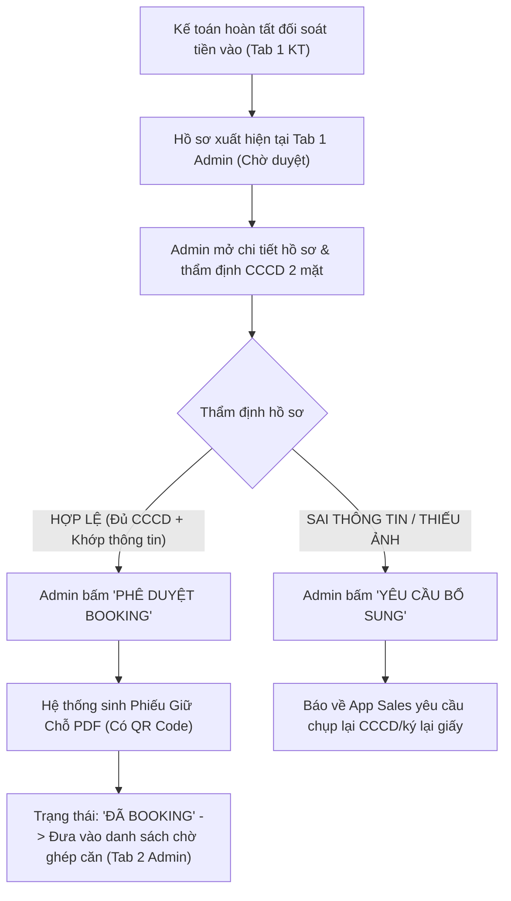
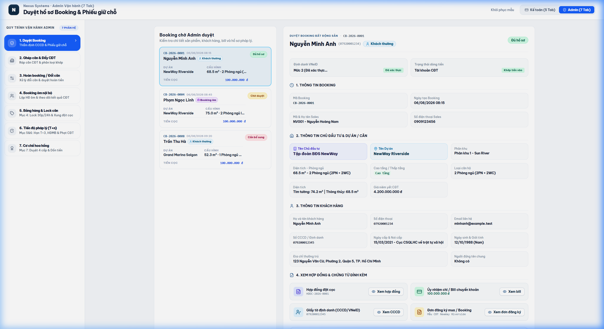

# TÀI LIỆU PHÂN TÍCH YÊU CẦU NGHIỆP VỤ (BA SPECIFICATION)
# PHÂN HỆ ADMIN - TAB 1: DUYỆT BOOKING & PHIẾU GIỮ CHỖ

**Dự án:** Hệ thống Quản trị & Vận hành Booking BĐS (NewWay Booking - Final Flow)  
**Phân hệ:** Quản trị Vận hành Bất động sản (Admin Module)  
**Mã màn hình:** `ADM_TAB_01_BOOKING_APPROVAL_AND_RECEIPT`

---

## 1. TỔNG QUAN (OVERVIEW)

### 1.1. Mục tiêu nghiệp vụ
1. **Thẩm định Pháp lý & Hồ sơ Booking Khách Hàng**:
   - Tiếp nhận các hồ sơ Booking đã được Kế toán xác nhận `Đã đối soát` (tiền đã vào tài khoản công ty).
   - Admin kiểm tra tính chính xác của thông tin cá nhân khách hàng (Họ tên, Số CCCD, Địa chỉ, Số điện thoại) đối chiếu trực tiếp với bản chụp CCCD/VNeID 2 mặt do Sales tải lên.
2. **Phê Duyệt Cấp Mã Phiếu Giữ Chỗ (Booking Receipt)**:
   - Admin bấm **"Phê duyệt Booking"** $\rightarrow$ Hệ thống chuyển trạng thái sang `Đã booking` (Hợp lệ).
   - Tự động sinh **Phiếu Giữ Chỗ / Phiếu Cọc Thiện Chí (PDF)** có gắn mã QR Code tra cứu và dấu mộc điện tử để gửi khách hàng.
3. **Yêu cầu Bổ sung Hồ sơ (Nếu sai sót)**:
   - Trường hợp CCCD mờ, sai thông tin hoặc thiếu giấy tờ $\rightarrow$ Admin bấm **"Yêu cầu bổ sung"** để gửi thông báo về App Sales.

### 1.2. Sơ đồ Luồng Nghiệp vụ (Process Flow)



---

## 2. ĐẶC TẢ CHỨC NĂNG & GIAO DIỆN (FUNCTIONAL SPECIFICATIONS & UI)

### 2.1. Giao diện Mockup Thực tế



### 2.2. Thành phần Giao diện & Tính năng Chi tiết
1. **Bảng Danh sách Booking Chờ Duyệt (Left Panel)**:
   - Hiển thị danh sách: Mã Booking (`CB-xxxx`), Ngày giờ nộp, Loại booking (Ưu tiên 1, Ưu tiên 2), Kênh bán, Số tiền cọc, Trạng thái Kế toán (`Kế toán đã xác nhận tiền vào`), Trạng thái hồ sơ (`Đủ hồ sơ` / `Chưa duyệt`).
2. **Khung Chi tiết Thẩm định Hồ sơ (Right Panel)**:
   - **Thông tin Khách hàng**: Họ tên, Số CCCD, SĐT, Email, Tên đăng ký nguyện vọng.
   - **Thông tin Bất động sản**: Tên dự án, Phân khu, Mã căn/Khoảng tầng, Diện tích, Số phòng ngủ, Mức giá dự kiến.
   - **Thông tin Chuyên viên tư vấn (Sales)**: Mã Sales, Họ tên, Sàn giao dịch, Số điện thoại.
   - **Khu vực xem chứng từ đính kèm**:
     + Ảnh mặt trước & mặt sau CCCD/VNeID.
     + File Phiếu đăng ký nguyện vọng có chữ ký khách hàng.
     + File Bill chuyển khoản ngân hàng.
   - **Nút hành động**:
     + `✓ Phê duyệt Booking` (Màu xanh dương) $\rightarrow$ Cấp mã và xuất phiếu giữ chỗ.
     + `Yêu cầu bổ sung` (Màu xám) $\rightarrow$ Ghi chú lỗi gửi Sales.
     + `In Phiếu Giữ Chỗ` $\rightarrow$ Tải xuống tệp PDF chuẩn in.

### 2.3. Danh mục trường dữ liệu (Data Dictionary)

| Tên trường | Kiểu dữ liệu | Bắt buộc | Mô tả & Quy tắc |
| :--- | :---: | :---: | :--- |
| `id` | String | Có | Mã Booking duy nhất (VD: `CB-2026-0001`). |
| `customerName` | String | Có | Họ tên đầy đủ của khách hàng trên CCCD. |
| `idCard` | String | Có | Số Căn cước công dân (12 chữ số). |
| `project` | String | Có | Dự án bất động sản đăng ký giữ chỗ. |
| `apartment` | String | Có | Căn hộ nguyện vọng (VD: `A12-08 · Tầng 12 · 2PN`). |
| `depositAmount` | Currency | Có | Số tiền cọc thiện chí (VNĐ). |
| `status` | Enum | Có | Trạng thái: `'Chờ duyệt'` $\rightarrow$ `'Đã booking'`. |
| `receiptPdfUrl` | URL | Tự sinh | Đường dẫn tải file PDF Phiếu Giữ Chỗ. |

---

## 3. QUY TẮC NGHIỆP VỤ (BUSINESS RULES & VALIDATIONS)

### 3.1. Các quy tắc xử lý nghiệp vụ (Business Rules - BR)
- **BR-ADM01 (Ràng buộc đối soát kế toán)**: Admin chỉ được phép phê duyệt các booking đã có cờ xác nhận `Đã đối soát` từ Kế toán (tiền đã vào tài khoản công ty).
- **BR-ADM02 (Tính toàn vẹn của Phiếu giữ chỗ)**: Phiếu Giữ Chỗ PDF khi sinh ra phải bao gồm đầy đủ: Mã Booking, Số CCCD đã thẩm định, Mã QR Code tra cứu và dấu bảo chứng điện tử.

---

## 4. ĐẶC TẢ API & TÍCH HỢP (API SPECIFICATIONS)

### 4.1. Danh sách Endpoints

| STT | Method | Endpoint URI | Mô tả chức năng |
| :---: | :---: | :--- | :--- |
| 1 | `GET` | `/api/v1/admin/bookings/pending-approval` | Lấy danh sách booking chờ Admin thẩm định và duyệt. |
| 2 | `POST` | `/api/v1/admin/bookings/{id}/approve` | Admin phê duyệt booking và kích hoạt sinh phiếu giữ chỗ. |
| 3 | `POST` | `/api/v1/admin/bookings/{id}/request-supplement` | Yêu cầu Sales bổ sung/sửa đổi hồ sơ giấy tờ. |

---

### 4.2. Chi tiết API & Schema Data

#### API 1: `GET /api/v1/admin/bookings/pending-approval`
* **Mô tả**: Lấy danh sách hồ sơ booking đã qua bước đối soát Kế toán, đang chờ Admin thẩm định CCCD và phê duyệt.
* **Query Parameters**:
  * `page` (integer, optional): Trang hiện tại (mặc định: `1`).
  * `limit` (integer, optional): Số bản ghi/trang (mặc định: `20`).
  * `keyword` (string, optional): Tìm theo mã booking, tên khách, số CCCD hoặc SĐT.
  * `status` (string, optional): `PENDING_APPROVAL`, `SUPPLEMENT_REQUESTED`, `APPROVED`.

* **Response Schema (200 OK)**:
```json
{
  "success": true,
  "statusCode": 200,
  "data": {
    "total": 1,
    "page": 1,
    "limit": 20,
    "items": [
      {
        "id": "CB-2026-0001",
        "bookingDate": "04/08/2026 09:30",
        "customer": {
          "name": "Nguyễn Văn An",
          "type": "Khách thường",
          "phone": "0901234567",
          "email": "an.nguyen@example.com",
          "idCardNumber": "001090012345",
          "idIssueDate": "12/05/2021",
          "idIssuePlace": "Cục Cảnh sát QLHC về TTXH",
          "dob": "15/03/1990",
          "gender": "Nam",
          "address": "123 Nguyễn Huệ, Phường Bến Nghé, Quận 1, TP. Hồ Chí Minh",
          "vneidStatus": "Định danh Mức 2 (Đã xác thực)",
          "fieldsCount": "11/11 trường chuẩn xác",
          "coOwner": "Không có"
        },
        "unit": {
          "investor": "Masterise Homes",
          "project": "LUMIÈRE Riverside",
          "subDivision": "Tòa West",
          "block": "Tháp W1",
          "code": "A12-08",
          "type": "2 Phòng ngủ (2PN + 2WC)",
          "carpetArea": "74.5 m²",
          "builtUpArea": "81.2 m²",
          "direction": "Đông Nam (View Sông Sài Gòn)",
          "floor": "Tầng 12",
          "floorType": "Cao tầng",
          "listPrice": 6850000000,
          "promotion": "Chiết khấu 2% ngày mở bán"
        },
        "sales": {
          "code": "NV009",
          "name": "Trần Thị Mai",
          "phone": "0988112233",
          "agency": "Sàn Alpha - Đất Xanh Services"
        },
        "depositAmount": 100000000,
        "accountingReconciliationStatus": "RECONCILED",
        "statusBadge": "Chờ duyệt",
        "documents": {
          "contractNo": "HDDC-2026-0001",
          "contractFile": "Hop_Dong_Dat_Coc_A12-08_NguyenVanAn.pdf",
          "billFile": "Bill_Chuyen_Tien_100M_NguyenVanAn.png",
          "idDocFile": "CCCD_NguyenVanAn_HaiMat.pdf",
          "bookingFormFile": "Phieu_Dang_Ky_Nguyen_Vong_A12-08.pdf"
        }
      }
    ]
  }
}
```

---

#### API 2: `POST /api/v1/admin/bookings/{id}/approve`
* **Mô tả**: Admin xác nhận phê duyệt hồ sơ booking hợp lệ, cập nhật trạng thái sang `Đã booking` và tự động sinh Phiếu Giữ Chỗ PDF có mã QR.
* **Path Parameters**:
  * `id` (string, required): Mã booking cần duyệt (VD: `CB-2026-0001`).
* **Request Body Schema**:
```json
{
  "adminNote": "string (Ghi chú phê duyệt của Admin)",
  "priorityLevel": "integer (Mức ưu tiên bốc thăm/khớp căn, ví dụ: 1 hoặc 2)",
  "approvedBy": "string (Mã định danh Admin thực hiện)"
}
```

* **Request Example**:
```json
{
  "adminNote": "Hồ sơ CCCD và VNeID khớp 100%, tiền đã đối soát đủ 100 triệu.",
  "priorityLevel": 1,
  "approvedBy": "ADM-001"
}
```

* **Response Schema (200 OK)**:
```json
{
  "success": true,
  "statusCode": 200,
  "message": "Phê duyệt booking thành công và đã xuất Phiếu Giữ Chỗ.",
  "data": {
    "bookingId": "CB-2026-0001",
    "status": "APPROVED",
    "statusBadge": "Đã booking",
    "receiptCode": "PGC-2026-0001",
    "receiptPdfUrl": "https://storage.newway.vn/receipts/2026/08/PGC-CB-2026-0001.pdf",
    "qrCodeData": "https://booking.newway.vn/verify/PGC-2026-0001?checksum=a8f9c2d1",
    "approvedAt": "2026-08-04T10:15:30Z",
    "nextStep": "ADM_TAB_02_UNIT_MATCHING"
  }
}
```

---

#### API 3: `POST /api/v1/admin/bookings/{id}/request-supplement`
* **Mô tả**: Gửi thông báo yêu cầu Sales bổ sung/sửa đổi chứng từ khi thông tin chưa đạt chuẩn.
* **Request Body Schema**:
```json
{
  "reason": "string (Lý do từ chối/yêu cầu bổ sung)",
  "requiredDocuments": "array of string (Danh sách chứng từ cần nộp lại: CCCD_BACK, SIGNED_FORM, PAYMENT_BILL)",
  "deadline": "string (Hạn chót bổ sung, ISO 8601 string)"
}
```

* **Request Example**:
```json
{
  "reason": "Ảnh CCCD mặt sau bị mờ góc chip, yêu cầu Sales chụp lại bản quét nét từ VNeID.",
  "requiredDocuments": ["CCCD_BACK"],
  "deadline": "2026-08-04T17:00:00Z"
}
```

* **Response Schema (200 OK)**:
```json
{
  "success": true,
  "statusCode": 200,
  "message": "Đã gửi yêu cầu bổ sung hồ sơ tới Sales phụ trách.",
  "data": {
    "bookingId": "CB-2026-0001",
    "status": "SUPPLEMENT_REQUESTED",
    "notifiedSalesPhone": "0988112233",
    "requestedAt": "2026-08-04T10:20:00Z"
  }
}
```

---
*Tài liệu BA chuẩn hóa theo hệ thống NewWay Booking Final.*
