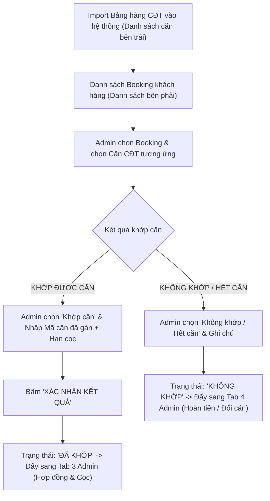
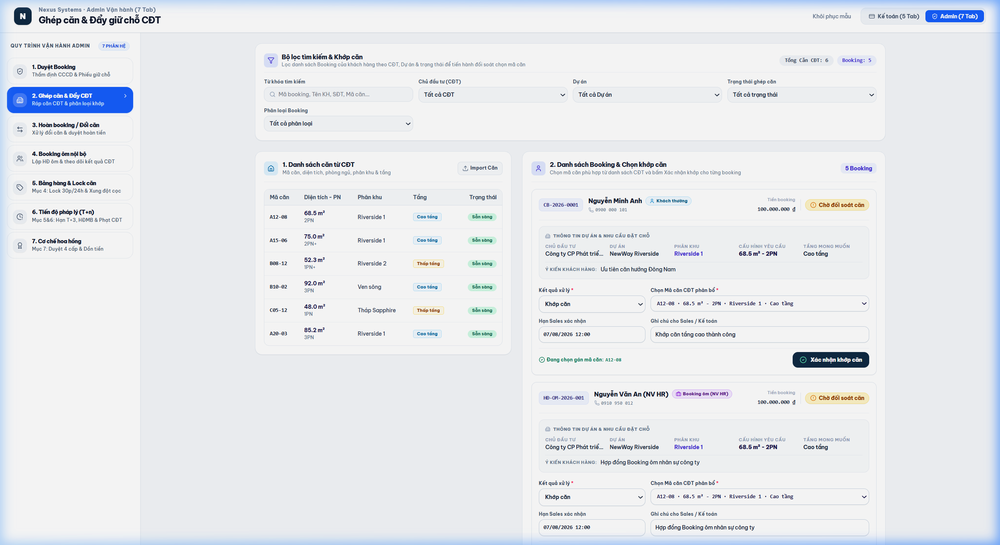

# TÀI LIỆU PHÂN TÍCH YÊU CẦU NGHIỆP VỤ (BA SPECIFICATION)
# PHÂN HỆ ADMIN - TAB 2: GHÉP CĂN & ĐẨY GIỮ CHỖ CĐT

**Dự án:** Hệ thống Quản trị & Vận hành Booking BĐS (NewWay Booking - Final Flow)  
**Phân hệ:** Quản trị Vận hành Bất động sản (Admin Module)  
**Mã màn hình:** `ADM_TAB_02_UNIT_MATCHING_AND_ALLOCATION`

---

## 1. TỔNG QUAN (OVERVIEW)

### 1.1. Mục tiêu nghiệp vụ
1. **Tiếp nhận Giỏ hàng từ Chủ Đầu Tư (CĐT)**:
   - Import hoặc cập nhật danh sách các căn hộ được CĐT phân bổ cho sàn (Mã căn, Diện tích, Số PN, Phân khu, Loại tầng, Giá bán).
2. **Ráp Căn / Ghép Mã Căn Vào Danh Sách Booking**:
   - Đối chiếu nguyện vọng của Khách hàng (hoặc Booking Ôm) với giỏ hàng thực tế từ CĐT.
   - Gán mã căn cụ thể cho từng Booking $\rightarrow$ Đặt hạn chót chuyển cọc chính thức (Deposit Deadline).
3. **Phân loại Kết quả Khớp Căn**:
   - **Đã khớp căn**: Chuyển tiếp sang **Tab 3 Admin** để ký Hợp đồng cọc.
   - **Không khớp / Hết căn**: Chuyển sang **Tab 4 Admin** để xử lý Hoàn cọc (Refund) hoặc Đổi căn khác.

### 1.2. Sơ đồ Luồng Nghiệp vụ (Process Flow)



---

## 2. ĐẶC TẢ CHỨC NĂNG & GIAO DIỆN (FUNCTIONAL SPECIFICATIONS & UI)

### 2.1. Giao diện Mockup Thực tế



### 2.2. Thành phần Giao diện & Tính năng Chi tiết
1. **Cột Trái: Danh Sách Căn Từ CĐT (CĐT Inventory Table)**:
   - Nút `+ Import Căn`: Tải lên file Excel danh sách bảng hàng CĐT phân bổ.
   - Bảng hiển thị: Mã căn (`A12-08`, `B05-12`), Diện tích, Số PN, Phân khu, Loại tầng (`Cao tầng` / `Thấp tầng`), Trạng thái (`Sẵn sàng khớp`, `Đã phân bổ`).
2. **Cột Phải: Danh Sách Khách Hàng Đăng Ký Booking (Customer Matching Table)**:
   - Bộ lọc theo: Phân loại (`Khách thường` / `Booking ôm`), Dự án, Phân khu, Trạng thái ghép căn.
   - Bảng hiển thị: Mã Booking, Khách hàng, Nguyện vọng đăng ký (DT, PN, Tầng), Tiền cọc, Trạng thái (`Chưa khớp`, `Đã khớp`, `Không khớp`).
3. **Form Thao Tác Khớp Căn (Matching Action Form)**:
   - Chọn Booking cần xử lý.
   - Chọn Kết quả: `Khớp căn` hoặc `Không khớp / Hết căn`.
   - Chọn Căn CĐT muốn gán: Dropdown danh sách các căn đang ở trạng thái `Sẵn sàng khớp`.
   - Hạn chót nộp cọc (Deadline): Thời điểm Sales phải đưa khách ký và hoàn tất tiền cọc.
   - Ghi chú đối soát: Nhập thông tin bổ sung nếu có.
   - Nút `Xác nhận kết quả`: Cập nhật trạng thái tức thời.

### 2.3. Danh mục trường dữ liệu (Data Dictionary)

| Tên trường | Kiểu dữ liệu | Bắt buộc | Mô tả & Quy tắc |
| :--- | :---: | :---: | :--- |
| `unitCode` | String | Có khi khớp | Mã căn hộ từ CĐT (VD: `A12-08`). |
| `assignedUnitCode` | String | Có khi khớp | Mã căn đã gán chính thức cho booking. |
| `matchStatus` | Enum | Có | Trạng thái: `'Chưa khớp'` \| `'Đã khớp'` \| `'Không khớp / Hết căn'`. |
| `deadline` | DateTime | Có khi khớp | Hạn chót ký hợp đồng cọc chính thức. |
| `note` | Text | Không | Ghi chú lý do khớp hoặc hết căn. |

---

## 3. QUY TẮC NGHIỆP VỤ (BUSINESS RULES & VALIDATIONS)

### 3.1. Các quy tắc xử lý nghiệp vụ (Business Rules - BR)
- **BR-ADM03 (Quy tắc 1:1 trong Phân bổ căn)**: Một mã căn CĐT đang ở trạng thái `Đã phân bổ` không thể gán tiếp cho một Booking khác (trừ khi Booking trước bị hủy hoặc đổi căn).
- **BR-ADM04 (Tự động cập nhật trạng thái kho)**: Khi bấm "Xác nhận kết quả" khớp căn thành công, trạng thái của căn CĐT ở cột trái tự động chuyển từ `Sẵn sàng khớp` sang `Đã phân bổ`.

---

## 4. ĐẶC TẢ API & TÍCH HỢP (API SPECIFICATIONS)

### 4.1. Danh sách Endpoints

| STT | Method | Endpoint URI | Mô tả chức năng |
| :---: | :---: | :--- | :--- |
| 1 | `GET` | `/api/v1/admin/matching/inventory` | Lấy danh sách bảng hàng CĐT phân bổ. |
| 2 | `POST` | `/api/v1/admin/matching/assign-unit` | Gán mã căn CĐT cho Booking kèm thời hạn chốt cọc. |
| 3 | `POST` | `/api/v1/admin/matching/mark-unmatched` | Đánh dấu booking không khớp được căn. |

---

### 4.2. Chi tiết API & Schema Data

#### API 1: `GET /api/v1/admin/matching/inventory`
* **Mô tả**: Lấy danh sách bảng hàng từ CĐT với trạng thái khả dụng để đối chiếu ghép căn.
* **Query Parameters**:
  * `projectId` (string, optional): Lọc theo ID dự án (VD: `PRJ-LUMIERE`).
  * `status` (string, optional): `AVAILABLE` (Sẵn sàng khớp), `ALLOCATED` (Đã phân bổ).
  * `floorType` (string, optional): `HIGH` (Cao tầng), `LOW` (Thấp tầng).

* **Response Schema (200 OK)**:
```json
{
  "success": true,
  "statusCode": 200,
  "data": {
    "total": 3,
    "items": [
      {
        "unitCode": "A12-08",
        "investor": "Masterise Homes",
        "project": "LUMIÈRE Riverside",
        "subDivision": "Tòa West",
        "area": 74.5,
        "bedrooms": "2PN",
        "floor": 12,
        "floorType": "Cao tầng",
        "price": 6850000000,
        "status": "AVAILABLE",
        "statusText": "Sẵn sàng khớp"
      },
      {
        "unitCode": "B05-12",
        "investor": "Masterise Homes",
        "project": "LUMIÈRE Riverside",
        "subDivision": "Tòa East",
        "area": 52.3,
        "bedrooms": "1PN+1",
        "floor": 5,
        "floorType": "Thấp tầng",
        "price": 4600000000,
        "status": "AVAILABLE",
        "statusText": "Sẵn sàng khớp"
      },
      {
        "unitCode": "A18-02",
        "investor": "Vinhomes",
        "project": "Grand Park",
        "subDivision": "The Beverly",
        "area": 98.0,
        "bedrooms": "3PN",
        "floor": 18,
        "floorType": "Cao tầng",
        "price": 8900000000,
        "status": "ALLOCATED",
        "statusText": "Đã phân bổ"
      }
    ]
  }
}
```

---

#### API 2: `POST /api/v1/admin/matching/assign-unit`
* **Mô tả**: Ghép căn thành công cho khách hàng hoặc suất booking ôm, khóa mã căn ở bảng hàng và ấn định deadline nộp tiền cọc ($T$).
* **Request Body Schema**:
```json
{
  "bookingId": "string (Mã booking cần ghép, required)",
  "unitCode": "string (Mã căn CĐT được gán, required)",
  "deadline": "string (Hạn chót nộp cọc, ISO 8601 string, required)",
  "depositDateT": "string (Ngày dự kiến đi tiền cọc T, format YYYY-MM-DD)",
  "note": "string (Ghi chú lý do ghép căn, optional)",
  "matchedBy": "string (Mã Admin thực hiện)"
}
```

* **Request Example**:
```json
{
  "bookingId": "CB-2026-0001",
  "unitCode": "A12-08",
  "deadline": "2026-08-07T12:00:00Z",
  "depositDateT": "2026-08-05",
  "note": "Khách hàng ưu tiên 1 đã đồng ý chọn căn A12-08.",
  "matchedBy": "ADM-001"
}
```

* **Response Schema (200 OK)**:
```json
{
  "success": true,
  "statusCode": 200,
  "message": "Ghép căn thành công. Căn A12-08 đã được chuyển sang trạng thái Đã phân bổ.",
  "data": {
    "bookingId": "CB-2026-0001",
    "assignedUnitCode": "A12-08",
    "matchStatus": "MATCHED",
    "statusBadge": "Đã khớp: A12-08",
    "deadline": "2026-08-07T12:00:00Z",
    "depositDateT": "2026-08-05",
    "nextStep": "ADM_TAB_03_CONTRACT_DEPOSIT"
  }
}
```

---

#### API 3: `POST /api/v1/admin/matching/mark-unmatched`
* **Mô tả**: Đánh dấu booking không khớp được căn do hết bảng hàng hoặc không phù hợp nguyện vọng.
* **Request Body Schema**:
```json
{
  "bookingId": "string (Mã booking, required)",
  "reason": "string (Lý do không khớp: HẾT_CĂN, KHÔNG_ĐỒNG_Ý_KHOẢNG_TẦNG, HỦY_NGUYỆN_VỌNG)",
  "suggestedAction": "string (Hành động kế tiếp: REFUND hoặc EXCHANGE_UNIT)",
  "note": "string (Ghi chú chi tiết)"
}
```

* **Request Example**:
```json
{
  "bookingId": "CB-2026-0003",
  "reason": "HẾT_CĂN",
  "suggestedAction": "REFUND",
  "note": "CĐT hết quỹ căn 3PN tòa West, khách từ chối chuyển sang tòa East."
}
```

* **Response Schema (200 OK)**:
```json
{
  "success": true,
  "statusCode": 200,
  "message": "Đã ghi nhận kết quả Không khớp căn. Hồ sơ được chuyển sang Tab Hoàn tiền/Đổi căn.",
  "data": {
    "bookingId": "CB-2026-0003",
    "matchStatus": "UNMATCHED",
    "statusBadge": "Không khớp / Hết căn",
    "nextStep": "ADM_TAB_04_REFUND_OR_EXCHANGE"
  }
}
```

---
*Tài liệu BA chuẩn hóa theo hệ thống NewWay Booking Final.*
