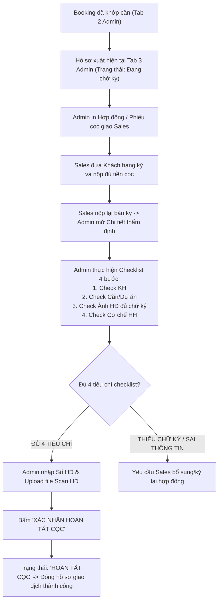
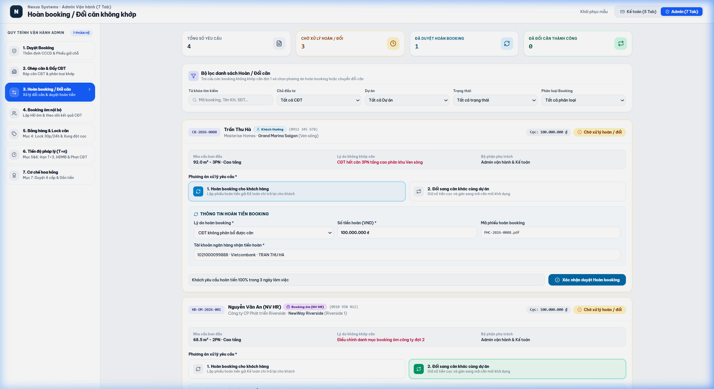

# TÀI LIỆU PHÂN TÍCH YÊU CẦU NGHIỆP VỤ (BA SPECIFICATION)
# PHÂN HỆ ADMIN - TAB 3: QUẢN LÝ HỢP ĐỒNG & CỌC

**Dự án:** Hệ thống Quản trị & Vận hành Booking BĐS (NewWay Booking - Final Flow)  
**Phân hệ:** Quản trị Vận hành Bất động sản (Admin Module)  
**Mã màn hình:** `ADM_TAB_03_CONTRACT_AND_DEPOSIT`

---

## 1. TỔNG QUAN (OVERVIEW)

### 1.1. Mục tiêu nghiệp vụ
1. **Quản lý Chuyển đổi từ Giữ chỗ sang Cọc**:
   - Tiếp nhận danh sách các Booking đã được khớp căn thành công tại Tab 2 Admin.
   - Admin tạo và in Phiếu Đặt Cọc Chính Thức / Văn Bản Thỏa Thuận Đặt Cọc (HĐ Đặt Cọc) để Sales đưa khách hàng ký kết.
2. **Checklist Kiểm Duyệt Hồ Sơ Pháp Lý 4 Bước**:
   - Khi Sales nộp lại hợp đồng có chữ ký khách hàng, Admin kiểm tra checklist:
     - `Check 1`: Thông tin cá nhân khách hàng & CCCD.
     - `Check 2`: Thông tin căn hộ, dự án, diện tích và giá trị cọc.
     - `Check 3`: Bản chụp/Scan hợp đồng đã ký có đủ chữ ký các bên.
     - `Check 4`: Xác nhận cơ chế hoa hồng ghi nhận cho Sales phụ trách.
3. **Upload Hợp Đồng & Hoàn Tất Cọc**:
   - Nhập Số hợp đồng (`Số HĐ`), upload file PDF Scan Hợp đồng đã ký $\rightarrow$ Bấm **"Xác nhận hoàn tất cọc"** $\rightarrow$ Ghi nhận giao dịch thành công chính thức.

### 1.2. Sơ đồ Luồng Nghiệp vụ (Process Flow)



---

## 2. ĐẶC TẢ CHỨC NĂNG & GIAO DIỆN (FUNCTIONAL SPECIFICATIONS & UI)

### 2.1. Giao diện Mockup Thực tế



### 2.2. Thành phần Giao diện & Tính năng Chi tiết
1. **Bảng Danh Sách Hồ Sơ Đặt Cọc (Left Table)**:
   - Hiển thị: Mã Booking, Khách hàng (hoặc Booking ôm), SĐT, Mã căn đã gán, Phân khu, Số tiền cọc, Số HĐ, Sales phụ trách, Trạng thái (`Đang chờ ký`, `Đã ký & Upload`, `Hoàn tất cọc`).
2. **Khung Chi Tiết & Checklist Thẩm Định (Right Panel)**:
   - **Thông tin giao dịch**: Khách hàng, CCCD, Dự án, Căn hộ (`A12-08`), Thời điểm khớp căn, Sales phụ trách.
   - **Bảng Checklist Thẩm định 4 Bước**:
     - `☑ 1. Kiểm tra thông tin Khách hàng (CCCD, SĐT, Email)`
     - `☑ 2. Kiểm tra thông tin Căn hộ & Dự án`
     - `☑ 3. Kiểm tra ảnh/scan Hợp đồng có đầy đủ chữ ký 2 bên`
     - `☑ 4. Kiểm tra cơ chế ghi nhận hoa hồng cho Sales`
   - **Form Nhập Dữ Liệu Hợp Đồng**:
     - Ô nhập `Số Hợp Đồng Cọc` (VD: `HD-NW-2026-0812`).
     - Ghi chú thẩm định của Admin.
     - Khu vực Upload file Scan PDF Hợp đồng đã ký.
     - Nút `In Phiếu Cọc` (Tải file mẫu để in ra giấy).
     - Nút `✓ Xác nhận hoàn tất cọc` (Màu xanh lá).

### 2.3. Danh mục trường dữ liệu (Data Dictionary)

| Tên trường | Kiểu dữ liệu | Bắt buộc | Mô tả & Quy tắc |
| :--- | :---: | :---: | :--- |
| `id` | String | Có | Mã Booking (VD: `CB-2026-0001`). |
| `contractNumber` | String | Có khi hoàn tất | Số hợp đồng cọc chính thức (VD: `HD-NW-2026-0812`). |
| `contractStatus` | Enum | Có | `'Đang chờ ký'` \| `'Đã ký & Upload'` \| `'Hoàn tất cọc'`. |
| `checkCustomer` | Boolean | Có | Đã tích check thông tin khách hàng. |
| `checkProject` | Boolean | Có | Đã tích check căn hộ & dự án. |
| `checkContractImage`| Boolean | Có | Đã tích check bản scan chữ ký hợp đồng. |
| `checkCommission` | Boolean | Có | Đã tích check cơ chế hoa hồng Sales. |
| `contractSignedUrl` | URL | Có khi hoàn tất | Đường dẫn tệp Scan Hợp đồng đã ký. |

---

## 3. QUY TẮC NGHIỆP VỤ (BUSINESS RULES & VALIDATIONS)

### 3.1. Các quy tắc xử lý nghiệp vụ (Business Rules - BR)
- **BR-ADM05 (Quy tắc 4 điểm chạm Checklist)**: Nút "Xác nhận hoàn tất cọc" chỉ được kích hoạt khi Admin đã tích chọn đủ cả 4 mục trong checklist và đã nhập `Số Hợp Đồng`.
- **BR-ADM06 (Chuyển đổi phân loại giao dịch)**: Khi hoàn tất cọc, số tiền từ "Cọc thiện chí" chính thức chuyển sang "Cọc" (không thể rút lại ngoại trừ trường hợp vi phạm hợp đồng).

---

## 4. ĐẶC TẢ API & TÍCH HỢP (API SPECIFICATIONS)

### 4.1. Danh sách Endpoints

| STT | Method | Endpoint URI | Mô tả chức năng |
| :---: | :---: | :--- | :--- |
| 1 | `GET` | `/api/v1/admin/contracts/pending` | Lấy danh sách hồ sơ đang chờ ký và hoàn tất cọc. |
| 2 | `POST` | `/api/v1/admin/contracts/{id}/complete-dead-deposit` | Xác nhận hoàn tất hợp đồng cọc kèm file scan. |

---

### 4.2. Chi tiết API & Schema Data

#### API 1: `GET /api/v1/admin/contracts/pending`
* **Mô tả**: Lấy danh sách các hợp đồng cọc thiện chí / cọc đang trong tiến trình ký kết hoặc thẩm định checklist.
* **Query Parameters**:
  * `status` (string, optional): `AWAITING_SIGNATURE`, `SIGNED_AND_UPLOADED`, `COMPLETED`.
  * `salesCode` (string, optional): Lọc theo mã nhân viên Sales.

* **Response Schema (200 OK)**:
```json
{
  "success": true,
  "statusCode": 200,
  "data": {
    "total": 1,
    "items": [
      {
        "id": "CB-2026-0001",
        "contractNumber": "HDDC-2026-0001",
        "customerName": "Nguyễn Văn An",
        "customerPhone": "0901234567",
        "customerCccd": "001090012345",
        "unitCode": "A12-08",
        "project": "LUMIÈRE Riverside",
        "subDivision": "Tòa West",
        "depositAmount": 100000000,
        "sales": {
          "code": "NV009",
          "name": "Trần Thị Mai",
          "department": "Sàn Alpha"
        },
        "contractStatus": "AWAITING_SIGNATURE",
        "statusBadge": "Đang chờ ký",
        "checklist": {
          "checkCustomer": true,
          "checkProject": true,
          "checkContractImage": false,
          "checkCommission": false
        },
        "uploadedContractFile": null
      }
    ]
  }
}
```

---

#### API 2: `POST /api/v1/admin/contracts/{id}/complete-dead-deposit`
* **Mô tả**: Admin gửi xác nhận hoàn tất 4 tiêu chí checklist, số hợp đồng cọc và file scan PDF có chữ ký 2 bên để chính thức khóa cọc.
* **Path Parameters**:
  * `id` (string, required): Mã booking (VD: `CB-2026-0001`).
* **Request Body Schema**:
```json
{
  "contractNumber": "string (Số hợp đồng đặt cọc chính thức, required)",
  "checklist": {
    "checkCustomer": "boolean (Xác nhận thông tin KH, required: true)",
    "checkProject": "boolean (Xác nhận căn hộ/dự án, required: true)",
    "checkContractImage": "boolean (Xác nhận ảnh scan đủ chữ ký, required: true)",
    "checkCommission": "boolean (Xác nhận cơ chế hoa hồng, required: true)"
  },
  "signedContractFileUrl": "string (URL file Scan hợp đồng PDF đã upload, required)",
  "adminNote": "string (Ghi chú phê duyệt)",
  "confirmedBy": "string (Mã Admin)"
}
```

* **Request Example**:
```json
{
  "contractNumber": "HD-NW-2026-0812",
  "checklist": {
    "checkCustomer": true,
    "checkProject": true,
    "checkContractImage": true,
    "checkCommission": true
  },
  "signedContractFileUrl": "https://storage.newway.vn/contracts/2026/08/HD_A12-08_Signed_Scan.pdf",
  "adminNote": "Đã kiểm tra đủ 4 chữ ký và bản scan rõ nét.",
  "confirmedBy": "ADM-001"
}
```

* **Response Schema (200 OK)**:
```json
{
  "success": true,
  "statusCode": 200,
  "message": "Đã xác nhận hoàn tất cọc cho căn A12-08.",
  "data": {
    "bookingId": "CB-2026-0001",
    "contractNumber": "HD-NW-2026-0812",
    "contractStatus": "COMPLETED",
    "statusBadge": "Hoàn tất cọc",
    "completedAt": "2026-08-05T14:30:00Z",
    "lockedUnitCode": "A12-08",
    "nextStep": "ADM_TAB_06_LEGAL_CONTRACTS_PROGRESSION"
  }
}
```

---
*Tài liệu BA chuẩn hóa theo hệ thống NewWay Booking Final.*
