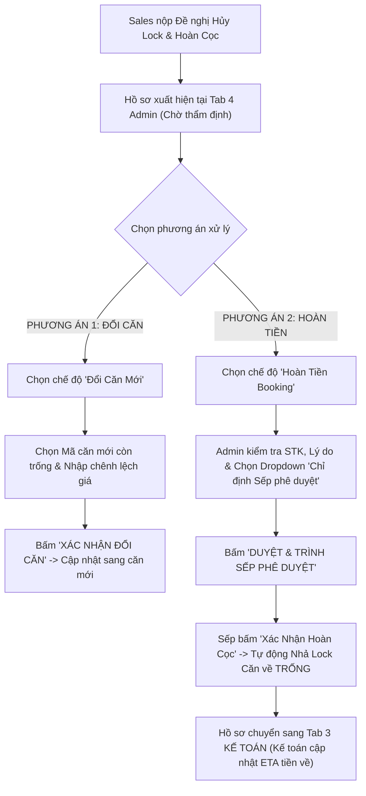
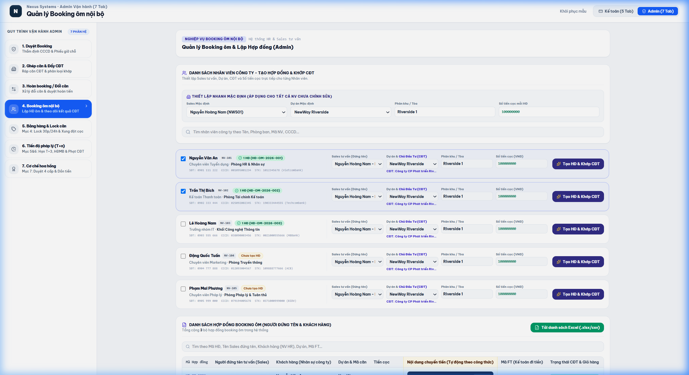

# TÀI LIỆU PHÂN TÍCH YÊU CẦU NGHIỆP VỤ (BA SPECIFICATION)
# PHÂN HỆ ADMIN - TAB 4: HOÀN BOOKING & ĐỔI CĂN

**Dự án:** Hệ thống Quản trị & Vận hành Booking BĐS (NewWay Booking - Final Flow)  
**Phân hệ:** Quản trị Vận hành Bất động sản (Admin Module)  
**Mã màn hình:** `ADM_TAB_04_REFUND_AND_EXCHANGE_MANAGEMENT`

---

## 1. TỔNG QUAN (OVERVIEW)

### 1.1. Mục tiêu nghiệp vụ
1. **Tiếp nhận Danh sách Không Khớp Căn & Yêu Cầu Hủy Lock Căn Từ Sales**:
   - Tiếp nhận các Booking có trạng thái `Không khớp / Hết căn` sau khi kết thúc đợt mở bán hoặc khi Sales nộp đơn `Đề nghị Hủy Lock & Hoàn Cọc` từ bảng hàng độc quyền.
2. **Xử lý Luồng 1: Đổi Căn Khác (Unit Exchange)**:
   - Khách đồng ý chọn một căn hộ khác còn trống trong giỏ hàng $\rightarrow$ Admin chọn mã căn mới, nhập thông tin chênh lệch tiền cọc/tiền bán và ghi nhận **"Đã đổi căn"**.
3. **Xử lý Luồng 2: Thẩm Định Hoàn Cọc & Chỉ Định Sếp Phê Duyệt (Boss Approver Assignment)**:
   - Admin kiểm tra thông tin tài khoản ngân hàng của khách (STK, Bank, Chủ TK, Lý do hoàn).
   - Admin chọn **"Chỉ định Người xác nhận (Sếp / Ban Lãnh Đạo)"** từ danh sách (VD: *Giám đốc Khối Lê Minh Khoa, Phó Tổng Giám Đốc Nguyễn Văn Hải*).
   - Admin bấm **"Duyệt & Trình Sếp Phê Duyệt"** $\rightarrow$ Hệ thống chuyển trạng thái sang `Chờ Sếp [Tên Sếp] phê duyệt`.
   - Khi Sếp bấm Xác nhận $\rightarrow$ **Căn hộ tự động được Nhả Lock về "Trống (Sẵn sàng)"** và hồ sơ chuyển sang **Tab 3 Kế toán** để chi tiền.

### 1.2. Sơ đồ Luồng Nghiệp vụ (Process Flow)



---

## 2. ĐẶC TẢ CHỨC NĂNG & GIAO DIỆN (FUNCTIONAL SPECIFICATIONS & UI)

### 2.1. Giao diện Mockup Thực tế



### 2.2. Thành phần Giao diện & Tính năng Chi tiết
1. **Bảng Danh Sách Hồ Sơ Không Khớp Căn (Left Table)**:
   - Hiển thị: Mã Booking, Khách hàng, SĐT, Dự án, Mã căn hủy lock, Số tiền cọc, Lý do hoàn cọc, Người chỉ định duyệt (Sếp), Trạng thái (`Chờ thẩm định`, `Chờ Sếp duyệt`, `Đã duyệt hoàn`, `Đã đổi căn`).
2. **Khung Xử Lý Yêu Cầu (Right Panel)**:
   - **Nút chuyển đổi chế độ**: `Hoàn tiền booking` (Icon Hoàn tiền) / `Đổi căn mới` (Icon Đổi căn).
   - **Giao diện khi chọn HOÀN TIỀN**:
     - Tên Ngân hàng thụ hưởng.
     - Số tài khoản nhận tiền.
     - Tên Chủ tài khoản (chữ in hoa).
     - Số tiền hoàn lại (VNĐ).
     - Lý do hoàn cọc.
     - **Dropdown "Chỉ định Người xác nhận (Sếp / Ban Lãnh Đạo)"**: Danh sách cấp lãnh đạo (GĐ Khối, P.TGĐ, TGĐ).
     - Nút `Duyệt & Trình Sếp phê duyệt` $\rightarrow$ Chuyển thông báo đến Sếp.
   - **Giao diện khi chọn ĐỔI CĂN**:
     - Dropdown chọn Mã căn mới còn trống.
     - Thông tin chi tiết căn mới (Diện tích, Tầng, Hướng).
     - Số tiền cọc chênh lệch (nếu có).
     - Ghi chú đổi căn.
     - Nút `Xác nhận đổi căn`.

### 2.3. Danh mục trường dữ liệu (Data Dictionary)

| Tên trường | Kiểu dữ liệu | Bắt buộc | Mô tả & Quy tắc |
| :--- | :---: | :---: | :--- |
| `id` | String | Có | Mã Booking (VD: `CB-2026-0008`). |
| `requestType` | Enum | Có | `'hoan_coc'` \| `'doi_can'`. |
| `unitCode` | String | Có | Mã căn hộ cần hủy lock / đổi căn. |
| `targetAccount` | String | Có khi hoàn | Số tài khoản ngân hàng nhận tiền hoàn. |
| `refundReason` | Text | Có khi hoàn | Lý do hoàn tiền cọc thiện chí. |
| `assignedBossApprover` | String | Có khi hoàn | Họ tên & chức vụ Sếp được chỉ định phê duyệt. |
| `newUnitCode` | String | Có khi đổi | Mã căn mới chuyển đổi sang. |
| `status` | Enum | Có | `'Chờ thẩm định'` \| `'Chờ Sếp duyệt'` \| `'Đã duyệt hoàn'` \| `'Đã đổi căn'`. |

---

## 3. QUY TẮC NGHIỆP VỤ (BUSINESS RULES & VALIDATIONS)

### 3.1. Các quy tắc xử lý nghiệp vụ (Business Rules - BR)
- **BR-ADM07 (Phân quyền duyệt 2 cấp)**: Mọi yêu cầu hủy lock và hoàn cọc bắt buộc phải qua Admin thẩm định hồ sơ và được Sếp chỉ định (`assignedBossApprover`) bấm xác nhận mới được chuyển sang Kế toán.
- **BR-ADM08 (Tự động giải phóng căn hộ)**: Ngay thời điểm Sếp bấm xác nhận hoàn cọc, hệ thống tự động đưa căn hộ về trạng thái `Trống (Sẵn sàng)` trên Bảng hàng để các Sales khác có thể bán ngay.
- **BR-ADM09 (Liên thông Phân hệ Kế toán)**: Sau khi Sếp phê duyệt, hồ sơ xuất hiện ngay trên **Tab 3 Kế toán** với trạng thái `Đã duyệt hoàn` để Kế toán cập nhật ngày dự kiến tiền về (ETA) và chi trả.

---

## 4. ĐẶC TẢ API & TÍCH HỢP (API SPECIFICATIONS)

### 4.1. Danh sách Endpoints

| STT | Method | Endpoint URI | Mô tả chức năng |
| :---: | :---: | :--- | :--- |
| 1 | `GET` | `/api/v1/admin/refund-exchanges` | Lấy danh sách booking không khớp cần xử lý. |
| 2 | `POST` | `/api/v1/admin/refund-exchanges/{id}/approve-refund` | Admin duyệt đề xuất hoàn cọc chuyển sang Kế toán. |
| 3 | `POST` | `/api/v1/admin/refund-exchanges/{id}/exchange-unit` | Admin xác nhận đổi sang mã căn mới. |

---

### 4.2. Chi tiết API & Schema Data

#### API 1: `GET /api/v1/admin/refund-exchanges`
* **Mô tả**: Lấy danh sách booking không khớp căn, chờ quyết định Hoàn tiền cọc hoặc Đổi căn.
* **Query Parameters**:
  * `status` (string, optional): `PENDING` (Chờ xử lý), `APPROVED_REFUND` (Đã duyệt hoàn), `EXCHANGED` (Đã đổi căn).

* **Response Schema (200 OK)**:
```json
{
  "success": true,
  "statusCode": 200,
  "data": {
    "total": 2,
    "items": [
      {
        "id": "CB-2026-0008",
        "customerName": "Lê Hoài Nam",
        "phone": "0918776655",
        "project": "LUMIÈRE Riverside",
        "originalPreference": "Tòa West · 3PN · View Sông",
        "depositAmount": 100000000,
        "unmatchedReason": "CĐT hết giỏ hàng 3PN tòa West",
        "requestType": "hoan_coc",
        "bankInfo": {
          "bankName": "Techcombank",
          "accountNumber": "19034567890123",
          "accountHolder": "LE HOAI NAM"
        },
        "status": "PENDING",
        "statusBadge": "Chờ xử lý"
      },
      {
        "id": "CB-2026-0012",
        "customerName": "Vũ Minh Tuấn",
        "phone": "0909887766",
        "project": "Grand Marina Saigon",
        "originalPreference": "Tòa B · 1PN · Thấp tầng",
        "depositAmount": 100000000,
        "unmatchedReason": "Khách muốn chuyển lên tầng cao hơn",
        "requestType": "doi_can",
        "status": "PENDING",
        "statusBadge": "Chờ xử lý"
      }
    ]
  }
}
```

---

#### API 2: `POST /api/v1/admin/refund-exchanges/{id}/approve-refund`
* **Mô tả**: Admin phê duyệt đề xuất hoàn tiền cọc thiện chí cho khách hàng và đẩy lệnh sang Phân hệ Kế toán (Tab 3).
* **Path Parameters**:
  * `id` (string, required): Mã booking cần hoàn cọc (VD: `CB-2026-0008`).
* **Request Body Schema**:
```json
{
  "bankName": "string (Tên ngân hàng thụ hưởng, required)",
  "accountNumber": "string (Số tài khoản nhận tiền, required)",
  "accountHolder": "string (Tên chủ tài khoản, chữ in hoa, required)",
  "refundAmount": "number (Số tiền hoàn lại VNĐ, required)",
  "refundReason": "string (Lý do hoàn cọc, required)",
  "approvedBy": "string (Mã Admin phê duyệt)"
}
```

* **Request Example**:
```json
{
  "bankName": "Techcombank",
  "accountNumber": "19034567890123",
  "accountHolder": "LE HOAI NAM",
  "refundAmount": 100000000,
  "refundReason": "Hết căn 3PN theo đúng nguyện vọng khách hàng.",
  "approvedBy": "ADM-001"
}
```

* **Response Schema (200 OK)**:
```json
{
  "success": true,
  "statusCode": 200,
  "message": "Đã phê duyệt đề xuất hoàn tiền. Hồ sơ đã chuyển sang Kế toán Tab 3 để lập lệnh chi.",
  "data": {
    "bookingId": "CB-2026-0008",
    "refundCode": "REF-2026-0008",
    "status": "APPROVED_REFUND",
    "statusBadge": "Đã duyệt hoàn",
    "refundAmount": 100000000,
    "forwardedToAccountingTab": "ACC_TAB_03_REFUND_MANAGEMENT",
    "approvedAt": "2026-08-05T15:00:00Z"
  }
}
```

---

#### API 3: `POST /api/v1/admin/refund-exchanges/{id}/exchange-unit`
* **Mô tả**: Admin xác nhận đổi sang căn mới cho khách hàng, tự động gán mã căn mới và cập nhật chênh lệch giá.
* **Request Body Schema**:
```json
{
  "newUnitCode": "string (Mã căn mới chọn đổi, required)",
  "priceDifference": "number (Chênh lệch giá bán nếu có, VNĐ)",
  "depositAdjustment": "number (Điều chỉnh tiền cọc nếu có, VNĐ)",
  "note": "string (Ghi chú lý do đổi căn)",
  "exchangedBy": "string (Mã Admin)"
}
```

* **Request Example**:
```json
{
  "newUnitCode": "B15-02",
  "priceDifference": 350000000,
  "depositAdjustment": 0,
  "note": "Khách đồng ý chuyển sang căn B15-02 tầng 15 tòa East.",
  "exchangedBy": "ADM-001"
}
```

* **Response Schema (200 OK)**:
```json
{
  "success": true,
  "statusCode": 200,
  "message": "Đổi căn thành công. Booking đã được gán mã căn mới B15-02.",
  "data": {
    "bookingId": "CB-2026-0012",
    "newUnitCode": "B15-02",
    "status": "EXCHANGED",
    "statusBadge": "Đã đổi căn",
    "nextStep": "ADM_TAB_03_CONTRACT_DEPOSIT"
  }
}
```

---
*Tài liệu BA chuẩn hóa theo hệ thống NewWay Booking Final.*
