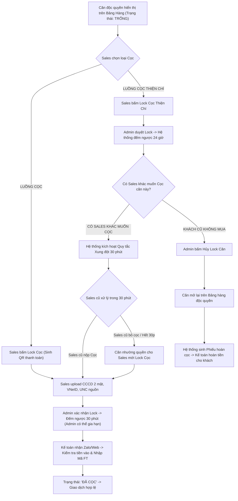
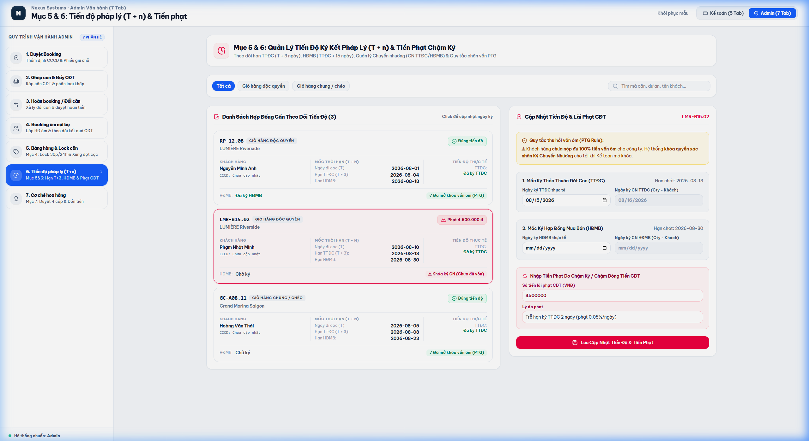

# TÀI LIỆU PHÂN TÍCH YÊU CẦU NGHIỆP VỤ (BA SPECIFICATION)
# PHÂN HỆ ADMIN - TAB 5: BẢNG HÀNG ĐỘC QUYỀN & KHÓA CĂN (LOCK CỌC 30P / 24H)

**Dự án:** Hệ thống Quản trị & Vận hành Booking BĐS (NewWay Booking - Chuẩn Hóa Theo Untitled.pdf)  
**Phân hệ:** Quản trị Vận hành Bất động sản (Admin Module)  
**Mục quy trình trong PDF:** `Mục 4 - Giỏ hàng độc quyền & Khóa căn`  
**Mã màn hình:** `ADM_TAB_05_EXCLUSIVE_INVENTORY_AND_LOCKS`

---

## 1. TỔNG QUAN (OVERVIEW)

### 1.1. Mục tiêu nghiệp vụ
1. **Quản trị Quỹ Căn Độc Quyền (Exclusive Inventory)**:
   - Tiếp nhận các căn hộ độc quyền từ 2 nguồn: (1) Căn khớp từ đợt Booking Ôm nội bộ chuyển sang; (2) Ôm trực tiếp từ CĐT.
   - Hiển thị trực quan trạng thái từng căn: `Trống` (Màu xanh), `Lock Cọc (30p)` (Màu cam), `Lock Cọc Thiện Chí (24h)` (Màu tím), `Đã cọc` (Màu xanh dương).
2. **Quy trình Khóa Căn Cọc (Deposit Lock - 30 Phút)**:
   - Sales chọn căn $\rightarrow$ Bấm Lock Cọc $\rightarrow$ Hệ thống tự sinh Cú pháp chuyển tiền và Mã QR thanh toán.
   - Sales upload hồ sơ pháp lý: CCCD 2 mặt, VNeID, UNC nguồn, thông tin cá nhân khách.
   - Admin duyệt lock $\rightarrow$ Hệ thống kích hoạt bộ đếm ngược **30 phút** (Admin có quyền gia hạn thêm thời gian).
   - Kế toán nhận thông báo qua Web/Zalo $\rightarrow$ Kiểm tra tiền về $\rightarrow$ Nhập Mã FT $\rightarrow$ Chuyển thành `Đã cọc`.
3. **Quy trình Khóa Căn Cọc Thiện Chí (Goodwill Deposit Lock - 24 Giờ)**:
   - Khách muốn giữ chỗ ưu tiên trên căn độc quyền $\rightarrow$ Admin duyệt lock **24 giờ**.
4. **Xử lý Xung Đột Cọc (Conflict Resolution - Quy tắc 30 Phút)**:
   - Khi một căn hộ đang bị khóa bởi **Cọc Thiện Chí** mà có **Sales khác muốn vào Cọc**:
     + Hệ thống tự động kích hoạt bộ đếm ngược **30 phút** ân hạn cho Sales cũ.
     + *Nếu Sales cũ nộp hồ sơ chuyển sang Cọc trong 30p* $\rightarrow$ Sales cũ được ưu tiên mua.
     + *Nếu Sales cũ không vào Cọc (hoặc bấm Hủy cọc)* $\rightarrow$ Căn được chuyển quyền cho Sales mới cọc.
5. **Hủy Lock Căn & Xuất Phiếu Hoàn Cọc Thiện Chí**:
   - Khi khách cọc thiện chí không mua $\rightarrow$ Admin bấm Hủy lock $\rightarrow$ Căn mở lại trên bảng hàng độc quyền $\rightarrow$ Hệ thống tự sinh Phiếu hoàn cọc thiện chí $\rightarrow$ Chuyển Kế toán hoàn tiền cho khách.
6. **Đồng bộ Thời gian thực Google Sheets**:
   - Toàn bộ biến động trạng thái giỏ hàng độc quyền tự động đồng bộ sang Google Sheets trên Google Drive chung của công ty.

### 1.2. Sơ đồ Luồng Nghiệp vụ (Process Flow)



---

## 2. ĐẶC TẢ CHỨC NĂNG & GIAO DIỆN (FUNCTIONAL SPECIFICATIONS & UI)

### 2.1. Giao diện Mockup Thực tế



### 2.2. Thành phần Giao diện & Tính năng Chi tiết
1. **Header Bảng Hàng & Nút Sync Google Sheets**:
   - Nút `Sync Google Sheets Drive`: Đồng bộ 100% dữ liệu căn, giá, trạng thái lock sang Google Drive.
2. **Bộ Lọc Trạng Thái Nhanh**:
   - `Tất cả` | `Trống` | `Lock Cọc (30p)` | `Lock Cọc Thiện Chí (24h)` | `Đã cọc`.
3. **Cột Trái: Bảng Quỹ Căn Độc Quyền (Left Panel)**:
   - Danh sách căn hộ hiển thị: Mã căn, Phân khu, Tòa, Tầng, Diện tích, Hướng view, Giá bán, Nguồn gốc (`Từ Quỹ Ôm Chuyển Sang` / `Ôm Trực Tiếp CĐT`), Badge trạng thái và đếm ngược thời gian lock còn lại.
   - Cảnh báo xung đột (Conflict Alert Badge màu đỏ nhấp nháy): Hiển thị khi có Sales khác tranh chấp cọc.
4. **Cột Phải: Khung Chi Tiết & Thao Tác Xử Lý Lock (Right Action Panel)**:
   - **Thẻ thông tin căn hộ**: Tên dự án, Vị trí, Diện tích, Giá bán niêm yết.
   - **Khung giải quyết xung đột 30 phút (Conflict Box)**:
     - Nút `✓ Vào Cọc (Sales Cũ)`: Kích hoạt bảo lưu quyền ưu tiên mua.
     - Nút `Nhường Cho Sales Mới`: Trao quyền lock cọc cho Sales mới.
   - **Khung thông tin Khách & Sales đang giữ chỗ**:
     - Họ tên khách hàng, Số CCCD, SĐT.
     - Sales phụ trách, Sàn/Team công tác, SĐT Sales.
   - **Các nút điều khiển Admin**:
     - Nút `+15 Phút Lock` / `+30 Phút Lock` (Gia hạn thời gian lock).
     - Nút `Hủy Lock Căn & Xuất Phiếu Hoàn Cọc` (Giải phóng căn mở lại trên bảng hàng).

### 2.3. Danh mục trường dữ liệu (Data Dictionary)

| Tên trường | Kiểu dữ liệu | Bắt buộc | Mô tả & Quy tắc |
| :--- | :---: | :---: | :--- |
| `unitCode` | String | Có | Mã căn hộ độc quyền (VD: `RP-12.08`, `LMR-B15.02`). |
| `status` | Enum | Có | `'Trống'` \| `'Lock Cọc (30p)'` \| `'Lock Cọc Thiện Chí (24h)'` \| `'Đã cọc'`. |
| `price` | Currency | Có | Giá bán niêm yết của căn hộ (VNĐ). |
| `lockedBySalesName`| String | Có khi lock | Họ tên Sales thực hiện thao tác lock căn. |
| `remainingMinutes` | Number | Có khi lock | Số phút đếm ngược còn lại của phiên lock. |
| `hasConflictRequest`| Boolean | Có | Đang có xung đột tranh chấp cọc từ Sales khác. |
| `conflictRequestedBySales`| String | Có khi xung đột | Tên Sales mới muốn vào cọc. |
| `conflictRemainingMinutes`| Number | Có khi xung đột | Thời gian ân hạn còn lại (tối đa 30 phút). |

---

## 3. QUY TẮC NGHIỆP VỤ (BUSINESS RULES & VALIDATIONS)

### 3.1. Các quy tắc xử lý nghiệp vụ (Business Rules - BR)
- **BR-ADM11 (Quy tắc Lock Cọc 30 Phút)**: Lock Cọc có hiệu lực tối đa 30 phút. Quá 30 phút mà Kế toán chưa xác nhận tiền vào (hoặc Admin không gia hạn) thì căn tự động giải phóng về trạng thái `Trống`.
- **BR-ADM12 (Quy tắc Xung Đột Cọc 30 Phút - Conflict Priority Rule)**: Cọc Thiện Chí (24h) chỉ là giữ chỗ tạm thời. Bất kỳ lúc nào có khách khác muốn vào Cọc, Sales giữ cọc thiện chí chỉ có **duy nhất 30 phút** để quyết định chuyển sang Cọc. Hết 30 phút, quyền mua lập tức thuộc về khách Cọc.
- **BR-ADM13 (Đồng bộ Google Sheets)**: Bất kỳ thay đổi trạng thái nào của căn hộ (Lock, Hủy lock, Cọc) đều được kích hoạt webhook đồng bộ sang Google Sheets trong vòng 3 giây.

---

## 4. ĐẶC TẢ API & TÍCH HỢP (API SPECIFICATIONS)

### 4.1. Danh sách Endpoints

| STT | Method | Endpoint URI | Mô tả chức năng |
| :---: | :---: | :--- | :--- |
| 1 | `GET` | `/api/v1/admin/exclusive-units` | Lấy danh sách toàn bộ quỹ căn độc quyền và trạng thái lock. |
| 2 | `POST` | `/api/v1/admin/exclusive-units/{id}/extend-lock` | Admin gia hạn thêm thời gian lock căn (15p / 30p). |
| 3 | `POST` | `/api/v1/admin/exclusive-units/{id}/cancel-lock` | Hủy lock căn, mở lại giỏ hàng và sinh phiếu hoàn cọc. |
| 4 | `POST` | `/api/v1/admin/exclusive-units/{id}/resolve-conflict` | Xử lý xung đột cọc: Chuyển cọc hoặc nhường quyền. |
| 5 | `POST` | `/api/v1/admin/exclusive-units/sync-google-sheets` | Kích hoạt đồng bộ bảng hàng sang Google Sheets. |

---

### 4.2. Chi tiết API & Schema Data

#### API 1: `GET /api/v1/admin/exclusive-units`
* **Mô tả**: Lấy danh sách quỹ căn độc quyền, tình trạng khóa căn, thời gian đếm ngược và trạng thái tranh chấp xung đột cọc.
* **Query Parameters**:
  * `status` (string, optional): `AVAILABLE`, `LOCKED_DEAD_30M`, `LOCKED_GOODWILL_24H`, `SOLD_DEAD_DEPOSIT`.
  * `projectId` (string, optional): Lọc theo ID dự án.

* **Response Schema (200 OK)**:
```json
{
  "success": true,
  "statusCode": 200,
  "data": {
    "total": 3,
    "items": [
      {
        "id": "EXCL-001",
        "unitCode": "RP-12.08",
        "project": "LUMIÈRE Riverside",
        "subDivision": "Tòa West",
        "building": "Tháp W1",
        "floor": 12,
        "area": 74.5,
        "bedrooms": "2PN - 2WC",
        "direction": "Đông Nam",
        "view": "Sông Sài Gòn",
        "price": 6850000000,
        "sourceType": "Từ Quỹ Ôm Chuyển Sang",
        "status": "Trống",
        "lockedBySalesName": null,
        "hasConflictRequest": false
      },
      {
        "id": "EXCL-002",
        "unitCode": "LMR-B15.02",
        "project": "LUMIÈRE Riverside",
        "subDivision": "Tòa East",
        "building": "Tháp E1",
        "floor": 15,
        "area": 92.0,
        "bedrooms": "3PN - 2WC",
        "direction": "Đông Bắc",
        "view": "Góc Landmark 81",
        "price": 9200000000,
        "sourceType": "Ôm Trực Tiếp CĐT",
        "status": "Lock Cọc (30p)",
        "lockedBySalesName": "Nguyễn Hoàng Nam",
        "lockedByDepartment": "Sàn 1 - Team Alpha",
        "lockedBySalesPhone": "0912888101",
        "customerName": "Phạm Nhật Minh",
        "customerCccd": "001095009876",
        "remainingMinutes": 18,
        "hasConflictRequest": false
      },
      {
        "id": "EXCL-003",
        "unitCode": "RP-18.05",
        "project": "LUMIÈRE Riverside",
        "subDivision": "Tòa West",
        "building": "Tháp W2",
        "floor": 18,
        "area": 52.3,
        "bedrooms": "1PN+1 - 1WC",
        "direction": "Tây Nam",
        "view": "Hồ bơi tràn",
        "price": 5100000000,
        "sourceType": "Từ Quỹ Ôm Chuyển Sang",
        "status": "Lock Cọc Thiện Chí (24h)",
        "lockedBySalesName": "Lê Văn Hùng",
        "lockedByDepartment": "Sàn 2 - Team Bravo",
        "lockedBySalesPhone": "0933778899",
        "customerName": "Đặng Thu Thảo",
        "customerCccd": "079092001122",
        "remainingMinutes": 1120,
        "hasConflictRequest": true,
        "conflictRequestedBySales": "Vũ Mạnh Cường (Sàn 1)",
        "conflictRemainingMinutes": 25
      }
    ]
  }
}
```

---

#### API 2: `POST /api/v1/admin/exclusive-units/{id}/extend-lock`
* **Mô tả**: Admin gia hạn thêm thời gian lock cọc cho Sales (15 phút hoặc 30 phút).
* **Request Body Schema**:
```json
{
  "additionalMinutes": "integer (Số phút gia hạn thêm: 15 hoặc 30, required)",
  "reason": "string (Lý do gia hạn, ví dụ: Chờ khách hàng chuyển nốt tiền vào tài khoản)",
  "extendedBy": "string (Mã Admin)"
}
```

* **Request Example**:
```json
{
  "additionalMinutes": 15,
  "reason": "Khách hàng đang thao tác app banking Techcombank hạn mức lớn.",
  "extendedBy": "ADM-001"
}
```

* **Response Schema (200 OK)**:
```json
{
  "success": true,
  "statusCode": 200,
  "message": "Đã gia hạn thành công thêm 15 phút cho căn LMR-B15.02.",
  "data": {
    "unitId": "EXCL-002",
    "unitCode": "LMR-B15.02",
    "newRemainingMinutes": 33,
    "newLockExpiresAt": "2026-08-05T16:45:00Z"
  }
}
```

---

#### API 3: `POST /api/v1/admin/exclusive-units/{id}/cancel-lock`
* **Mô tả**: Hủy lock cọc thiện chí khi khách không mua, mở lại căn trên bảng hàng và tự động sinh Phiếu hoàn cọc đẩy sang Kế toán.
* **Response Schema (200 OK)**:
```json
{
  "success": true,
  "statusCode": 200,
  "message": "Đã hủy lock căn RP-18.05, mở lại giỏ hàng và sinh Phiếu hoàn cọc.",
  "data": {
    "unitId": "EXCL-003",
    "unitCode": "RP-18.05",
    "status": "Trống",
    "refundReceiptCode": "PHC-2026-0018",
    "refundAmount": 50000000,
    "forwardedToAccountingTab": "ACC_TAB_03_REFUND_MANAGEMENT"
  }
}
```

---

#### API 4: `POST /api/v1/admin/exclusive-units/{id}/resolve-conflict`
* **Mô tả**: Xử lý xung đột cọc 30 phút giữa khách Cọc Thiện Chí và khách Cọc.
* **Request Body Schema**:
```json
{
  "resolutionAction": "string (Enum: 'UPGRADE_TO_DEAD_DEPOSIT' | 'YIELD_TO_NEW_SALES', required)",
  "note": "string (Ghi chú lý do)"
}
```

* **Request Example**:
```json
{
  "resolutionAction": "UPGRADE_TO_DEAD_DEPOSIT",
  "note": "Sales cũ Lê Văn Hùng đã nộp đủ hồ sơ và ủy nhiệm chi chuyển sang Cọc."
}
```

* **Response Schema (200 OK)**:
```json
{
  "success": true,
  "statusCode": 200,
  "message": "Đã nâng cấp căn RP-18.05 sang Lock Cọc cho Sales cũ Lê Văn Hùng.",
  "data": {
    "unitId": "EXCL-003",
    "unitCode": "RP-18.05",
    "status": "Lock Cọc (30p)",
    "remainingMinutes": 30,
    "hasConflictRequest": false
  }
}
```

---

#### API 5: `POST /api/v1/admin/exclusive-units/sync-google-sheets`
* **Mô tả**: Đồng bộ tức thời 100% bảng hàng quỹ căn độc quyền sang Google Sheets trên Google Drive.
* **Response Schema (200 OK)**:
```json
{
  "success": true,
  "statusCode": 200,
  "message": "Đồng bộ thành công 4 căn độc quyền sang Google Drive!",
  "data": {
    "syncedUnitsCount": 4,
    "googleSheetUrl": "https://docs.google.com/spreadsheets/d/1BxiMVs0XRA5nFMdKvBdBZjgmUUqptlbs74OgvE2upms/edit",
    "syncedAt": "2026-08-05T16:30:00Z"
  }
}
```

---
*Tài liệu BA đặc tả chuẩn xác theo Mục 4 của Untitled.pdf.*
