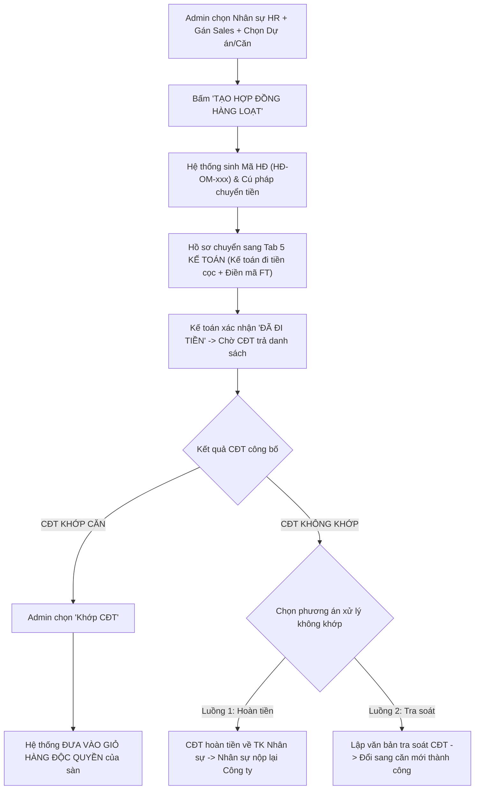
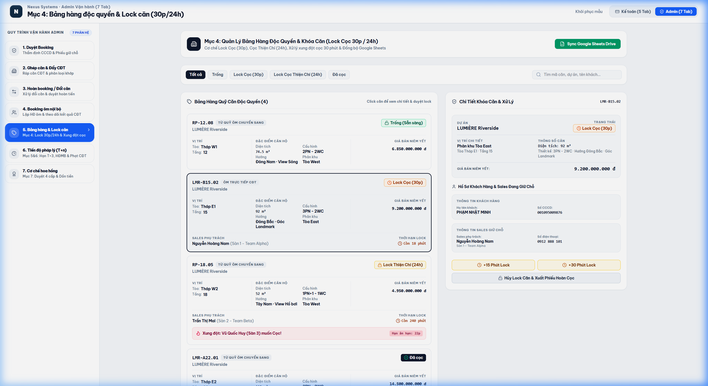

# TÀI LIỆU PHÂN TÍCH YÊU CẦU NGHIỆP VỤ (BA SPECIFICATION)
# PHÂN HỆ ADMIN - TAB 5: QUẢN LÝ BOOKING ÔM NỘI BỘ

**Dự án:** Hệ thống Quản trị & Vận hành Booking BĐS (NewWay Booking - Final Flow)  
**Phân hệ:** Quản trị Vận hành Bất động sản (Admin Module)  
**Mã màn hình:** `ADM_TAB_05_BULK_BOOKING_INTERNAL_MANAGEMENT`

---

## 1. TỔNG QUAN (OVERVIEW)

### 1.1. Mục tiêu nghiệp vụ
1. **Quản trị Danh mục Nhân sự HR & Sales Tư Vấn**:
   - Quản lý danh sách nhân sự nội bộ (HR Employees) đủ điều kiện đứng tên hợp đồng Booking Ôm để giữ chỗ giỏ hàng dự án cho công ty.
   - Phân bổ các nhân viên Sales tư vấn đứng tên cùng bộ hồ sơ (1 Sales có thể phụ trách nhiều bộ HĐ ôm).
2. **Khởi tạo Hàng loạt Hợp đồng Booking Ôm**:
   - Chọn nhiều nhân viên HR $\rightarrow$ Chọn Sales tư vấn $\rightarrow$ Chọn Dự án / Phân khu / Mức tiền cọc.
   - Bấm **"Tạo Hợp Đồng Hàng Loạt"** $\rightarrow$ Hệ thống tự động sinh Mã Hợp Đồng (`HĐ-OM-2026-xxx`) và Cú pháp chuyển tiền chuẩn $\rightarrow$ Đẩy sang **Tab 5 Kế toán** để thực hiện chi tiền cọc sang CĐT.
3. **Xử lý Toàn diện Kết quả Trả Căn từ Chủ Đầu Tư**:
   - **Trường hợp Khớp CĐT**: Căn hộ tự động được đưa vào **Giỏ Hàng Độc Quyền** của sàn để mở bán cho khách hàng.
   - **Trường hợp Không Khớp CĐT**: Xử lý linh hoạt theo 2 nhánh quy trình:
     - *Nhánh 1: Hoàn tiền về tài khoản nhân sự* $\rightarrow$ Nhân sự rút chuyển trả lại tài khoản công ty.
     - *Nhánh 2: Lập văn bản tra soát CĐT* $\rightarrow$ Đổi sang mã căn khác trong giỏ hàng CĐT.

### 1.2. Sơ đồ Luồng Nghiệp vụ (Process Flow)



---

## 2. ĐẶC TẢ CHỨC NĂNG & GIAO DIỆN (FUNCTIONAL SPECIFICATIONS & UI)

### 2.1. Giao diện Mockup Thực tế



### 2.2. Thành phần Giao diện & Tính năng Chi tiết
1. **Dashboard Thống kê Tổng quan (KPI Cards)**:
   - Tổng số hợp đồng ôm đã tạo.
   - Tổng giá trị tiền cọc ôm (VNĐ).
   - Số hợp đồng đã khớp CĐT (Vào giỏ hàng độc quyền).
   - Số hợp đồng không khớp CĐT (Đang xử lý hoàn tiền / tra soát).
2. **Khung Cấu hình & Tạo HĐ Hàng loạt (Top Creation Panel)**:
   - **Danh sách Nhân sự HR**: Bảng checkbox chọn các nhân viên công ty (`NV-101`, `NV-102`...).
   - **Chọn Sales tư vấn**: Dropdown chọn Sales phụ trách đứng tên hồ sơ.
   - **Cấu hình dự án & Tiền cọc**: Dropdown chọn Dự án, Phân khu, Nhập số tiền cọc (mặc định 100,000,000 đ).
   - **Nút Tạo Hàng Loạt**: `⚡ Tạo Hợp Đồng Cho Nhân Sự Đã Chọn` $\rightarrow$ Tự sinh danh sách HĐ.
3. **Bảng Danh sách Hợp đồng Booking Ôm (Contracts Management Table)**:
   - **Mã HĐ**: Mã bộ hồ sơ ôm.
   - **Nhân sự đứng tên**: Tên nhân viên, Chức danh, Phòng ban, CCCD.
   - **Sales tư vấn**: Tên Sales phụ trách.
   - **Dự án / Phân khu / Căn**: Căn hộ giữ chỗ.
   - **Trạng thái Kế toán**: `Chờ đi tiền` / `Đã đi tiền` (kèm Mã FT ngân hàng).
   - **Trạng thái Kết quả CĐT**:
     - `Khớp CĐT - Đã vào giỏ hàng độc quyền` (Badge Xanh lá)
     - `Không khớp CĐT` (Badge Đỏ / Cam)
   - **Nút hành động**:
     - Bấm `Khớp CĐT` $\rightarrow$ Đẩy vào giỏ hàng độc quyền.
     - Bấm `Không khớp CĐT` $\rightarrow$ Mở quy trình giải quyết.
4. **Sơ đồ Quy trình Xử lý Không Khớp CĐT (Non-Match Resolution Flow)**:
   - Cho phép Admin chọn 1 trong 2 phương án:
     + **Phương án 1 (Hoàn về nhân sự)**: Trạng thái tiến trình: `Chờ nhân sự chuyển trả tiền` $\rightarrow$ `Đã hoàn tiền về công ty`.
     + **Phương án 2 (Tra soát đổi căn)**: Trạng thái tiến trình: `Chờ lập văn bản tra soát` $\rightarrow$ `Đã lập văn bản tra soát` $\rightarrow$ `Đã tra soát đổi căn thành công`.

### 2.3. Danh mục trường dữ liệu (Data Dictionary)

| Tên trường | Kiểu dữ liệu | Bắt buộc | Mô tả & Quy tắc |
| :--- | :---: | :---: | :--- |
| `id` | String | Có | Mã hợp đồng ôm (VD: `HĐ-OM-2026-001`). |
| `employeeCustomer` | HREmployee | Có | Đối tượng nhân sự HR đứng tên hợp đồng. |
| `salesConsultant` | SalesStaff | Có | Đối tượng Sales tư vấn hồ sơ. |
| `project` | String | Có | Tên dự án BĐS ôm căn. |
| `depositAmount` | Currency | Có | Số tiền đặt cọc quy định. |
| `contractStatus` | Enum | Có | `'Đã lập hợp đồng'` \| `'Đã chuyển kế toán'` \| `'Đã đi tiền'`. |
| `matchStatus` | Enum | Có | `'Chờ CĐT trả danh sách'` \| `'Khớp CĐT - Đã vào giỏ hàng độc quyền'` \| `'Không khớp CĐT'`. |
| `resolutionType` | Enum | Không | `'hoan_ve_nhan_su'` \| `'tra_soat_doi_can'`. |
| `resolutionStatus` | Enum | Không | Tiến độ xử lý tương ứng của từng phương án. |
| `targetNewUnitCode`| String | Không | Mã căn mới trong trường hợp tra soát đổi căn. |

---

## 3. QUY TẮC NGHIỆP VỤ (BUSINESS RULES & VALIDATIONS)

### 3.1. Các quy tắc xử lý nghiệp vụ (Business Rules - BR)
- **BR-ADM09 (Cơ chế sinh Cú pháp chuyển tiền tự động)**: Hệ thống tự động sinh nội dung chuyển tiền theo cấu trúc: `[TÊN_CÔNG_TY] OM [MÃ_CĂN] [SỐ_CCCD_NHÂN_SỰ]`.
- **BR-ADM10 (Tự động đưa vào Giỏ hàng độc quyền)**: Khi Admin bấm "Khớp CĐT", căn hộ ôm sẽ được tự động kích hoạt vào Giỏ Hàng Độc Quyền của sàn để toàn bộ Sales trong hệ thống có thể mở bán cho khách hàng.

---

## 4. ĐẶC TẢ API & TÍCH HỢP (API SPECIFICATIONS)

### 4.1. Danh sách Endpoints

| STT | Method | Endpoint URI | Mô tả chức năng |
| :---: | :---: | :--- | :--- |
| 1 | `GET` | `/api/v1/admin/bulk-contracts` | Lấy danh sách toàn bộ hợp đồng booking ôm. |
| 2 | `POST` | `/api/v1/admin/bulk-contracts/batch-create` | Tạo hàng loạt hợp đồng booking ôm cho các nhân sự đã chọn. |
| 3 | `POST` | `/api/v1/admin/bulk-contracts/{id}/mark-matched` | Đánh dấu khớp CĐT và chuyển vào giỏ hàng độc quyền. |
| 4 | `POST` | `/api/v1/admin/bulk-contracts/{id}/resolve-unmatched` | Thiết lập phương án xử lý không khớp (Hoàn tiền / Tra soát đổi căn). |

---

### 4.2. Chi tiết API & Schema Data

#### API 1: `GET /api/v1/admin/bulk-contracts`
* **Mô tả**: Lấy danh sách hợp đồng booking ôm nội bộ, trạng thái chuyển tiền của Kế toán và kết quả trả căn từ CĐT.
* **Response Schema (200 OK)**:
```json
{
  "success": true,
  "statusCode": 200,
  "data": {
    "total": 2,
    "summary": {
      "totalContracts": 5,
      "totalDepositAmount": 500000000,
      "matchedCdtCount": 2,
      "unmatchedCount": 1
    },
    "items": [
      {
        "id": "HĐ-OM-2026-001",
        "employeeCustomer": {
          "code": "NV-101",
          "name": "Nguyễn Minh Châu",
          "department": "Phòng Nhân sự - HR",
          "position": "Chuyên viên Tuyển dụng",
          "cccd": "001095012345",
          "phone": "0912334455"
        },
        "salesConsultant": {
          "code": "NV009",
          "name": "Trần Thị Mai",
          "department": "Sàn Alpha",
          "phone": "0988112233"
        },
        "project": "LUMIÈRE Riverside",
        "subDivision": "Tòa West",
        "unitCode": "A12-08",
        "depositAmount": 100000000,
        "transferSyntax": "NEWWAY OM A12-08 001095012345",
        "payoutStatus": "Đã đi tiền",
        "ftCode": "FT262160911223",
        "matchStatus": "Khớp CĐT - Đã vào giỏ hàng độc quyền",
        "exclusiveInventoryStatus": "IN_EXCLUSIVE_INVENTORY"
      },
      {
        "id": "HĐ-OM-2026-002",
        "employeeCustomer": {
          "code": "NV-102",
          "name": "Lê Hoàng Phúc",
          "department": "Phòng Hành chính - Admin",
          "position": "Chuyên viên Vận hành",
          "cccd": "079093009876",
          "phone": "0933445566"
        },
        "salesConsultant": {
          "code": "NV009",
          "name": "Trần Thị Mai",
          "department": "Sàn Alpha",
          "phone": "0988112233"
        },
        "project": "LUMIÈRE Riverside",
        "subDivision": "Tòa East",
        "unitCode": "B15-02",
        "depositAmount": 100000000,
        "transferSyntax": "NEWWAY OM B15-02 079093009876",
        "payoutStatus": "Chờ đi tiền",
        "ftCode": null,
        "matchStatus": "Chờ CĐT trả danh sách",
        "exclusiveInventoryStatus": "PENDING"
      }
    ]
  }
}
```

---

#### API 2: `POST /api/v1/admin/bulk-contracts/batch-create`
* **Mô tả**: Tạo hàng loạt hợp đồng ôm cho danh sách nhân sự HR được chọn và gán Sales phụ trách.
* **Request Body Schema**:
```json
{
  "selectedEmployeeCodes": "array of string (Danh sách mã NV HR: ['NV-101', 'NV-102'], required)",
  "salesCode": "string (Mã Sales phụ trách tư vấn, required)",
  "project": "string (Tên dự án, required)",
  "subDivision": "string (Phân khu, required)",
  "depositAmountPerUnit": "number (Số tiền cọc mỗi căn, required, ví dụ: 100000000)"
}
```

* **Request Example**:
```json
{
  "selectedEmployeeCodes": ["NV-101", "NV-102"],
  "salesCode": "NV009",
  "project": "LUMIÈRE Riverside",
  "subDivision": "Tòa West",
  "depositAmountPerUnit": 100000000
}
```

* **Response Schema (201 Created)**:
```json
{
  "success": true,
  "statusCode": 201,
  "message": "Đã tạo thành công 2 hợp đồng booking ôm. Đã đẩy sang Kế toán Tab 5 để chi tiền.",
  "data": {
    "createdContractsCount": 2,
    "totalDepositAmount": 200000000,
    "contracts": [
      {
        "contractId": "HĐ-OM-2026-003",
        "employeeCode": "NV-101",
        "transferSyntax": "NEWWAY OM A14-05 001095012345"
      },
      {
        "contractId": "HĐ-OM-2026-004",
        "employeeCode": "NV-102",
        "transferSyntax": "NEWWAY OM A14-06 079093009876"
      }
    ],
    "forwardedTo": "ACC_TAB_05_COMMISSION_AND_BULK_PAYOUT"
  }
}
```

---

#### API 3: `POST /api/v1/admin/bulk-contracts/{id}/mark-matched`
* **Mô tả**: Xác nhận căn ôm đã được CĐT phân bổ thành công $\rightarrow$ Đưa căn vào Bảng hàng Độc Quyền (Tab 5 Admin).
* **Path Parameters**:
  * `id` (string, required): Mã hợp đồng ôm (VD: `HĐ-OM-2026-001`).
* **Response Schema (200 OK)**:
```json
{
  "success": true,
  "statusCode": 200,
  "message": "Đã ghi nhận Khớp CĐT và đưa căn A12-08 vào Giỏ hàng độc quyền.",
  "data": {
    "contractId": "HĐ-OM-2026-001",
    "unitCode": "A12-08",
    "matchStatus": "Khớp CĐT - Đã vào giỏ hàng độc quyền",
    "exclusiveInventoryId": "EXCL-A12-08",
    "availableForLock": true,
    "syncedToTab": "ADM_TAB_05_EXCLUSIVE_LOCK"
  }
}
```

---

#### API 4: `POST /api/v1/admin/bulk-contracts/{id}/resolve-unmatched`
* **Mô tả**: Thiết lập phương án giải quyết cho căn ôm không khớp CĐT (Hoàn tiền về công ty hoặc Lập tra soát đổi căn).
* **Request Body Schema**:
```json
{
  "resolutionType": "string (Enum: 'hoan_ve_nhan_su' | 'tra_soat_doi_can', required)",
  "resolutionStatus": "string (Trạng thái tiến trình)",
  "targetNewUnitCode": "string (Mã căn mới nếu chọn tra soát đổi căn, optional)",
  "note": "string (Ghi chú)"
}
```

* **Request Example (Luồng 1 - Hoàn tiền)**:
```json
{
  "resolutionType": "hoan_ve_nhan_su",
  "resolutionStatus": "CHO_NHAN_SU_CHUYEN_TRA",
  "note": "CĐT hoàn tiền 100M về tài khoản Techcombank của NV Châu, chờ NV rút nộp lại công ty."
}
```

* **Response Schema (200 OK)**:
```json
{
  "success": true,
  "statusCode": 200,
  "message": "Đã cập nhật tiến trình xử lý không khớp CĐT.",
  "data": {
    "contractId": "HĐ-OM-2026-002",
    "resolutionType": "hoan_ve_nhan_su",
    "resolutionStatus": "CHO_NHAN_SU_CHUYEN_TRA",
    "statusBadge": "Chờ nhân sự chuyển trả tiền"
  }
}
```

---
*Tài liệu BA chuẩn hóa theo hệ thống NewWay Booking Final.*
