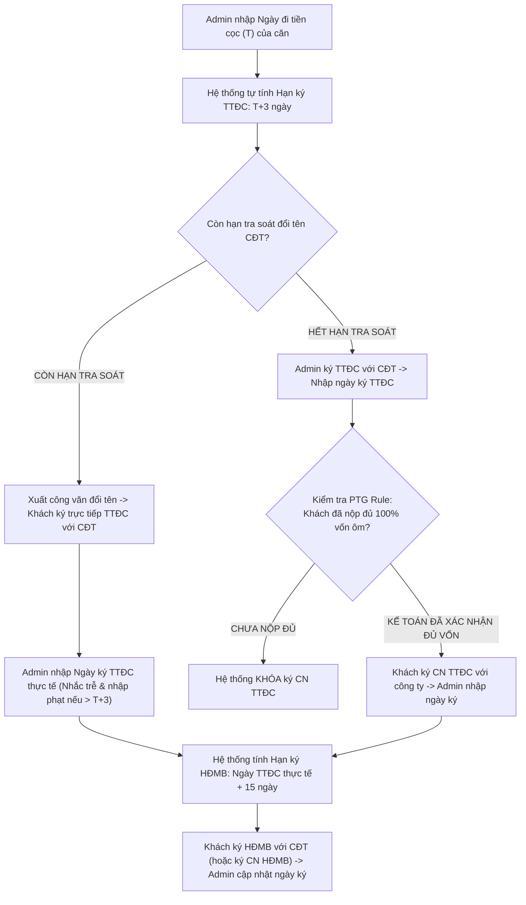

# TÀI LIỆU PHÂN TÍCH YÊU CẦU NGHIỆP VỤ (BA SPECIFICATION)
# PHÂN HỆ ADMIN - TAB 6: TIẾN ĐỘ PHÁP LÝ ($T+n$) & TIỀN PHẠT CHẬM KÝ

**Dự án:** Hệ thống Quản trị & Vận hành Booking BĐS (NewWay Booking - Chuẩn Hóa Theo Untitled.pdf)  
**Phân hệ:** Quản trị Vận hành Bất động sản (Admin Module)  
**Mục quy trình trong PDF:** `Mục 5 - Các thủ tục ký & Mục 6 - Giỏ hàng chung / chéo`  
**Mã màn hình:** `ADM_TAB_06_LEGAL_MILESTONES_AND_PENALTIES`

---

## 1. TỔNG QUAN (OVERVIEW)

### 1.1. Mục tiêu nghiệp vụ
1. **Theo dõi Vòng đời Mốc Ký Kết Pháp Lý ($T+n$)**:
   - Ghi nhận Ngày công ty nộp tiền cọc vào CĐT ($T$).
   - Hệ thống tự động tính toán hạn ký **Thỏa Thuận Đặt Cọc (TTĐC) là $T+3$ ngày**.
   - Sau khi ghi nhận Ngày ký TTĐC thực tế $\rightarrow$ Hệ thống tự động tính hạn ký **Hợp Đồng Mua Bán (HĐMB) là $\text{Ngày TTĐC thực tế} + 15$ ngày**.
2. **Quản lý Phân Nhánh Tra Soát Đổi Tên $\leftrightarrow$ Chuyển Nhượng Nội Bộ**:
   - **Trường hợp 1 (Còn hạn tra soát đổi tên với CĐT)**: Hệ thống xuất công văn đổi tên sang Khách để Khách ký trực tiếp TTĐC/HĐMB với CĐT.
   - **Trường hợp 2 (Không còn hạn tra soát đổi tên)**:
     + Admin ký TTĐC/HĐMB đứng tên công ty với CĐT.
     + Khách hàng ký văn bản Chuyển nhượng (`CN TTĐC`, `CN HĐMB`) với công ty.
     + Admin theo dõi và cập nhật ngày ký chuyển nhượng thực tế.
3. **Quy tắc Thu hồi Vốn Ôm Chặn Ký Chuyển Nhượng (PTG Rule)**:
   - Hệ thống **tự động khóa quyền xác nhận Ký Chuyển Nhượng** cho đến khi Kế toán bấm xác nhận khách hàng đã nộp đủ 100% tiền vốn công ty đã ứng ra ôm căn (dựa trên Mã FT).
4. **Cảnh báo Quá Hạn & Nhập Lãi Phạt Do Chậm Ký CĐT**:
   - Tự động phát hiện vi phạm tiến độ ký kết $T+3$ hoặc $\text{TTĐC}+15$.
   - Cho phép Admin **nhập số tiền lãi phạt do CĐT phạt vì chậm ký/chậm đóng tiền** kèm lý do phát sinh.
5. **Mục 6 - Quản lý Giỏ Hàng Chung / Chéo**:
   - Áp dụng quy trình ký TTĐC $\rightarrow$ CN TTĐC $\rightarrow$ Mốc HĐMB ($TTĐC+15$) cho các giao dịch thuộc quỹ hàng chung của CĐT hoặc liên minh sàn.

### 1.2. Sơ đồ Luồng Nghiệp vụ (Process Flow)



---

## 2. ĐẶC TẢ CHỨC NĂNG & GIAO DIỆN (FUNCTIONAL SPECIFICATIONS & UI)

### 2.1. Giao diện Mockup Thực tế


### 2.2. Thành phần Giao diện & Tính năng Chi tiết
1. **Bộ Lọc Phân Loại**:
   - `Tất cả` | `Giỏ hàng độc quyền` | `Giỏ hàng chung / chéo`.
2. **Cột Trái: Danh Sách Hợp Đồng Theo Dõi Tiến Độ (Left Table)**:
   - Danh sách hiển thị: Mã căn, Phân loại giỏ hàng, Tên khách hàng, Ngày đi cọc ($T$), Hạn ký TTĐC ($T+3$), Hạn ký HĐMB ($TTĐC+15$), Trạng thái tiến độ (`Đã ký TTĐC`, `Chờ ký`, `Quá hạn`).
   - Badge tiền phạt CĐT: Hiển thị số tiền phạt màu đỏ nếu có.
   - Badge PTG: Hiển thị trạng thái mở khóa vốn ôm (`✓ Đã mở khóa vốn ôm` / `⚠ Khóa ký CN`).
3. **Cột Phải: Khung Cập Nhật Tiến Độ & Tiền Phạt (Right Action Panel)**:
   - **Cảnh báo PTG Rule**: Hiển thị chi tiết xác nhận vốn của Kế toán.
   - **Mốc 1 (Ký TTĐC - Hạn $T+3$)**:
     - Ô nhập: Ngày ký TTĐC thực tế.
     - Ô nhập: Ngày ký CN TTĐC với công ty (Chỉ mở khi PTG Rule hợp lệ).
   - **Mốc 2 (Ký HĐMB - Hạn $\text{TTĐC} + 15$)**:
     - Ô nhập: Ngày ký HĐMB thực tế.
     - Ô nhập: Ngày ký CN HĐMB với công ty.
   - **Khung Nhập Lãi Phạt Chậm Ký CĐT**:
     - Ô nhập: Số tiền lãi phạt CĐT (VNĐ).
     - Ô nhập: Lý do phạt chi tiết (VD: *"Khách đi công tác chậm ký 2 ngày, CĐT phạt 0.05%/ngày"*).
   - **Nút Lưu Cập Nhật Tiến Độ**: Lưu dữ liệu và gửi thông báo cho Sales/Kế toán.

### 2.3. Danh mục trường dữ liệu (Data Dictionary)

| Tên trường | Kiểu dữ liệu | Bắt buộc | Mô tả & Quy tắc |
| :--- | :---: | :---: | :--- |
| `depositDateT` | Date (YYYY-MM-DD) | Có | Ngày công ty đi tiền cọc ban đầu ($T$). |
| `ttdcDeadline` | Date | Tự sinh | Hạn ký TTĐC ($T+3$). |
| `ttdcActualDate` | Date | Không | Ngày ký TTĐC thực tế. |
| `hasTraceNameDeadline` | Boolean | Có | Còn hạn làm thủ tục tra soát đổi tên với CĐT. |
| `cnTtdcSigningDate` | Date | Không | Ngày ký Chuyển nhượng TTĐC giữa Công ty và Khách. |
| `hdmbDeadline` | Date | Tự sinh | Hạn ký HĐMB ($\text{TTĐC thực tế} + 15$). |
| `hdmbActualDate` | Date | Không | Ngày ký HĐMB thực tế. |
| `isCompanyCapitalFullyPaidByCustomer` | Boolean | Có | Kế toán xác nhận khách đã nộp đủ tiền vốn ôm. |
| `latePenaltyFee` | Currency | Không | Số tiền phạt do CĐT phạt vì chậm ký/chậm nộp tiền. |
| `penaltyReason` | Text | Không | Lý do phát sinh tiền phạt. |

---

## 3. QUY TẮC NGHIỆP VỤ (BUSINESS RULES & VALIDATIONS)

### 3.1. Các quy tắc xử lý nghiệp vụ (Business Rules - BR)
- **BR-ADM14 (Công thức tính hạn pháp lý)**:
  - $\text{Hạn TTĐC} = T + 3 \text{ ngày}$.
  - $\text{Hạn HĐMB} = \text{Ngày TTĐC thực tế} + 15 \text{ ngày}$.
- **BR-ADM15 (Khóa ký Chuyển nhượng - PTG Rule)**: Admin không được phép lưu ngày ký `CN TTĐC` hoặc `CN HĐMB` nếu cờ `isCompanyCapitalFullyPaidByCustomer` là `False`.
- **BR-ADM16 (Tự động cảnh báo quá hạn)**: Nếu ngày ký thực tế vượt quá ngày hạn chót quy định, hệ thống tự động đánh dấu cờ **QUÁ HẠN** và bắt buộc Admin phải nhập số tiền lãi phạt (nếu CĐT có phạt).

---

## 4. ĐẶC TẢ API & TÍCH HỢP (API SPECIFICATIONS)

### 4.1. Danh sách Endpoints

| STT | Method | Endpoint URI | Mô tả chức năng |
| :---: | :---: | :--- | :--- |
| 1 | `GET` | `/api/v1/admin/legal-milestones` | Lấy danh sách tiến độ ký kết và cảnh báo quá hạn. |
| 2 | `POST` | `/api/v1/admin/legal-milestones/{id}/update-milestones` | Cập nhật ngày ký thực tế và số tiền phạt CĐT. |
| 3 | `POST` | `/api/v1/admin/legal-milestones/{id}/verify-capital-payout` | Kế toán xác nhận khách đã nộp đủ 100% tiền vốn ôm. |

---

### 4.2. Chi tiết API & Schema Data

#### API 1: `GET /api/v1/admin/legal-milestones`
* **Mô tả**: Lấy danh sách hợp đồng kèm các mốc thời hạn pháp lý $T$, $T+3$, $TTĐC+15$, trạng thái nộp vốn PTG và số tiền phạt chậm ký CĐT.
* **Query Parameters**:
  * `category` (string, optional): `EXCLUSIVE` (Giỏ hàng độc quyền), `SHARED` (Giỏ hàng chung / chéo).
  * `isOverdue` (boolean, optional): `true` (Chỉ lấy các hợp đồng quá hạn).

* **Response Schema (200 OK)**:
```json
{
  "success": true,
  "statusCode": 200,
  "data": {
    "total": 2,
    "items": [
      {
        "id": "HD-2026-001",
        "unitCode": "RP-12.08",
        "project": "LUMIÈRE Riverside",
        "inventoryCategory": "Giỏ hàng độc quyền",
        "customerName": "Nguyễn Văn An",
        "customerCccd": "001090012345",
        "depositDateT": "2026-08-01",
        "ttdcDeadline": "2026-08-04",
        "ttdcActualDate": "2026-08-03",
        "hasTraceNameDeadline": true,
        "cnTtdcSigningDate": null,
        "hdmbDeadline": "2026-08-18",
        "hdmbActualDate": null,
        "isCompanyCapitalFullyPaidByCustomer": true,
        "latePenaltyFee": 0,
        "penaltyReason": null,
        "ttdcStatus": "Đã ký TTĐC",
        "hdmbStatus": "Chờ đến hạn HĐMB"
      },
      {
        "id": "HD-2026-002",
        "unitCode": "LMR-B15.02",
        "project": "LUMIÈRE Riverside",
        "inventoryCategory": "Giỏ hàng chung / chéo",
        "customerName": "Phạm Nhật Minh",
        "customerCccd": "001095009876",
        "depositDateT": "2026-07-28",
        "ttdcDeadline": "2026-07-31",
        "ttdcActualDate": "2026-08-03",
        "hasTraceNameDeadline": false,
        "cnTtdcSigningDate": "2026-08-03",
        "hdmbDeadline": "2026-08-18",
        "hdmbActualDate": null,
        "isCompanyCapitalFullyPaidByCustomer": false,
        "latePenaltyFee": 15000000,
        "penaltyReason": "Khách hàng đi công tác chậm ký TTĐC 3 ngày. CĐT phạt 0.05%/ngày theo điều khoản cọc.",
        "ttdcStatus": "Đã ký TTĐC (Trễ hạn)",
        "hdmbStatus": "Chờ đến hạn HĐMB"
      }
    ]
  }
}
```

---

#### API 2: `POST /api/v1/admin/legal-milestones/{id}/update-milestones`
* **Mô tả**: Admin cập nhật ngày ký thực tế của TTĐC, CN TTĐC, HĐMB và nhập số tiền lãi phạt do CĐT phạt (nếu có).
* **Path Parameters**:
  * `id` (string, required): Mã hợp đồng (VD: `HD-2026-002`).
* **Request Body Schema**:
```json
{
  "ttdcActualDate": "string (Ngày ký TTĐC thực tế YYYY-MM-DD, optional)",
  "cnTtdcSigningDate": "string (Ngày ký CN TTĐC YYYY-MM-DD, chỉ được nhập khi đã mở khóa PTG, optional)",
  "hdmbActualDate": "string (Ngày ký HĐMB thực tế YYYY-MM-DD, optional)",
  "cnHdmbSigningDate": "string (Ngày ký CN HĐMB YYYY-MM-DD, optional)",
  "latePenaltyFee": "number (Số tiền phạt chậm ký CĐT, VNĐ, optional)",
  "penaltyReason": "string (Lý do phạt chi tiết, optional)",
  "updatedBy": "string (Mã Admin)"
}
```

* **Request Example**:
```json
{
  "ttdcActualDate": "2026-08-03",
  "cnTtdcSigningDate": "2026-08-03",
  "hdmbActualDate": null,
  "latePenaltyFee": 15000000,
  "penaltyReason": "Khách hàng đi công tác chậm ký TTĐC 3 ngày. CĐT phạt 0.05%/ngày theo điều khoản cọc.",
  "updatedBy": "ADM-001"
}
```

* **Response Schema (200 OK)**:
```json
{
  "success": true,
  "statusCode": 200,
  "message": "Cập nhật tiến độ pháp lý và số tiền phạt thành công!",
  "data": {
    "contractId": "HD-2026-002",
    "ttdcStatus": "Đã ký TTĐC (Trễ hạn)",
    "calculatedHdmbDeadline": "2026-08-18",
    "latePenaltyFee": 15000000,
    "updatedAt": "2026-08-05T17:00:00Z"
  }
}
```

---

#### API 3: `POST /api/v1/admin/legal-milestones/{id}/verify-capital-payout`
* **Mô tả**: Kế toán xác nhận khách hàng đã nộp đủ 100% số tiền vốn công ty đã ứng ra ôm căn (dựa vào Mã FT) $\rightarrow$ Mở khóa quyền ký Chuyển nhượng (PTG Rule).
* **Path Parameters**:
  * `id` (string, required): Mã hợp đồng (VD: `HD-2026-002`).
* **Request Body Schema**:
```json
{
  "ftCode": "string (Mã giao dịch ngân hàng khớp tiền nộp, required)",
  "paidAmount": "number (Số tiền khách đã hoàn nộp lại công ty, VNĐ, required)",
  "verifiedBy": "string (Mã Kế toán)"
}
```

* **Request Example**:
```json
{
  "ftCode": "FT262170889912",
  "paidAmount": 100000000,
  "verifiedBy": "ACC-002"
}
```

* **Response Schema (200 OK)**:
```json
{
  "success": true,
  "statusCode": 200,
  "message": "Đã xác nhận nộp đủ 100% vốn ôm. Đã mở khóa quyền ký Chuyển nhượng (PTG Rule) cho căn LMR-B15.02.",
  "data": {
    "contractId": "HD-2026-002",
    "isCompanyCapitalFullyPaidByCustomer": true,
    "unlockedForTransferSigning": true,
    "verifiedAt": "2026-08-05T17:15:00Z"
  }
}
```

---
*Tài liệu BA đặc tả chuẩn xác theo Mục 5 & 6 của Untitled.pdf.*
