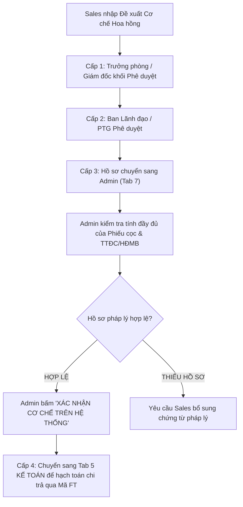
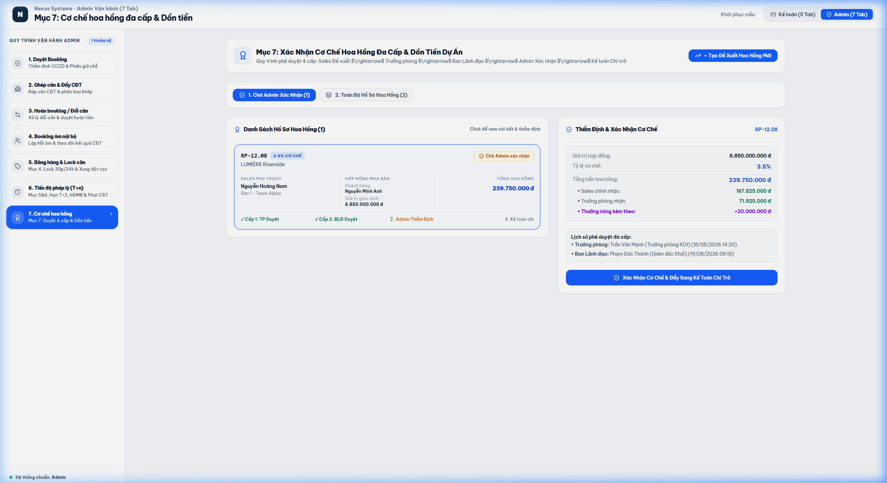

# TÀI LIỆU PHÂN TÍCH YÊU CẦU NGHIỆP VỤ (BA SPECIFICATION)
# PHÂN HỆ ADMIN - TAB 7: CƠ CHẾ HOA HỒNG ĐA CẤP & DỒN TIỀN

**Dự án:** Hệ thống Quản trị & Vận hành Booking BĐS (NewWay Booking - Chuẩn Hóa Theo Untitled.pdf)  
**Phân hệ:** Quản trị Vận hành Bất động sản (Admin Module)  
**Mục quy trình trong PDF:** `Mục 7 - Các ô đặc biệt (Cơ chế hoa hồng & Dồn tiền)`  
**Mã màn hình:** `ADM_TAB_07_COMMISSION_APPROVAL_AND_FUND_POOLING`

---

## 1. TỔNG QUAN (OVERVIEW)

### 1.1. Mục tiêu nghiệp vụ
1. **Phê Duyệt Cơ Chế Hoa Hồng 4 Cấp (Multi-Stage Commission Workflow)**:
   - **Cấp 0 (Sales)**: Sales nhập đề xuất cơ chế hoa hồng lên hệ thống (Tỷ lệ %, phí môi giới, phân chia Sales / Trưởng phòng, thưởng nóng).
   - **Cấp 1 (Trưởng phòng KD / GĐ Khối)**: Phê duyệt ban đầu về hiệu suất và phân bổ team.
   - **Cấp 2 (Ban Lãnh đạo / PTG)**: Phê duyệt chính sách chi trả của công ty.
   - **Cấp 3 (Admin Vận hành)**: Thẩm định tính đầy đủ của hồ sơ pháp lý hợp đồng $\rightarrow$ Bấm nút **"Xác nhận cơ chế trên hệ thống"**.
   - **Cấp 4 (Bộ phận Kế toán)**: Tiếp nhận hồ sơ đã được Admin xác nhận $\rightarrow$ Hạch toán và chi tiền hoa hồng qua Mã FT.
2. **Quy trình Tra Soát & Dồn Tiền Sang Căn Khác (Fund Pooling)**:
   - Khi khách hàng hoặc công ty muốn dồn tiền từ căn này sang căn khác:
     + Hệ thống tự động tạo nội dung tra soát dồn tiền sang căn mới.
     + Kế toán đi thêm tiền cọc vào CĐT (điền số tiền đi thêm, ngày giờ và Mã FT).
     + PTG tự động dồn tiền $\rightarrow$ Khách hàng bắt buộc phải thanh toán hết tiền công ty đã ứng vào CĐT để ký văn bản chuyển nhượng.

### 1.2. Sơ đồ Luồng Nghiệp vụ (Process Flow)



---

## 2. ĐẶC TẢ CHỨC NĂNG & GIAO DIỆN (FUNCTIONAL SPECIFICATIONS & UI)

### 2.1. Giao diện Mockup Thực tế



### 2.2. Thành phần Giao diện & Tính năng Chi tiết
1. **Thanh Header & Nút Tạo Đề Xuất Mới**:
   - Nút `+ Tạo Đề Xuất Hoa Hồng Mới`: Mở khung nhập form đề xuất trực tiếp trên giao diện.
2. **Bộ Lọc Tab Phân Loại**:
   - `1. Chờ Admin Xác Nhận`: Lọc các hồ sơ đã có đủ duyệt của TP & BLĐ, đang chờ Admin thẩm định.
   - `2. Toàn Bộ Hồ Sơ Hoa Hồng`: Xem lịch sử toàn bộ các hồ sơ hoa hồng trong dự án.
3. **Cột Trái: Danh Sách Hồ Sơ Hoa Hồng (Left Table)**:
   - Danh sách hiển thị: Mã căn, Tỷ lệ hoa hồng (%), Sales chính phụ trách, Tên khách hàng, Giá trị hợp đồng, Tổng số tiền hoa hồng (VNĐ).
   - Thanh tiến trình phê duyệt 4 cấp: `✓ TP Duyệt` $\rightarrow$ `✓ BLĐ Duyệt` $\rightarrow$ `Admin Thẩm Định` $\rightarrow$ `Kế toán chi`.
4. **Cột Phải: Khung Thẩm Định & Xác Nhận Cơ Chế (Right Action Panel)**:
   - **Bảng bóc tách cơ cấu hoa hồng (Commission Breakdown)**:
     - Giá trị hợp đồng (deal value).
     - Tỷ lệ cơ chế (%).
     - Tổng tiền hoa hồng.
     - Tiền về Sales chính (70%).
     - Tiền về Trưởng phòng KD (30%).
     - Tiền thưởng nóng (nếu có).
   - **Lịch sử phê duyệt đa cấp**: Chi tiết họ tên người duyệt và thời gian của TP, BLĐ.
   - **Nút Xác Nhận**: `Xác Nhận Cơ Chế & Đẩy Sang Kế Toán Chi Trả` (Màu xanh dương).

### 2.3. Danh mục trường dữ liệu (Data Dictionary)

| Tên trường | Kiểu dữ liệu | Bắt buộc | Mô tả & Quy tắc |
| :--- | :---: | :---: | :--- |
| `id` | String | Có | Mã hồ sơ hoa hồng (VD: `HH-2026-001`). |
| `unitCode` | String | Có | Mã căn hộ giao dịch. |
| `dealValue` | Currency | Có | Giá trị hợp đồng bất động sản (VNĐ). |
| `commissionRate` | Number (%) | Có | Tỷ lệ hoa hồng bán hàng (VD: 3.5%). |
| `totalCommissionAmount` | Currency | Có | Tổng tiền hoa hồng = $\text{dealValue} \times \text{commissionRate}$. |
| `salesCommissionShare` | Currency | Có | Tiền hoa hồng thực nhận của Sales chính. |
| `managerCommissionShare`| Currency | Có | Tiền hoa hồng quản lý của Trưởng phòng. |
| `adminConfirmation` | Object | Có | Trạng thái Admin xác nhận kèm timestamp & ghi chú. |

---

## 3. QUY TẮC NGHIỆP VỤ (BUSINESS RULES & VALIDATIONS)

### 3.1. Các quy tắc xử lý nghiệp vụ (Business Rules - BR)
- **BR-ADM17 (Quy tắc luồng duyệt 4 cấp tuần tự)**: Admin chỉ nhìn thấy và được phép bấm "Xác nhận cơ chế" sau khi hồ sơ đã có đủ 2 chữ ký điện tử phê duyệt từ **Trưởng phòng** (Cấp 1) và **Ban Lãnh đạo** (Cấp 2).
- **BR-ADM18 (Điều kiện kích hoạt lệnh chi Kế toán)**: Kế toán chỉ có thể nhìn thấy hồ sơ tại Tab 5 Kế toán để thực hiện lệnh chi sau khi Admin đã bấm "Xác nhận cơ chế" tại Tab 7 Admin.

---

## 4. ĐẶC TẢ API & TÍCH HỢP (API SPECIFICATIONS)

### 4.1. Danh sách Endpoints

| STT | Method | Endpoint URI | Mô tả chức năng |
| :---: | :---: | :--- | :--- |
| 1 | `GET` | `/api/v1/admin/commissions/pending-confirmation` | Lấy danh sách hoa hồng đã qua duyệt BLĐ chờ Admin xác nhận. |
| 2 | `POST` | `/api/v1/admin/commissions/{id}/confirm` | Admin xác nhận hoàn tất hồ sơ hoa hồng. |
| 3 | `POST` | `/api/v1/admin/fund-pooling/exchange-and-pool` | Thực hiện quy trình tra soát và dồn tiền sang căn khác. |

---

### 4.2. Chi tiết API & Schema Data

#### API 1: `GET /api/v1/admin/commissions/pending-confirmation`
* **Mô tả**: Lấy danh sách hồ sơ hoa hồng 4 cấp đang chờ Admin thẩm định và xác nhận.
* **Response Schema (200 OK)**:
```json
{
  "success": true,
  "statusCode": 200,
  "data": {
    "total": 1,
    "items": [
      {
        "id": "HH-2026-001",
        "unitCode": "RP-12.08",
        "project": "LUMIÈRE Riverside",
        "customerName": "Nguyễn Văn An",
        "mainSalesName": "Nguyễn Hoàng Nam",
        "department": "Sàn 1 - Team Alpha",
        "dealValue": 6850000000,
        "commissionRate": 3.5,
        "totalCommissionAmount": 239750000,
        "salesCommissionShare": 167825000,
        "managerCommissionShare": 71925000,
        "bonusAmount": 20000000,
        "approvalWorkflow": {
          "managerApproval": {
            "status": "Đã duyệt",
            "approvedBy": "Trần Văn Hùng (GĐ Khối)",
            "approvedAt": "2026-08-04T10:00:00Z"
          },
          "directorApproval": {
            "status": "Đã duyệt",
            "approvedBy": "Phạm Quang Minh (Phó TGĐ)",
            "approvedAt": "2026-08-04T14:30:00Z"
          },
          "adminConfirmation": {
            "status": "Chờ xác nhận",
            "confirmedBy": null,
            "confirmedAt": null
          },
          "accountingPayout": {
            "status": "Chờ lệnh chi",
            "ftCode": null,
            "paidAt": null
          }
        }
      }
    ]
  }
}
```

---

#### API 2: `POST /api/v1/admin/commissions/{id}/confirm`
* **Mô tả**: Admin thẩm định tính hợp lệ của hợp đồng và xác nhận cơ chế hoa hồng, tự động chuyển hồ sơ sang Kế toán (Tab 5) để chi trả.
* **Path Parameters**:
  * `id` (string, required): Mã hồ sơ hoa hồng (VD: `HH-2026-001`).
* **Request Body Schema**:
```json
{
  "adminNote": "string (Ghi chú thẩm định, ví dụ: Hợp đồng và phiếu cọc đã đủ tính pháp lý)",
  "confirmedBy": "string (Mã Admin)"
}
```

* **Request Example**:
```json
{
  "adminNote": "Đã kiểm tra đủ HĐ cọc và đối soát tiền cọc vào tài khoản.",
  "confirmedBy": "ADM-001"
}
```

* **Response Schema (200 OK)**:
```json
{
  "success": true,
  "statusCode": 200,
  "message": "Đã xác nhận cơ chế hoa hồng thành công. Hồ sơ đã chuyển sang Kế toán Tab 5 để chi trả.",
  "data": {
    "commissionId": "HH-2026-001",
    "adminStatus": "Đã xác nhận",
    "confirmedAt": "2026-08-05T17:30:00Z",
    "accountingQueueStatus": "READY_FOR_PAYOUT",
    "forwardedTo": "ACC_TAB_05_COMMISSION_PAYOUT"
  }
}
```

---

#### API 3: `POST /api/v1/admin/fund-pooling/exchange-and-pool`
* **Mô tả**: Lập lệnh tra soát dồn tiền từ căn này sang căn khác và yêu cầu Kế toán đi thêm tiền cọc vào CĐT.
* **Request Body Schema**:
```json
{
  "sourceUnitCode": "string (Mã căn nguồn rút tiền, required)",
  "targetUnitCode": "string (Mã căn đích dồn tiền sang, required)",
  "additionalCapitalAmount": "number (Số tiền công ty phải đi thêm vào CĐT, VNĐ)",
  "poolingReason": "string (Lý do dồn tiền)",
  "requestedBy": "string (Mã Admin)"
}
```

* **Request Example**:
```json
{
  "sourceUnitCode": "RP-12.08",
  "targetUnitCode": "LMR-B15.02",
  "additionalCapitalAmount": 50000000,
  "poolingReason": "Khách hàng đổi từ căn 2PN lên căn 3PN tòa East, dồn tiền cọc cũ và nộp thêm 50M.",
  "requestedBy": "ADM-001"
}
```

* **Response Schema (200 OK)**:
```json
{
  "success": true,
  "statusCode": 200,
  "message": "Đã lập lệnh tra soát dồn tiền sang căn LMR-B15.02. Lệnh chi tiền bổ sung đã gửi sang Kế toán.",
  "data": {
    "poolingId": "POOL-2026-009",
    "sourceUnitCode": "RP-12.08",
    "targetUnitCode": "LMR-B15.02",
    "totalPooledAmount": 150000000,
    "additionalCapitalRequired": 50000000,
    "status": "WAITING_ACCOUNTING_TOPUP",
    "createdAt": "2026-08-05T17:45:00Z"
  }
}
```

---
*Tài liệu BA đặc tả chuẩn xác theo Mục 7 của Untitled.pdf.*
