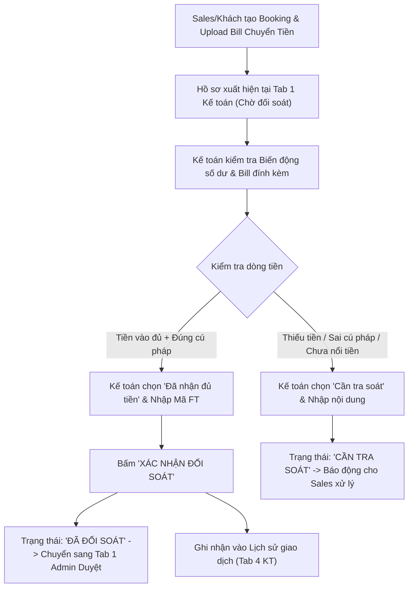
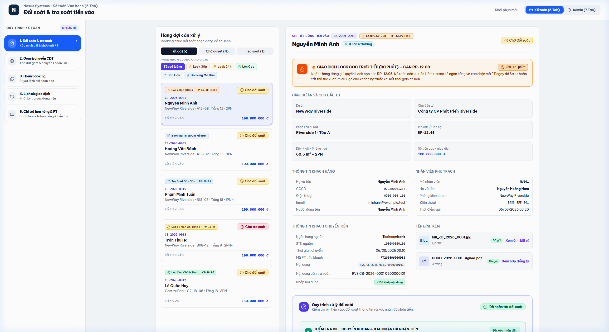

# TÀI LIỆU PHÂN TÍCH YÊU CẦU NGHIỆP VỤ (BA SPECIFICATION)
# PHÂN HỆ KẾ TOÁN - TAB 1: ĐỐI SOÁT & TRA SOÁT TIỀN VÀO

**Dự án:** Hệ thống Quản trị & Vận hành Booking BĐS (NewWay Booking - Final Flow)  
**Phân hệ:** Vận hành Kế toán (Accounting Module)  
**Mã màn hình:** `ACC_TAB_01_RECONCILIATION_AND_AUDIT`

---

## 1. TỔNG QUAN (OVERVIEW)

### 1.1. Mục tiêu nghiệp vụ
1. **Tiếp nhận & Xác minh Bill Chuyển tiền**:
   - Nhân viên Kế toán tiếp nhận các giao dịch nộp tiền Booking/Cọc thiện chí từ Khách hàng thường hoặc Nhân viên đứng tên Booking Ôm.
   - Đối chiếu bill chuyển khoản ngân hàng do Sales tải lên với biến động số dư thực tế trên Internet Banking / Sao kê tài khoản công ty.
2. **Khớp Mã FT & Ghi nhận Số tiền Thực nhận**:
   - Đối soát mã giao dịch ngân hàng (`Mã FT`), số tiền thực nhận, ngày giờ tiền nổi vào tài khoản.
   - Nếu tiền đã khớp $\rightarrow$ Bấm **"Xác nhận đối soát (Đã nhận đủ tiền)"** $\rightarrow$ Hệ thống cập nhật trạng thái `Đã đối soát`, tự động chuyển hồ sơ sang Phân hệ Admin để thẩm định & duyệt cấp Phiếu giữ chỗ.
3. **Quản lý Tra soát Dòng tiền Bất thường**:
   - Trường hợp khách chuyển thiếu tiền, sai cú pháp, hoặc tiền chưa nổi $\rightarrow$ Kế toán chọn kết quả **"Cần tra soát" / "Thiếu tiền"**, nhập nội dung yêu cầu tra soát để Sales/Khách hàng bổ sung chứng từ.

### 1.2. Sơ đồ Luồng Nghiệp vụ (Process Flow)



---

## 2. ĐẶC TẢ CHỨC NĂNG & GIAO DIỆN (FUNCTIONAL SPECIFICATIONS & UI)

### 2.1. Giao diện Mockup Thực tế



### 2.2. Thành phần Giao diện & Tính năng Chi tiết
1. **Bộ lọc trạng thái (Filter Tabs)**:
   - `Tất cả`: Hiển thị toàn bộ danh sách booking.
   - `Chờ đối soát`: Lọc các booking mới nộp tiền cần kế toán kiểm tra.
   - `Cần tra soát`: Lọc các booking có vấn đề về dòng tiền, sai lệch bill.
2. **Bảng danh sách Booking (Reconciliation Table)**:
   - Hiển thị: Mã Booking (`CB-xxxx`), Khách hàng, Dự án/Phân khu/Căn, Số tiền cọc, Thông tin Sales phụ trách, Trạng thái chứng từ (Bill chuyển khoản, Giấy ký giữ chỗ).
   - Cho phép bấm nút "Xem bill" hoặc "Xem giấy ký" để mở Modal xem trước chứng từ PDF/Ảnh.
3. **Cột Form Xác minh Tiền vào (Right Sidebar / Detail Panel)**:
   - **Kết quả xác minh**: Dropdown chọn `Đã nhận đủ tiền`, `Thiếu tiền`, `Sai thông tin`, `Chuyển sang cần tra soát`, `Khác`.
   - **Số tiền thực nhận (VNĐ)**: Mặc định theo số tiền cọc, có thể điều chỉnh nếu khách nộp thiếu/thừa.
   - **Thời gian nhận**: Ngày giờ tiền nổi vào tài khoản công ty.
   - **Mã FT**: Mã giao dịch ngân hàng do Kế toán nhập hoặc đối chiếu từ bill.
   - **Checkbox**: `Tích đã khớp nội dung chuyển khoản theo cú pháp`.
   - **Nội dung tra soát / Ghi chú**: Nhập lý do nếu trạng thái là Cần tra soát.
   - **Nút hành động**: `Xác nhận đối soát` (màu xanh) / `Lưu tra soát` (màu cam).

### 2.3. Danh mục trường dữ liệu (Data Dictionary)

| Tên trường | Kiểu dữ liệu | Bắt buộc | Mô tả & Quy tắc |
| :--- | :---: | :---: | :--- |
| `id` | String | Có | Mã phiếu Booking (VD: `CB-2026-0001`). |
| `customerName` | String | Có | Họ tên khách hàng hoặc nhân viên đứng tên booking ôm. |
| `depositAmount` | Currency | Có | Số tiền cọc quy định (VD: `100,000,000 VNĐ`). |
| `actualReceivedAmount` | Currency | Có | Số tiền thực nhận vào tài khoản ngân hàng. |
| `ftCode` | String | Có khi duyệt | Mã giao dịch ngân hàng (Mã FT). |
| `transferTime` | DateTime | Có | Thời gian khách thực hiện chuyển khoản. |
| `verificationResult` | Enum | Có | Trạng thái xác minh: `Đã nhận đủ tiền`, `Thiếu tiền`, `Cần tra soát`... |
| `isContentMatched` | Boolean | Có | Đã đối chiếu đúng nội dung chuyển khoản. |
| `auditContent` | Text | Không | Nội dung chi tiết cần tra soát bổ sung. |

---

## 3. QUY TẮC NGHIỆP VỤ (BUSINESS RULES & VALIDATIONS)

### 3.1. Các quy tắc xử lý nghiệp vụ (Business Rules - BR)
- **BR-ACC01 (Điều kiện hoàn tất đối soát)**: Kế toán bắt buộc phải nhập `Mã FT` hợp lệ và chọn kết quả `Đã nhận đủ tiền` mới được kích hoạt nút "Xác nhận đối soát".
- **BR-ACC02 (Đẩy dữ liệu liên thông Admin)**: Sau khi Kế toán xác nhận đối soát thành công, hồ sơ tự động chuyển trạng thái sang `Đã đối soát`, đồng thời hiển thị ngay lập tức trên **Tab 1 Admin (Duyệt Booking)**.
- **BR-ACC03 (Tự động ghi Log Lịch sử giao dịch)**: Mỗi lệnh xác nhận đối soát thành công sẽ tự động tạo một bản ghi giao dịch loại `Tiền khách vào` trong **Tab 4 Kế toán (Lịch sử giao dịch)**.

### 3.2. Ma trận Validation Rules
| Hành động | Điều kiện kiểm tra | Thông báo lỗi / Xử lý hệ thống |
| :--- | :--- | :--- |
| **Bấm Xác nhận đối soát** | `ftCode` để trống hoặc chỉ có khoảng trắng. | Cảnh báo: *"Vui lòng nhập Mã giao dịch ngân hàng (Mã FT) để đối soát!"* |
| **Xác nhận Đã nhận đủ tiền** | `actualReceivedAmount` < `depositAmount`. | Yêu cầu chuyển sang trạng thái *"Thiếu tiền / Cần tra soát"*. |

---

## 4. ĐẶC TẢ API & TÍCH HỢP (API SPECIFICATIONS)

### 4.1. Danh sách Endpoints

| STT | Method | Endpoint URI | Mô tả chức năng |
| :---: | :---: | :--- | :--- |
| 1 | `GET` | `/api/v1/accounting/reconciliations` | Lấy danh sách booking cần đối soát theo bộ lọc. |
| 2 | `POST` | `/api/v1/accounting/reconciliations/{id}/confirm` | Kế toán xác nhận đối soát nhận đủ tiền kèm mã FT. |
| 3 | `POST` | `/api/v1/accounting/reconciliations/{id}/audit` | Gắn cờ cần tra soát và gửi thông báo cho Sales. |

---

### 4.2. Chi tiết API & Schema Data

#### API 1: `GET /api/v1/accounting/reconciliations`
* **Mô tả**: Lấy danh sách phiếu booking mới nộp tiền cần Kế toán kiểm tra sao kê ngân hàng và khớp mã FT.
* **Query Parameters**:
  * `status` (string, optional): `PENDING` (Chờ đối soát), `RECONCILED` (Đã đối soát), `NEED_AUDIT` (Cần tra soát).
  * `page` (integer, optional): Trang hiện tại (mặc định: `1`).
  * `limit` (integer, optional): Số bản ghi/trang (mặc định: `20`).

* **Response Schema (200 OK)**:
```json
{
  "success": true,
  "statusCode": 200,
  "data": {
    "total": 2,
    "items": [
      {
        "id": "CB-2026-0001",
        "customerName": "Nguyễn Văn An",
        "customerType": "Khách thường",
        "project": "LUMIÈRE Riverside",
        "subDivision": "Tòa West",
        "assignedUnitCode": "A12-08",
        "depositAmount": 100000000,
        "actualReceivedAmount": 100000000,
        "transferTime": "2026-08-04 09:30",
        "ftCode": "FT262160911223",
        "status": "Chờ đối soát",
        "sales": {
          "code": "NV009",
          "name": "Trần Thị Mai",
          "department": "Sàn Alpha"
        },
        "attachments": {
          "paymentBillUrl": "https://storage.newway.vn/bills/2026/08/Bill_100M_NguyenVanAn.png",
          "bookingDocUrl": "https://storage.newway.vn/docs/2026/08/Phieu_Dang_Ky_A12-08.pdf"
        }
      },
      {
        "id": "CB-2026-0002",
        "customerName": "Lê Hoàng Phúc",
        "customerType": "Booking ôm",
        "project": "LUMIÈRE Riverside",
        "subDivision": "Tòa East",
        "assignedUnitCode": "B15-02",
        "depositAmount": 100000000,
        "actualReceivedAmount": 100000000,
        "transferTime": "2026-08-04 10:15",
        "ftCode": "FT262160988771",
        "status": "Chờ đối soát",
        "sales": {
          "code": "NV009",
          "name": "Trần Thị Mai",
          "department": "Sàn Alpha"
        },
        "attachments": {
          "paymentBillUrl": "https://storage.newway.vn/bills/2026/08/Bill_100M_LeHoangPhuc.png",
          "bookingDocUrl": "https://storage.newway.vn/docs/2026/08/Phieu_Booking_Om_B15-02.pdf"
        }
      }
    ]
  }
}
```

---

#### API 2: `POST /api/v1/accounting/reconciliations/{id}/confirm`
* **Mô tả**: Kế toán xác nhận tiền đã về tài khoản ngân hàng, lưu mã FT và chuyển tiếp hồ sơ sang Admin Tab 1 (Duyệt Booking).
* **Path Parameters**:
  * `id` (string, required): Mã booking (VD: `CB-2026-0001`).
* **Request Body Schema**:
```json
{
  "actualReceivedAmount": "number (Số tiền thực nhận vào tài khoản, VNĐ, required)",
  "ftCode": "string (Mã giao dịch ngân hàng FT, required)",
  "receivedTime": "string (Thời gian tiền nổi, ISO 8601 string)",
  "isContentMatched": "boolean (Đã kiểm tra đúng cú pháp chuyển khoản, required: true)",
  "accountingNote": "string (Ghi chú kế toán)",
  "confirmedBy": "string (Mã Kế toán)"
}
```

* **Request Example**:
```json
{
  "actualReceivedAmount": 100000000,
  "ftCode": "FT262160911223",
  "receivedTime": "2026-08-04T09:35:00Z",
  "isContentMatched": true,
  "accountingNote": "Khớp số tiền 100M tài khoản Techcombank công ty.",
  "confirmedBy": "ACC-001"
}
```

* **Response Schema (200 OK)**:
```json
{
  "success": true,
  "statusCode": 200,
  "message": "Đối soát thành công! Hồ sơ đã chuyển sang Admin để phê duyệt cấp phiếu giữ chỗ.",
  "data": {
    "bookingId": "CB-2026-0001",
    "status": "RECONCILED",
    "statusBadge": "Đã đối soát",
    "ftCode": "FT262160911223",
    "reconciledAt": "2026-08-04T09:40:00Z",
    "forwardedTo": "ADM_TAB_01_APPROVE_BOOKING",
    "loggedToHistory": true
  }
}
```

---

#### API 3: `POST /api/v1/accounting/reconciliations/{id}/audit`
* **Mô tả**: Đánh dấu giao dịch có sai lệch (thiếu tiền, sai cú pháp, chưa nổi tiền) và chuyển sang trạng thái Cần tra soát.
* **Path Parameters**:
  * `id` (string, required): Mã booking (VD: `CB-2026-0003`).
* **Request Body Schema**:
```json
{
  "auditReason": "string (Enum: 'THIEU_TIEN' | 'SAI_CU_PHAP' | 'TIEN_CHUA_NOI' | 'KHAC', required)",
  "actualAmountReceived": "number (Số tiền thực nhận nếu có, VNĐ)",
  "auditContent": "string (Nội dung chi tiết yêu cầu tra soát, required)",
  "auditedBy": "string (Mã Kế toán)"
}
```

* **Request Example**:
```json
{
  "auditReason": "THIEU_TIEN",
  "actualAmountReceived": 50000000,
  "auditContent": "Khách chuyển 50 triệu thay vì 100 triệu tiền booking quy định, yêu cầu chuyển bổ sung 50 triệu.",
  "auditedBy": "ACC-001"
}
```

* **Response Schema (200 OK)**:
```json
{
  "success": true,
  "statusCode": 200,
  "message": "Đã chuyển hồ sơ sang trạng thái Cần tra soát và gửi thông báo cho Sales.",
  "data": {
    "bookingId": "CB-2026-0003",
    "status": "NEED_AUDIT",
    "statusBadge": "Cần tra soát",
    "auditContent": "Khách chuyển 50 triệu thay vì 100 triệu...",
    "updatedAt": "2026-08-04T09:50:00Z"
  }
}
```

---
*Tài liệu BA chuẩn hóa theo hệ thống NewWay Booking Final.*
