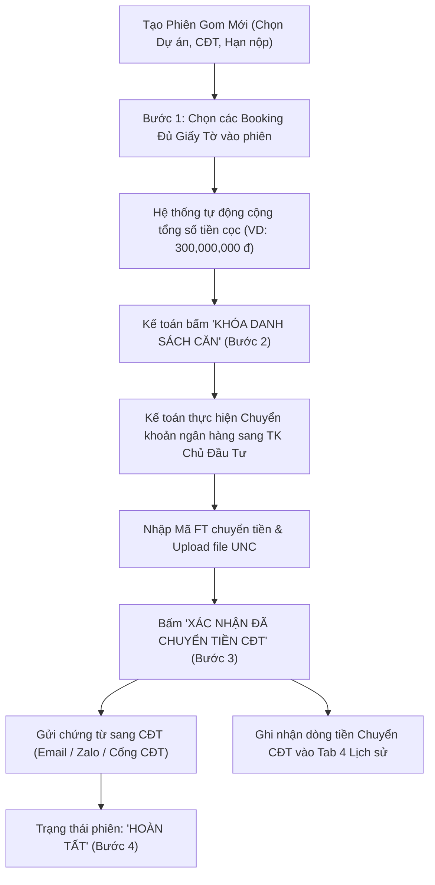
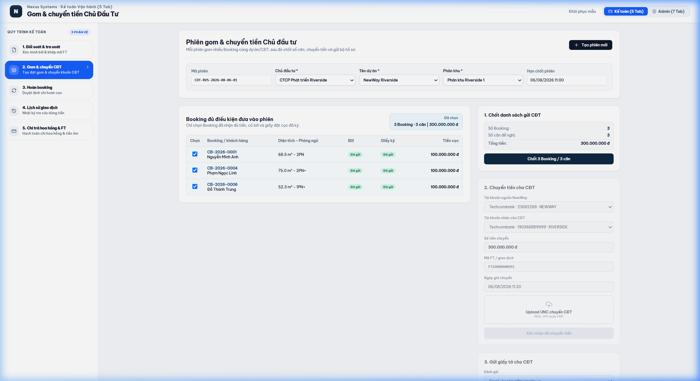

# TÀI LIỆU PHÂN TÍCH YÊU CẦU NGHIỆP VỤ (BA SPECIFICATION)
# PHÂN HỆ KẾ TOÁN - TAB 2: GOM BOOKING & CHUYỂN TIỀN CĐT

**Dự án:** Hệ thống Quản trị & Vận hành Booking BĐS (NewWay Booking - Final Flow)  
**Phân hệ:** Vận hành Kế toán (Accounting Module)  
**Mã màn hình:** `ACC_TAB_02_INVESTOR_SESSION_TRANSFER`

---

## 1. TỔNG QUAN (OVERVIEW)

### 1.1. Mục tiêu nghiệp vụ
1. **Quản lý Phiên Gom Tiền Theo Đợt (Investor Sessions)**:
   - Gom toàn bộ các Booking của cùng một Dự án / Chủ đầu tư (CĐT) có hạn nộp tiền cọc vào một đợt chuyển khoản tập trung (Batch transfer).
2. **Kiểm tra Điều kiện Chứng từ & Khóa Danh sách**:
   - Chỉ cho phép đưa các Booking có trạng thái `Đủ giấy tờ` (Đã có Bill + Giấy ký nguyện vọng giữ chỗ) vào danh sách chuyển CĐT.
   - Bấm **"Khóa danh sách căn"** (Bước 2) để cố định tổng số tiền cần chuyển, ngăn chặn chỉnh sửa phát sinh.
3. **Thực hiện Lệnh Chuyển Tiền & Upload Ủy Nhiệm Chi (UNC)**:
   - Kế toán chuyển tiền từ tài khoản nguồn công ty sang tài khoản CĐT $\rightarrow$ Nhập `Mã FT chuyển CĐT`, thời gian chuyển và upload file Scan Ủy Nhiệm Chi (`UNC_xxxx.pdf`).
   - Bấm **"Xác nhận đã chuyển tiền CĐT"** (Bước 3) $\rightarrow$ Hoàn tất phiên gom và ghi nhận lịch sử dòng tiền.

### 1.2. Sơ đồ Luồng Nghiệp vụ (Process Flow)



---

## 2. ĐẶC TẢ CHỨC NĂNG & GIAO DIỆN (FUNCTIONAL SPECIFICATIONS & UI)

### 2.1. Giao diện Mockup Thực tế



### 2.2. Thành phần Giao diện & Tính năng Chi tiết
1. **Thanh Header Phiên Gom Tiền**:
   - Thông tin: Mã phiên (`CDT-RVS-2026-08-06-01`), Tên Dự án (`NewWay Riverside`), Chủ đầu tư (`Công ty CP Phát triển Riverside`), Hạn chốt nộp tiền (`06/08/2026 11:30`).
   - Nút `+ Tạo đợt gom mới` (Mở Modal tạo phiên).
2. **Thanh Tiến độ Vòng đời 4 Bước (Workflow Stepper)**:
   - `1. Đang gom Booking` $\rightarrow$ `2. Đã chốt căn` $\rightarrow$ `3. Đã chuyển tiền` $\rightarrow$ `4. Hoàn tất`.
3. **Bảng Danh sách Booking Trong Phiên (Left Panel)**:
   - Bảng liệt kê các booking: Checkbox chọn, Mã Booking, Tên Khách, Căn hộ, Tình trạng giấy tờ (`Đủ giấy tờ` / `Thiếu giấy ký`), Số tiền cọc.
   - Nút `Chọn tất cả` / `Bỏ chọn`.
4. **Cột Thông tin Lệnh Chuyển Khoản & UNC (Right Panel)**:
   - **Tổng tiền chuyển (VNĐ)**: Hệ thống tự động tính tổng tiền của các booking được tick chọn.
   - **Tài khoản nguồn**: STK Techcombank của công ty.
   - **Tài khoản đích**: STK thụ hưởng của CĐT dự án.
   - **Mã FT chuyển**: Nhập mã giao dịch ngân hàng chuyển tiền CĐT.
   - **Khu vực Upload UNC**: Kéo thả file PDF/Ảnh UNC ngân hàng.
   - **Nút Xác nhận chuyển tiền**: Cập nhật trạng thái và chuyển sang bước tiếp theo.

### 2.3. Danh mục trường dữ liệu (Data Dictionary)

| Tên trường | Kiểu dữ liệu | Bắt buộc | Mô tả & Quy tắc |
| :--- | :---: | :---: | :--- |
| `sessionId` | String | Có | Mã định danh đợt gom (VD: `CDT-RVS-2026-08-06-01`). |
| `project` | String | Có | Tên dự án BĐS gom cọc. |
| `investor` | String | Có | Tên Chủ đầu tư nhận tiền cọc. |
| `transferAmount` | Currency | Có | Tổng số tiền chuyển khoản sang CĐT. |
| `transferFtCode` | String | Có | Mã giao dịch ngân hàng chuyển khoản sang CĐT. |
| `transferUncFile` | File/URL | Có | Tên tệp hoặc URL bản scan UNC ngân hàng. |
| `currentStep` | Number (1-4) | Có | Tiến độ xử lý phiên gom. |

---

## 3. QUY TẮC NGHIỆP VỤ (BUSINESS RULES & VALIDATIONS)

### 3.1. Các quy tắc xử lý nghiệp vụ (Business Rules - BR)
- **BR-ACC04 (Kiểm soát tính hợp lệ của Booking)**: Booking chỉ được phép đưa vào danh sách gom tiền nếu Kế toán đã xác nhận `Đã đối soát` ở Tab 1 và có trạng thái `Đủ giấy tờ`.
- **BR-ACC05 (Khóa dữ liệu)**: Sau khi đã bấm "Khóa danh sách căn" (Bước 2), danh sách booking trong phiên gom sẽ bị khóa (disable checkbox) để tránh sai lệch tổng tiền chuyển khoản.
- **BR-ACC06 (Bắt buộc đính kèm UNC)**: Kế toán bắt buộc phải đính kèm tệp UNC và nhập Mã FT mới được hoàn tất bước xác nhận chuyển tiền.

---

## 4. ĐẶC TẢ API & TÍCH HỢP (API SPECIFICATIONS)

### 4.1. Danh sách Endpoints

| STT | Method | Endpoint URI | Mô tả chức năng |
| :---: | :---: | :--- | :--- |
| 1 | `GET` | `/api/v1/accounting/sessions/{id}` | Lấy thông tin chi tiết đợt gom tiền và danh sách booking. |
| 2 | `POST` | `/api/v1/accounting/sessions` | Tạo đợt gom tiền CĐT mới. |
| 3 | `POST` | `/api/v1/accounting/sessions/{id}/lock` | Khóa danh sách booking trong đợt gom. |
| 4 | `POST` | `/api/v1/accounting/sessions/{id}/confirm-transfer` | Xác nhận đã chuyển tiền sang CĐT kèm mã FT và UNC. |

---

### 4.2. Chi tiết API & Schema Data

#### API 1: `GET /api/v1/accounting/sessions/{id}`
* **Mô tả**: Lấy thông tin chi tiết của phiên gom tiền, tổng giá trị cọc và danh sách các booking được chọn.
* **Path Parameters**:
  * `id` (string, required): Mã phiên gom (VD: `CDT-RVS-2026-08-06-01`).
* **Response Schema (200 OK)**:
```json
{
  "success": true,
  "statusCode": 200,
  "data": {
    "sessionId": "CDT-RVS-2026-08-06-01",
    "project": "LUMIÈRE Riverside",
    "investor": "Masterise Homes",
    "deadline": "2026-08-06 11:30",
    "currentStep": 1,
    "status": "DRAFT",
    "statusBadge": "Đang gom Booking",
    "totalTransferAmount": 300000000,
    "selectedBookingsCount": 3,
    "sourceAccount": {
      "bank": "Techcombank",
      "accountNumber": "190388889999",
      "accountName": "CONG TY CP BDS NEWWAY"
    },
    "destinationAccount": {
      "bank": "Vietcombank",
      "accountNumber": "0071009988776",
      "accountName": "MASTERISE HOMES JSC"
    },
    "bookings": [
      {
        "id": "CB-2026-0001",
        "customerName": "Nguyễn Văn An",
        "unitCode": "A12-08",
        "docStatus": "Đủ giấy tờ",
        "depositAmount": 100000000,
        "selected": true
      },
      {
        "id": "CB-2026-0002",
        "customerName": "Lê Hoàng Phúc",
        "unitCode": "B15-02",
        "docStatus": "Đủ giấy tờ",
        "depositAmount": 100000000,
        "selected": true
      },
      {
        "id": "CB-2026-0004",
        "customerName": "Trần Thị Lan",
        "unitCode": "A18-05",
        "docStatus": "Đủ giấy tờ",
        "depositAmount": 100000000,
        "selected": true
      }
    ]
  }
}
```

---

#### API 2: `POST /api/v1/accounting/sessions`
* **Mô tả**: Tạo một phiên gom tiền cọc mới theo Dự án và Chủ đầu tư.
* **Request Body Schema**:
```json
{
  "projectId": "string (Mã dự án, required)",
  "investor": "string (Tên chủ đầu tư, required)",
  "deadline": "string (Hạn chót nộp cọc CĐT, ISO 8601 string, required)",
  "createdBy": "string (Mã Kế toán)"
}
```

* **Request Example**:
```json
{
  "projectId": "PRJ-LUMIERE",
  "investor": "Masterise Homes",
  "deadline": "2026-08-06T11:30:00Z",
  "createdBy": "ACC-001"
}
```

* **Response Schema (201 Created)**:
```json
{
  "success": true,
  "statusCode": 201,
  "message": "Tạo phiên gom tiền CĐT thành công.",
  "data": {
    "sessionId": "CDT-LMR-2026-08-06-02",
    "project": "LUMIÈRE Riverside",
    "investor": "Masterise Homes",
    "deadline": "2026-08-06T11:30:00Z",
    "currentStep": 1,
    "createdAt": "2026-08-05T08:00:00Z"
  }
}
```

---

#### API 3: `POST /api/v1/accounting/sessions/{id}/lock`
* **Mô tả**: Khóa danh sách booking trong phiên gom (Bước 2) để cố định tổng số tiền trước khi lập lệnh chuyển khoản ngân hàng.
* **Path Parameters**:
  * `id` (string, required): Mã phiên gom (VD: `CDT-RVS-2026-08-06-01`).
* **Request Body Schema**:
```json
{
  "selectedBookingIds": "array of string (Danh sách mã booking chốt: ['CB-2026-0001', 'CB-2026-0002'], required)"
}
```

* **Response Schema (200 OK)**:
```json
{
  "success": true,
  "statusCode": 200,
  "message": "Đã khóa danh sách 3 căn trong phiên gom. Tổng tiền chuyển cố định: 300,000,000 đ.",
  "data": {
    "sessionId": "CDT-RVS-2026-08-06-01",
    "currentStep": 2,
    "status": "LOCKED",
    "statusBadge": "Đã chốt căn",
    "lockedBookingsCount": 3,
    "totalLockedAmount": 300000000
  }
}
```

---

#### API 4: `POST /api/v1/accounting/sessions/{id}/confirm-transfer`
* **Mô tả**: Kế toán tải lên file Scan Ủy Nhiệm Chi (UNC) và nhập Mã FT ngân hàng để hoàn tất chuyển tiền sang CĐT.
* **Path Parameters**:
  * `id` (string, required): Mã phiên gom (VD: `CDT-RVS-2026-08-06-01`).
* **Request Body Schema**:
```json
{
  "transferFtCode": "string (Mã giao dịch FT chuyển tiền sang CĐT, required)",
  "uncFileUrl": "string (URL tệp PDF/Ảnh scan Ủy nhiệm chi ngân hàng, required)",
  "transferredAt": "string (Thời gian thực hiện giao dịch, ISO 8601 string)",
  "confirmedBy": "string (Mã Kế toán)"
}
```

* **Request Example**:
```json
{
  "transferFtCode": "FT262170993322",
  "uncFileUrl": "https://storage.newway.vn/unc/2026/08/UNC_300M_MasteriseHomes.pdf",
  "transferredAt": "2026-08-06T10:15:00Z",
  "confirmedBy": "ACC-001"
}
```

* **Response Schema (200 OK)**:
```json
{
  "success": true,
  "statusCode": 200,
  "message": "Xác nhận chuyển tiền CĐT thành công! Đã ghi nhận dòng tiền và sẵn sàng gửi chứng từ sang CĐT.",
  "data": {
    "sessionId": "CDT-RVS-2026-08-06-01",
    "currentStep": 4,
    "status": "COMPLETED",
    "statusBadge": "Hoàn tất",
    "transferFtCode": "FT262170993322",
    "uncFileUrl": "https://storage.newway.vn/unc/2026/08/UNC_300M_MasteriseHomes.pdf",
    "loggedToTransactionHistory": true
  }
}
```

---
*Tài liệu BA chuẩn hóa theo hệ thống NewWay Booking Final.*
