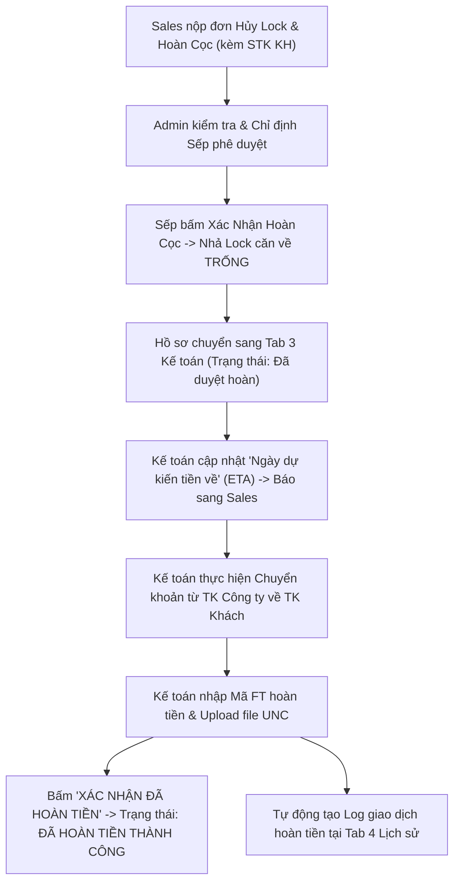
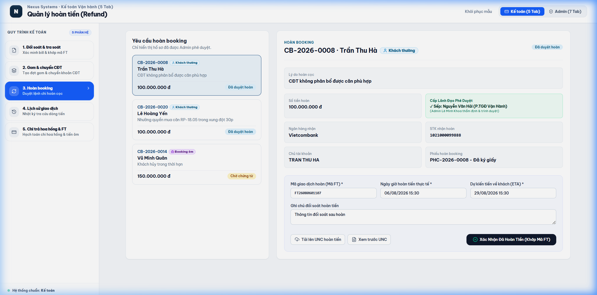

# TÀI LIỆU PHÂN TÍCH YÊU CẦU NGHIỆP VỤ (BA SPECIFICATION)
# PHÂN HỆ KẾ TOÁN - TAB 3: QUẢN LÝ HOÀN TIỀN (REFUND)

**Dự án:** Hệ thống Quản trị & Vận hành Booking BĐS (NewWay Booking - Final Flow)  
**Phân hệ:** Vận hành Kế toán (Accounting Module)  
**Mã màn hình:** `ACC_TAB_03_REFUND_MANAGEMENT`

---

## 1. TỔNG QUAN (OVERVIEW)

### 1.1. Mục tiêu nghiệp vụ
1. **Tiếp nhận Yêu cầu Hoàn Tiền Đã Qua 2 Cấp Duyệt (Admin & Sếp/Ban Lãnh Đạo)**:
   - Tiếp nhận các yêu cầu hủy lock căn và hoàn cọc từ Sales sau khi đã được **Admin thẩm định** và **Sếp (Ban Lãnh Đạo / Giám Đốc Khối) bấm xác nhận phê duyệt**.
   - Căn hộ trên giỏ hàng đã được hệ thống tự động nhả lock về trạng thái `Trống (Sẵn sàng)`.
2. **Cập nhật Ngày Dự Kiến Tiền Về (ETA Payment Date)**:
   - Kế toán tiếp nhận lệnh chi, cập nhật thời gian dự kiến tiền nổi vào STK của khách hàng (VD: *15:00 ngày 29/08/2026*).
   - Hệ thống tự động đẩy thông báo và timeline thời gian thực sang màn hình Sales để Sales chủ động giải đáp khách.
3. **Chi Trả Hoàn Tiền & Nhập Mã FT Đối Soát**:
   - Kế toán thực hiện lệnh chuyển khoản qua Internet Banking theo đúng thông tin thụ hưởng (Ngân hàng, STK, Tên chủ TK).
   - Tải file scan UNC và nhập `Mã FT hoàn tiền` $\rightarrow$ Bấm **"Xác nhận đã hoàn tiền"** $\rightarrow$ Hệ thống cập nhật trạng thái `ĐÃ HOÀN TIỀN THÀNH CÔNG` (Closed).

### 1.2. Sơ đồ Luồng Nghiệp vụ (Process Flow)



---

## 2. ĐẶC TẢ CHỨC NĂNG & GIAO DIỆN (FUNCTIONAL SPECIFICATIONS & UI)

### 2.1. Giao diện Mockup Thực tế



### 2.2. Thành phần Giao diện & Tính năng Chi tiết
1. **Danh sách Hồ sơ Yêu cầu Hoàn Cọc (Left Table)**:
   - Hiển thị: Mã Booking (`CB-xxxx`), Khách hàng, Mã căn hủy lock, Số tiền hoàn (VNĐ), Lý do hoàn cọc, **Người xác nhận (Sếp phê duyệt)**, Trạng thái (`Chờ chi tiền` / `Đã hoàn tiền`).
2. **Cột Form Xử Lý Lệnh Chi Hoàn Tiền & Cập Nhật ETA (Right Detail Panel)**:
   - **Thông tin thụ hưởng của Khách**: Ngân hàng, Số tài khoản, Tên chủ tài khoản, Số tiền cọc cần hoàn.
   - **Cấp phê duyệt**: Hiển thị rõ *"Admin: Lê Minh Khoa thẩm định"* và *"Sếp phê duyệt: Nguyễn Văn Hải (GĐ Khối) đã xác nhận"*.
   - **Dự kiến thời gian tiền về (ETA)**: Ô chọn ngày & giờ dự kiến hoàn tất chi tiền (tự động đồng bộ sang Sales).
   - **Mã FT hoàn tiền**: Ô nhập mã giao dịch ngân hàng chuyển tiền hoàn.
   - **Thời gian hoàn tiền thực tế**: Ngày giờ thực hiện lệnh chi.
   - **Upload UNC hoàn tiền**: Khu vực đính kèm file scan UNC chuyển khoản trả khách.
   - **Nút Xác nhận đã hoàn tiền**: Đóng hồ sơ và gửi thông báo hoàn tiền thành công.

### 2.3. Danh mục trường dữ liệu (Data Dictionary)

| Tên trường | Kiểu dữ liệu | Bắt buộc | Mô tả & Quy tắc |
| :--- | :---: | :---: | :--- |
| `id` | String | Có | Mã phiếu Booking yêu cầu hoàn (VD: `CB-2026-0008`). |
| `unitCode` | String | Có | Mã căn hộ hủy lock hoàn cọc (VD: `RP-18.05`, `LMR-B15.02`). |
| `customerName` | String | Có | Họ tên khách hàng nhận tiền hoàn. |
| `refundAmount` | Currency | Có | Số tiền cọc thực tế hoàn trả cho khách. |
| `receivingBank` | String | Có | Tên ngân hàng thụ hưởng của khách hàng. |
| `receivingAccount` | String | Có | Số tài khoản ngân hàng của khách. |
| `accountHolder` | String | Có | Họ tên chủ tài khoản thụ hưởng. |
| `assignedApprover` | String | Có | Họ tên Sếp / Cấp lãnh đạo đã ký duyệt hoàn cọc. |
| `etaRefundDate` | DateTime | Có | Ngày giờ dự kiến tiền về tài khoản khách hàng. |
| `refundFtCode` | String | Có khi hoàn | Mã giao dịch ngân hàng lệnh chi hoàn tiền. |
| `refundTime` | DateTime | Có khi hoàn | Thời gian thực hiện chuyển tiền hoàn cọc. |
| `uncFile` | File/URL | Không | File đính kèm UNC lệnh chi hoàn tiền. |

---

## 3. QUY TẮC NGHIỆP VỤ (BUSINESS RULES & VALIDATIONS)

### 3.1. Các quy tắc xử lý nghiệp vụ (Business Rules - BR)
- **BR-ACC07 (Điều kiện chi hoàn tiền)**: Kế toán chỉ được phép thực hiện chi hoàn tiền đối với các hồ sơ đã có xác nhận phê duyệt từ Sếp / Ban Lãnh Đạo (`assignedApprover`).
- **BR-ACC08 (Cập nhật ETA minh bạch cho Sales)**: Khi tiếp nhận hồ sơ hoàn cọc, Kế toán cần thiết lập `etaRefundDate` để Sales có căn cứ thời gian phản hồi với khách hàng.
- **BR-ACC09 (Tính toàn vẹn của Mã FT)**: Mỗi lệnh hoàn tiền bắt buộc phải có `Mã FT hoàn` duy nhất để đối soát dòng tiền ra trên sao kê ngân hàng.

---

## 4. ĐẶC TẢ API & TÍCH HỢP (API SPECIFICATIONS)

### 4.1. Danh sách Endpoints

| STT | Method | Endpoint URI | Mô tả chức năng |
| :---: | :---: | :--- | :--- |
| 1 | `GET` | `/api/v1/accounting/refunds` | Lấy danh sách yêu cầu hoàn cọc cần kế toán chi trả. |
| 2 | `POST` | `/api/v1/accounting/refunds/{id}/execute` | Kế toán xác nhận đã chi hoàn tiền kèm mã FT và UNC. |

---

### 4.2. Chi tiết API & Schema Data

#### API 1: `GET /api/v1/accounting/refunds`
* **Mô tả**: Lấy danh sách yêu cầu hoàn tiền cọc thiện chí đã được Admin phê duyệt hoặc đã chi trả thành công.
* **Query Parameters**:
  * `status` (string, optional): `APPROVED_REFUND` (Đã duyệt hoàn - chờ chi), `COMPLETED` (Đã hoàn tiền).

* **Response Schema (200 OK)**:
```json
{
  "success": true,
  "statusCode": 200,
  "data": {
    "total": 1,
    "items": [
      {
        "id": "CB-2026-0008",
        "customerName": "Lê Hoài Nam",
        "project": "LUMIÈRE Riverside",
        "refundAmount": 100000000,
        "refundReason": "Không khớp được căn 3PN tòa West theo đúng nguyện vọng",
        "approvedBy": "Nguyễn Hoàng Nam (Admin)",
        "approvedAt": "2026-08-05 15:00",
        "bankInfo": {
          "bankName": "Techcombank",
          "accountNumber": "19034567890123",
          "accountHolder": "LE HOAI NAM"
        },
        "status": "APPROVED_REFUND",
        "statusBadge": "Đã duyệt hoàn",
        "refundFtCode": null,
        "refundTime": null
      }
    ]
  }
}
```

---

#### API 2: `POST /api/v1/accounting/refunds/{id}/execute`
* **Mô tả**: Kế toán xác nhận đã chuyển khoản hoàn tiền cọc cho khách hàng, lưu mã FT và file Scan UNC.
* **Path Parameters**:
  * `id` (string, required): Mã booking (VD: `CB-2026-0008`).
* **Request Body Schema**:
```json
{
  "refundFtCode": "string (Mã giao dịch ngân hàng lệnh chi hoàn tiền, required)",
  "refundTime": "string (Thời gian thực hiện chuyển tiền, ISO 8601 string)",
  "uncFileUrl": "string (URL tệp scan UNC hoàn tiền, optional)",
  "accountingNote": "string (Ghi chú đối soát sổ cái)",
  "executedBy": "string (Mã Kế toán)"
}
```

* **Request Example**:
```json
{
  "refundFtCode": "FT262170881144",
  "refundTime": "2026-08-05T16:00:00Z",
  "uncFileUrl": "https://storage.newway.vn/unc/2026/08/UNC_Hoan_100M_LeHoaiNam.pdf",
  "accountingNote": "Đã chuyển tiền hoàn cọc từ tài khoản Techcombank công ty sang Techcombank khách hàng.",
  "executedBy": "ACC-001"
}
```

* **Response Schema (200 OK)**:
```json
{
  "success": true,
  "statusCode": 200,
  "message": "Đã hoàn tiền thành công! Trạng thái booking chuyển sang Đã hoàn booking.",
  "data": {
    "bookingId": "CB-2026-0008",
    "status": "COMPLETED",
    "statusBadge": "Đã hoàn booking",
    "refundFtCode": "FT262170881144",
    "refundedAt": "2026-08-05T16:00:00Z",
    "loggedToTransactionHistory": true
  }
}
```

---
*Tài liệu BA chuẩn hóa theo hệ thống NewWay Booking Final.*
