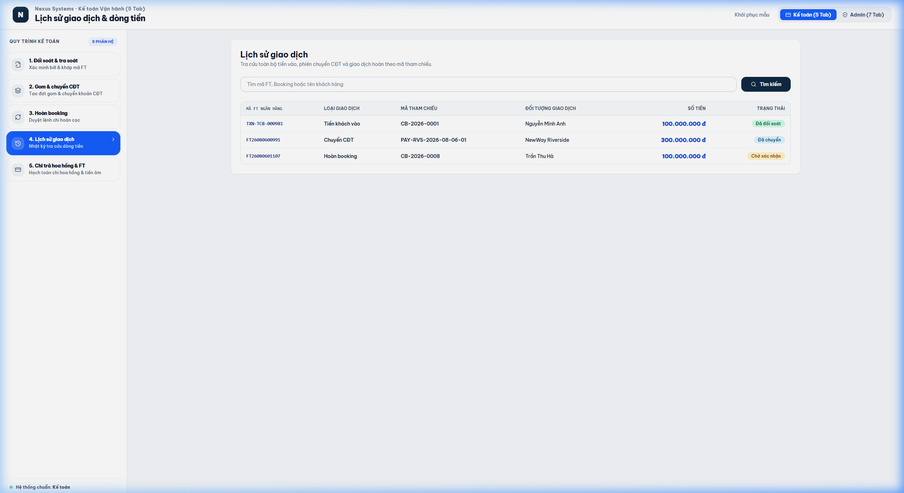

# TÀI LIỆU PHÂN TÍCH YÊU CẦU NGHIỆP VỤ (BA SPECIFICATION)
# PHÂN HỆ KẾ TOÁN - TAB 4: LỊCH SỬ GIAO DỊCH & DÒNG TIỀN

**Dự án:** Hệ thống Quản trị & Vận hành Booking BĐS (NewWay Booking - Final Flow)  
**Phân hệ:** Vận hành Kế toán (Accounting Module)  
**Mã màn hình:** `ACC_TAB_04_TRANSACTION_AUDIT_LOG`

---

## 1. TỔNG QUAN (OVERVIEW)

### 1.1. Mục tiêu nghiệp vụ
1. **Sổ cái Tra cứu Dòng tiền Tập trung**:
   - Ghi nhận và hiển thị tự động toàn bộ nhật ký các giao dịch tài chính phát sinh trong hệ thống bao gồm:
     - `Tiền khách vào`: Thu tiền cọc thiện chí / booking từ khách hàng hoặc nhân viên.
     - `Chuyển CĐT`: Chi tiền gom cọc chuyển khoản sang Chủ đầu tư.
     - `Hoàn booking`: Chi tiền hoàn cọc trả lại cho khách hàng.
2. **Hỗ trợ Đối soát & Kiểm toán Tài chính**:
   - Cung cấp công cụ tìm kiếm tức thời theo `Mã FT`, `Mã Booking`, `Đợt gom`, hoặc `Đối tượng giao dịch`.
   - Giúp Kế toán trưởng và Ban Kiểm soát đối soát 100% khớp đúng giữa biến động trên hệ thống và sao kê tài khoản ngân hàng thực tế.

---

## 2. ĐẶC TẢ CHỨC NĂNG & GIAO DIỆN (FUNCTIONAL SPECIFICATIONS & UI)

### 2.1. Giao diện Mockup Thực tế



### 2.2. Thành phần Giao diện & Tính năng Chi tiết
1. **Thanh Tìm Kiếm Nhanh (Search Bar)**:
   - Ô nhập từ khóa tìm kiếm: Tìm theo Mã FT, Mã Booking (`CB-xxxx`), Tên khách hàng, Tên Chủ đầu tư, Loại giao dịch.
2. **Bảng Nhật Ký Giao Dịch (Transaction Audit Table)**:
   - **Mã FT**: Mã giao dịch ngân hàng do hệ thống hoặc kế toán ghi nhận.
   - **Loại giao dịch**: Badge phân biệt màu sắc:
     - `Tiền khách vào` (Xanh lá - Emerald)
     - `Chuyển CĐT` (Xanh da trời - Sky)
     - `Hoàn booking` (Hồng/Đỏ - Rose)
   - **Mã Booking / Đợt gom**: Mã chứng từ nghiệp vụ liên quan.
   - **Đối tượng**: Tên khách hàng hoặc tên Chủ đầu tư thụ hưởng.
   - **Số tiền (VNĐ)**: Số tiền giao dịch hiển thị định dạng chuẩn tiền tệ.
   - **Trạng thái**: `Đã đối soát`, `Đã chuyển`, `Đã hoàn booking`, `Chờ xác nhận`.
   - **Ngày giờ**: Timestamp thời điểm phát sinh giao dịch.

### 2.3. Danh mục trường dữ liệu (Data Dictionary)

| Tên trường | Kiểu dữ liệu | Bắt buộc | Mô tả & Quy tắc |
| :--- | :---: | :---: | :--- |
| `id` | String | Có | Mã định danh bản ghi log (VD: `TXN-1787297288`). |
| `ftCode` | String | Có | Mã FT giao dịch ngân hàng. |
| `type` | Enum | Có | Loại giao dịch: `Tiền khách vào`, `Chuyển CĐT`, `Hoàn booking`. |
| `bookingOrBatch` | String | Có | Mã Booking hoặc Mã phiên gom tiền liên quan. |
| `target` | String | Có | Tên khách hàng hoặc CĐT liên quan. |
| `amount` | Currency | Có | Số tiền giao dịch (VNĐ). |
| `status` | Enum | Có | Trạng thái ghi nhận sổ cái. |
| `date` | DateTime | Có | Thời gian giao dịch phát sinh. |

---

## 3. QUY TẮC NGHIỆP VỤ (BUSINESS RULES & VALIDATIONS)

### 3.1. Các quy tắc xử lý nghiệp vụ (Business Rules - BR)
- **BR-ACC09 (Tính bất biến của Nhật ký giao dịch - Immutable Log)**: Các bản ghi trong bảng lịch sử giao dịch được hệ thống sinh tự động từ các Tab 1, Tab 2, Tab 3, Tab 5 và **không được phép xóa hoặc chỉnh sửa thủ công**.
- **BR-ACC10 (Tự động đồng bộ)**: Bất kỳ thao tác chuyển trạng thái tài chính nào thành công đều phải bắn event tạo bản ghi lịch sử ngay lập tức.

---

## 4. ĐẶC TẢ API & TÍCH HỢP (API SPECIFICATIONS)

### 4.1. Danh sách Endpoints

| STT | Method | Endpoint URI | Mô tả chức năng |
| :---: | :---: | :--- | :--- |
| 1 | `GET` | `/api/v1/accounting/transactions` | Lấy danh sách lịch sử giao dịch toàn hệ thống có phân trang và bộ lọc. |

---

### 4.2. Chi tiết API & Schema Data

#### API 1: `GET /api/v1/accounting/transactions`
* **Mô tả**: Tra cứu toàn bộ dòng tiền vào/ra trên sổ cái hệ thống theo mã FT, mã booking, loại giao dịch hoặc khoảng thời gian.
* **Query Parameters**:
  * `keyword` (string, optional): Tìm theo mã FT, mã booking, tên khách hàng hoặc CĐT.
  * `type` (string, optional): `INFLOW` (Tiền khách vào), `OUTFLOW_INVESTOR` (Chuyển CĐT), `REFUND` (Hoàn booking), `COMMISSION` (Chi hoa hồng).
  * `fromDate` (string, optional): Ngày bắt đầu `YYYY-MM-DD`.
  * `toDate` (string, optional): Ngày kết thúc `YYYY-MM-DD`.
  * `page` (integer, optional): Trang hiện tại (mặc định: `1`).
  * `limit` (integer, optional): Số bản ghi/trang (mặc định: `50`).

* **Response Schema (200 OK)**:
```json
{
  "success": true,
  "statusCode": 200,
  "data": {
    "total": 4,
    "page": 1,
    "limit": 50,
    "items": [
      {
        "id": "TXN-001",
        "ftCode": "FT262160911223",
        "type": "Tiền khách vào",
        "bookingOrBatch": "CB-2026-0001",
        "target": "Nguyễn Văn An",
        "amount": 100000000,
        "status": "Đã đối soát",
        "date": "2026-08-04 09:35"
      },
      {
        "id": "TXN-002",
        "ftCode": "FT262170993322",
        "type": "Chuyển CĐT",
        "bookingOrBatch": "CDT-RVS-2026-08-06-01",
        "target": "Masterise Homes",
        "amount": 300000000,
        "status": "Đã chuyển",
        "date": "2026-08-06 10:15"
      },
      {
        "id": "TXN-003",
        "ftCode": "FT262170881144",
        "type": "Hoàn booking",
        "bookingOrBatch": "CB-2026-0008",
        "target": "Lê Hoài Nam",
        "amount": 100000000,
        "status": "Đã hoàn booking",
        "date": "2026-08-05 16:00"
      },
      {
        "id": "TXN-004",
        "ftCode": "FT262180556677",
        "type": "Chi hoa hồng",
        "bookingOrBatch": "HH-2026-001 (RP-12.08)",
        "target": "Nguyễn Hoàng Nam (Sales)",
        "amount": 167825000,
        "status": "Đã chi trả",
        "date": "2026-08-06 14:00"
      }
    ]
  }
}
```

---
*Tài liệu BA chuẩn hóa theo hệ thống NewWay Booking Final.*
