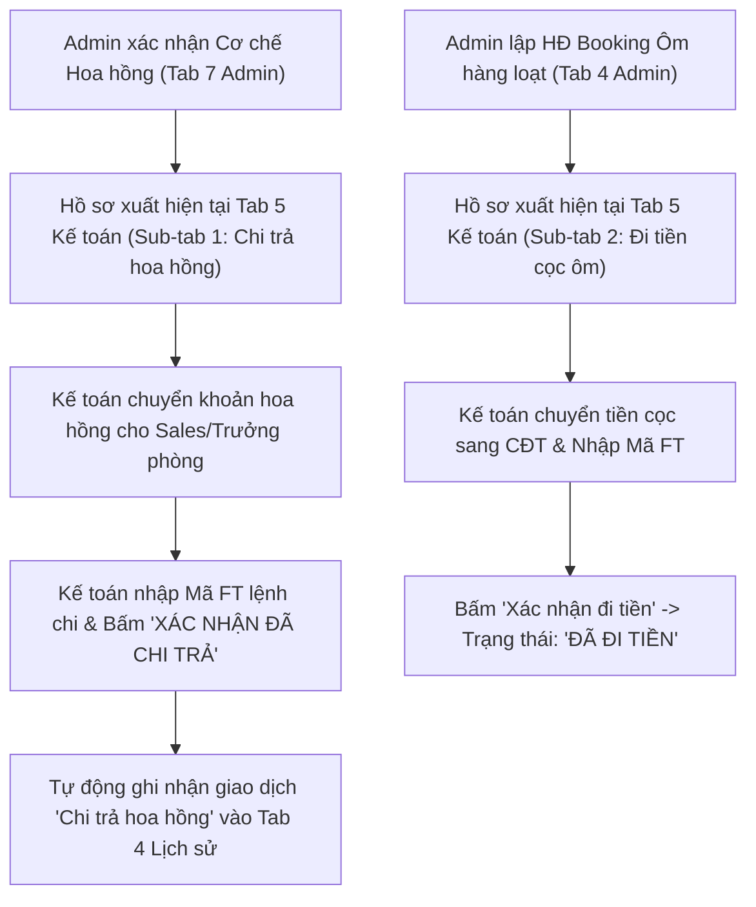
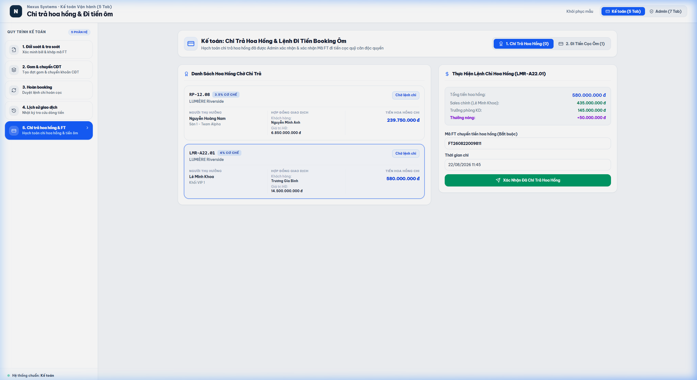

# TÀI LIỆU PHÂN TÍCH YÊU CẦU NGHIỆP VỤ (BA SPECIFICATION)
# PHÂN HỆ KẾ TOÁN - TAB 5: CHI TRẢ HOA HỒNG & LỆNH ĐI TIỀN CỌC ÔM

**Dự án:** Hệ thống Quản trị & Vận hành Booking BĐS (NewWay Booking - Chuẩn Hóa Theo Untitled.pdf)  
**Phân hệ:** Vận hành Kế toán (Accounting Module)  
**Mục quy trình trong PDF:** `Mục 1 (Đi tiền cọc ôm) & Mục 7 (Chi trả cơ chế hoa hồng)`  
**Mã màn hình:** `ACC_TAB_05_COMMISSION_PAYOUT_AND_BULK_DEPOSIT`

---

## 1. TỔNG QUAN (OVERVIEW)

### 1.1. Mục tiêu nghiệp vụ
1. **Phân hệ Con 1: Chi Trả Hoa Hồng Bán Hàng**:
   - Tiếp nhận các hồ sơ Đề xuất Cơ chế Hoa hồng đã được Admin thẩm định và bấm **"Xác nhận cơ chế"** tại Tab 7 Admin.
   - Kế toán kiểm tra số tiền hoa hồng của Sales chính, Trưởng phòng và Thưởng nóng $\rightarrow$ Thực hiện lệnh chuyển khoản thanh toán.
   - Nhập `Mã FT ngân hàng` lệnh chi hoa hồng và đính kèm Ủy Nhiệm Chi $\rightarrow$ Ghi nhận hoàn tất chi trả vào Sổ cái Tab 4.
2. **Phân hệ Con 2: Xác nhận Đi Tiền Cọc Booking Ôm**:
   - Tiếp nhận danh sách Hợp đồng Booking Ôm do Admin tạo (đứng tên nhân sự HR) $\rightarrow$ Kế toán chi tiền cọc sang CĐT.
   - Điền `Mã FT ngân hàng` vào từng hợp đồng $\rightarrow$ Kích hoạt trạng thái `Đã đi tiền` để chuyển sang chờ CĐT công bố kết quả.

### 1.2. Sơ đồ Luồng Nghiệp vụ (Process Flow)



---

## 2. ĐẶC TẢ CHỨC NĂNG & GIAO DIỆN (FUNCTIONAL SPECIFICATIONS & UI)

### 2.1. Giao diện Mockup Thực tế



### 2.2. Thành phần Giao diện & Tính năng Chi tiết
1. **Nút Chuyển Đổi Phân Hệ Con (Sub-Tab Switcher)**:
   - `1. Chi Trả Hoa Hồng`: Quản lý danh sách hồ sơ hoa hồng chờ lệnh chi.
   - `2. Đi Tiền Cọc Ôm`: Quản lý danh sách hợp đồng ôm cần đi tiền cọc sang CĐT.
2. **Giao diện Phân hệ Chi Trả Hoa Hồng (Sub-tab 1)**:
   - **Cột Trái**: Danh sách hồ sơ hoa hồng đã được Admin xác nhận (Mã căn, Sales chính, Sàn, Giá trị HĐ, Tổng tiền hoa hồng).
   - **Cột Phải**: Khung thực hiện lệnh chi (Bóc tách tiền Sales, Trưởng phòng, Thưởng nóng, Ô nhập Mã FT ngân hàng, Thời gian chi, Nút `Xác Nhận Đã Chi Trả Hoa Hồng`).
3. **Giao diện Phân hệ Đi Tiền Cọc Ôm (Sub-tab 2)**:
   - Bảng danh sách hợp đồng ôm: Mã HĐ (`HĐ-OM-xxxx`), Nhân sự đứng tên (HR), Sales tư vấn, Dự án & Căn, Số tiền cọc, Cú pháp chuyển khoản, Ô nhập Mã FT ngân hàng, Nút `Xác nhận đi tiền`.

### 2.3. Danh mục trường dữ liệu (Data Dictionary)

| Tên trường | Kiểu dữ liệu | Bắt buộc | Mô tả & Quy tắc |
| :--- | :---: | :---: | :--- |
| `id` | String | Có | Mã hồ sơ hoa hồng hoặc Mã HĐ ôm. |
| `unitCode` | String | Có | Mã căn hộ liên quan. |
| `totalCommissionAmount` | Currency | Có khi chi HH | Tổng số tiền hoa hồng chi trả. |
| `ftCode` | String | Có | Mã FT giao dịch ngân hàng lệnh chi. |
| `payoutStatus` | Enum | Có | `'Chờ chi'` \| `'Đã chi trả'` (hoặc `'Chờ đi tiền'` \| `'Đã đi tiền'`). |
| `payoutTime` | DateTime | Có | Thời gian thực hiện chuyển tiền. |

---

## 3. QUY TẮC NGHIỆP VỤ (BUSINESS RULES & VALIDATIONS)

### 3.1. Các quy tắc xử lý nghiệp vụ (Business Rules - BR)
- **BR-ACC13 (Bảo toàn số liệu hoa hồng)**: Kế toán không được phép sửa đổi cơ cấu phân chia hoa hồng mà chỉ thực hiện chi đúng số tiền đã được Ban Lãnh đạo và Admin phê duyệt.
- **BR-ACC14 (Bắt buộc Mã FT)**: Cả lệnh chi hoa hồng và lệnh đi tiền cọc ôm bắt buộc phải có `Mã FT` hợp lệ mới cho phép hoàn tất giao dịch.

---

## 4. ĐẶC TẢ API & TÍCH HỢP (API SPECIFICATIONS)

### 4.1. Danh sách Endpoints

| STT | Method | Endpoint URI | Mô tả chức năng |
| :---: | :---: | :--- | :--- |
| 1 | `GET` | `/api/v1/accounting/commissions/pending-payout` | Lấy danh sách hoa hồng đã duyệt chờ kế toán chi trả. |
| 2 | `POST` | `/api/v1/accounting/commissions/{id}/execute-payout` | Kế toán xác nhận đã chi trả hoa hồng kèm mã FT. |
| 3 | `POST` | `/api/v1/accounting/bulk-contracts/{id}/confirm-payout` | Kế toán xác nhận đi tiền cọc ôm kèm mã FT. |

---

### 4.2. Chi tiết API & Schema Data

#### API 1: `GET /api/v1/accounting/commissions/pending-payout`
* **Mô tả**: Lấy danh sách hồ sơ hoa hồng đã được Admin xác nhận (từ Tab 7 Admin) đang chờ Kế toán lập lệnh chi.
* **Response Schema (200 OK)**:
```json
{
  "success": true,
  "statusCode": 200,
  "data": {
    "total": 1,
    "items": [
      {
        "id": "HH-2026-001",
        "unitCode": "RP-12.08",
        "project": "LUMIÈRE Riverside",
        "customerName": "Nguyễn Văn An",
        "dealValue": 6850000000,
        "commissionRate": 3.5,
        "totalCommissionAmount": 239750000,
        "beneficiaries": {
          "salesName": "Nguyễn Hoàng Nam",
          "salesDepartment": "Sàn 1 - Team Alpha",
          "salesAmount": 167825000,
          "salesBankAccount": "190399887766 (Techcombank)",
          "managerName": "Trần Văn Hùng",
          "managerAmount": 71925000,
          "managerBankAccount": "0071001122334 (Vietcombank)"
        },
        "bonusAmount": 20000000,
        "adminConfirmedBy": "Nguyễn Hoàng Nam (Admin)",
        "adminConfirmedAt": "2026-08-05 17:30",
        "accountingPayoutStatus": "Chờ lệnh chi"
      }
    ]
  }
}
```

---

#### API 2: `POST /api/v1/accounting/commissions/{id}/execute-payout`
* **Mô tả**: Kế toán xác nhận đã chuyển khoản chi trả hoa hồng cho Sales / Trưởng phòng, lưu mã FT và ghi nhận sổ cái.
* **Path Parameters**:
  * `id` (string, required): Mã hồ sơ hoa hồng (VD: `HH-2026-001`).
* **Request Body Schema**:
```json
{
  "ftCode": "string (Mã giao dịch ngân hàng lệnh chi hoa hồng, required)",
  "payoutTime": "string (Thời gian thực hiện chuyển tiền, ISO 8601 string)",
  "totalAmountPaid": "number (Tổng số tiền thực chi, VNĐ, required)",
  "accountingNote": "string (Ghi chú đối soát)",
  "paidBy": "string (Mã Kế toán)"
}
```

* **Request Example**:
```json
{
  "ftCode": "FT262180556677",
  "payoutTime": "2026-08-06T14:00:00Z",
  "totalAmountPaid": 239750000,
  "accountingNote": "Đã chi trả hoa hồng Sales và Trưởng phòng qua Internet Banking Techcombank.",
  "paidBy": "ACC-001"
}
```

* **Response Schema (200 OK)**:
```json
{
  "success": true,
  "statusCode": 200,
  "message": "Chi trả hoa hồng thành công! Đã ghi nhận mã FT và cập nhật sổ cái lịch sử giao dịch.",
  "data": {
    "commissionId": "HH-2026-001",
    "payoutStatus": "Đã chi trả",
    "ftCode": "FT262180556677",
    "paidAt": "2026-08-06T14:00:00Z",
    "loggedToTransactionHistory": true
  }
}
```

---

#### API 3: `POST /api/v1/accounting/bulk-contracts/{id}/confirm-payout`
* **Mô tả**: Kế toán xác nhận đã chi tiền cọc ôm sang CĐT cho hợp đồng đứng tên nhân sự HR kèm mã FT.
* **Path Parameters**:
  * `id` (string, required): Mã hợp đồng ôm (VD: `HĐ-OM-2026-002`).
* **Request Body Schema**:
```json
{
  "ftCode": "string (Mã giao dịch ngân hàng chuyển tiền cọc ôm sang CĐT, required)",
  "transferTime": "string (Thời gian thực hiện chuyển tiền, ISO 8601 string)",
  "amountPaid": "number (Số tiền cọc đã đi, VNĐ, required)",
  "confirmedBy": "string (Mã Kế toán)"
}
```

* **Request Example**:
```json
{
  "ftCode": "FT262180991122",
  "transferTime": "2026-08-06T14:30:00Z",
  "amountPaid": 100000000,
  "confirmedBy": "ACC-001"
}
```

* **Response Schema (200 OK)**:
```json
{
  "success": true,
  "statusCode": 200,
  "message": "Đã ghi nhận đi tiền cọc ôm sang CĐT. Trạng thái hợp đồng chuyển sang Đã đi tiền.",
  "data": {
    "contractId": "HĐ-OM-2026-002",
    "payoutStatus": "Đã đi tiền",
    "ftCode": "FT262180991122",
    "transferredAt": "2026-08-06T14:30:00Z",
    "matchStatus": "Chờ CĐT trả danh sách"
  }
}
```

---
*Tài liệu BA chuẩn hóa theo hệ thống NewWay Booking Final.*
