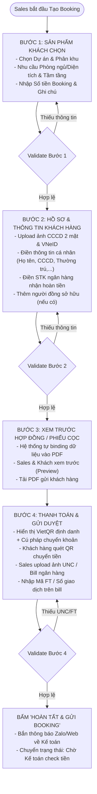
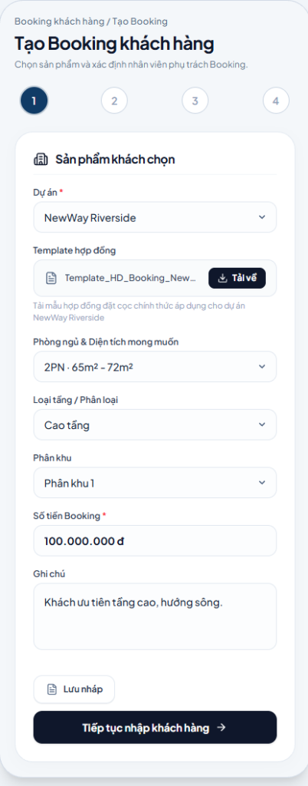
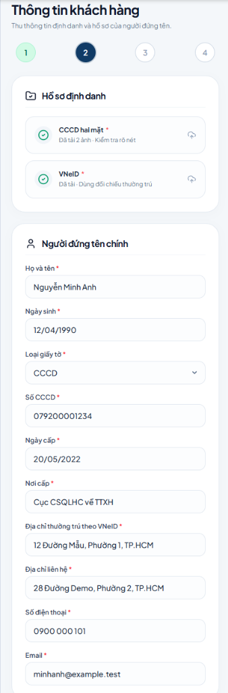
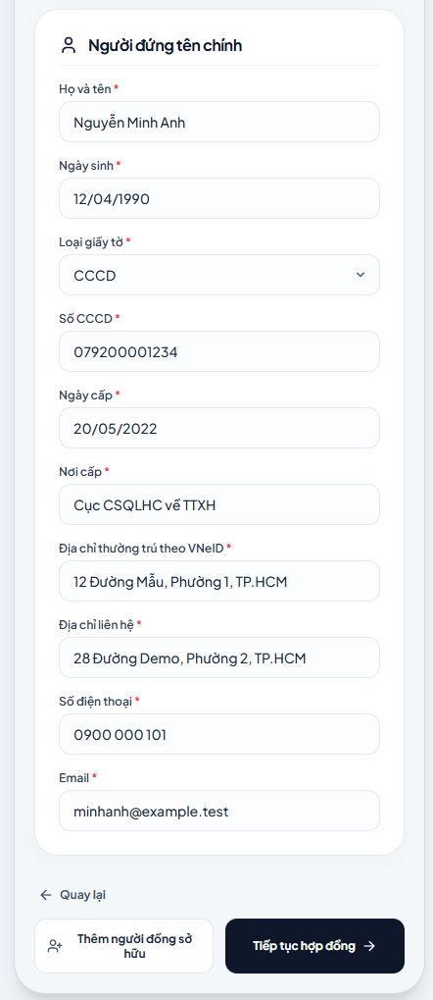
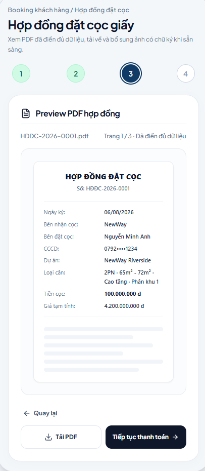
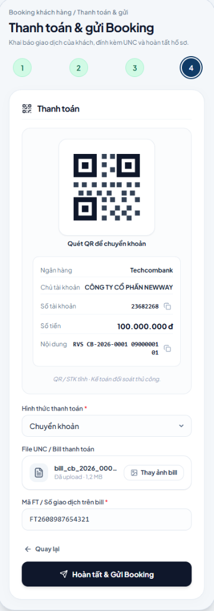

# TÀI LIỆU PHÂN TÍCH YÊU CẦU NGHIỆP VỤ (BA SPECIFICATION)

# PHÂN HỆ SALES - PHẦN 1: QUY TRÌNH TẠO BOOKING KHÁCH HÀNG (WIZARD 4 BƯỚC)

**Dự án:** Hệ thống Quản lý Booking & Giao dịch BĐS (NewWay Booking)
**Phân hệ:** Chuyên viên Kinh doanh (Sales Module)
**Mã màn hình:** `SALES_CREATE_BOOKING_WIZARD`

---

## 1. TỔNG QUAN (OVERVIEW)

### 1.1. Mục tiêu nghiệp vụ

- Hỗ trợ Chuyên viên Kinh doanh (Sales) thao tác trực tiếp trên thiết bị (Mobile/Tablet/Desktop) khi tư vấn khách hàng:
  1. Lựa chọn nhanh nhu cầu sản phẩm (Dự án, phân khu, loại phòng ngủ, tầm tầng).
  2. Thu thập đầy đủ hồ sơ pháp lý (CCCD 2 mặt, VNeID mức 2, thông tin đồng sở hữu, STK nhận hoàn tiền).
  3. Tự động sinh và xem trước (Preview) Phiếu Booking / Phiếu cọc thiện chí dưới dạng PDF.
  4. Hướng dẫn khách hàng quét mã VietQR thanh toán định danh, đính kèm ảnh UNC/Bill và gửi duyệt tức thời sang Bộ phận Kế toán.

### 1.2. Đối tượng sử dụng & Phạm vi

- **Người dùng chính**: Chuyên viên Kinh doanh (Sales F1/Đại lý chiến lược).
- **Phạm vi**: Khởi tạo booking giữ chỗ thiện chí từ lúc tiếp nhận nhu cầu đến khi hoàn tất gửi hồ sơ sang Kế toán.

### 1.3. Sơ đồ Luồng Nghiệp vụ (Process Flow)



---

## 2. ĐẶC TẢ CHỨC NĂNG & GIAO DIỆN (FUNCTIONAL SPECIFICATIONS & UI)

---

### 2.1. BƯỚC 1: SẢN PHẨM KHÁCH CHỌN (PRODUCT SELECTION)

#### A. Giao diện Mockup (UI Mockup)

<p align="center">
  
</p>

#### B. Mô tả chức năng & Hành động

- Cho phép Sales chọn dự án, tải template hợp đồng mẫu, lọc nhu cầu căn hộ và nhập số tiền cọc thiện chí.
- **Lưu ý nghiệp vụ quan trọng**:
  - Các trường **"Phòng ngủ & Diện tích mong muốn"**, **"Phân khu"**, và **"Loại tầng / Phân loại"** là các trường **KHÔNG BẮT BUỘC (TÙY CHỌN)**.
  - Trong giai đoạn đầu dự án mới ra mắt khi Chủ đầu tư (CĐT) chưa ban hành tài liệu chính thức (chưa có layout chi tiết, chưa chia giỏ hàng phân khu) hoặc Admin hệ thống chưa cấu hình danh mục căn/tầng, Sales chỉ cần chọn **Dự án** và nhập **Số tiền Booking** là đã đủ điều kiện chuyển tiếp sang Bước 2 để tạo booking cho khách.
- **Các nút hành động**:
  - `Lưu nháp`: Lưu lại dữ liệu tạm vào Database/LocalStorage.
  - `Tiếp tục nhập khách hàng ->`: Kiểm tra hợp lệ $\rightarrow$ Chuyển sang Bước 2.

#### C. Danh mục trường dữ liệu (Data Dictionary)

| Tên trường         | Tên hiển thị trên UI  | Kiểu dữ liệu |  Bắt buộc  | Mô tả & Quy tắc nghiệp vụ                                             |
| :-------------------- | :------------------------ | :-------------: | :-----------: | :------------------------------------------------------------------------- |
| `project_id`        | Dự án                   |    Dropdown    | **Có** | Chọn từ danh sách dự án mở booking (vd: `NewWay Riverside`).        |
| `contract_template` | Template hợp đồng      |  Download Link  |    Không    | Link tải file template hợp đồng/phiếu cọc mẫu của dự án.         |
| `desired_room_area` | Phòng ngủ & Diện tích |    Dropdown    |    **Không**    | `1PN`, `2PN · 65m² - 72m²`, `3PN`, `Duplex/Penthouse`. **Không bắt buộc** khi CĐT chưa cung cấp tài liệu hoặc Admin chưa cấu hình. |
| `floor_type`        | Loại tầng / Phân loại |    Dropdown    |    **Không**    | `Cao tầng`, `Thấp tầng`, `Khoảng tầng trung (8-20)`. **Không bắt buộc**. |
| `zone_subdivision`  | Phân khu                 |    Dropdown    |    **Không**    | `Phân khu 1`, `Phân khu River Park`,... **Không bắt buộc** khi CĐT chưa chia phân khu hoặc Admin chưa cấu hình. |
| `booking_amount`    | Số tiền Booking         | Currency Input | **Có** | Mức tiền cọc quy định (vd: `100.000.000 đ`).                        |
| `notes`             | Ghi chú                  |    Textarea    |    Không    | Ghi nhận yêu cầu đặc thù của khách (hướng sông, tầng cao,...). |

---

### 2.2. BƯỚC 2: HỒ SƠ & THÔNG TIN KHÁCH HÀNG (CUSTOMER PROFILE)

#### A. Giao diện Mockup (UI Mockup)

<p align="center">
  
  <br/>
  
</p>

#### B. Mô tả chức năng & Hành động

- Upload ảnh chụp CCCD 2 mặt, VNeID, điền thông tin định danh cá nhân và tài khoản ngân hàng thụ hưởng nhận hoàn tiền.
- **Nút `+ Thêm người đồng sở hữu`**: Mở thêm khối nhập liệu người thứ 2.
- **Các nút hành động**: `<- Quay lại` (về Bước 1), `Tiếp tục hợp đồng ->` (sang Bước 3).

#### C. Danh mục trường dữ liệu (Data Dictionary)

| Tên trường             | Tên hiển thị             | Kiểu dữ liệu |  Bắt buộc  | Mô tả & Quy tắc                                                                         |
| :------------------------ | :-------------------------- | :-------------: | :-----------: | :----------------------------------------------------------------------------------------- |
| `file_cccd_both_sides`  | CCCD hai mặt               |   File Upload   | **Có** | Tải lên 2 ảnh mặt trước + sau (hoặc 1 ảnh ghép), dung lượng$\le 10\text{MB}$. |
| `file_vneid`            | VNeID                       |   File Upload   | **Có** | Ảnh chụp màn hình VNeID mức 2 để đối chiếu nơi thường trú.                   |
| `fullname`              | Họ và tên                |   Text Input   | **Có** | Tự động chuyển thành chữ IN HOA (vd:`NGUYỄN MINH ANH`).                           |
| `dob`                   | Ngày sinh                  |   Date Picker   | **Có** | Định dạng`DD/MM/YYYY`.                                                                |
| `id_type`               | Loại giấy tờ             |    Dropdown    | **Có** | `CCCD`, `Hộ chiếu`, `CMND Quân đội`.                                            |
| `id_number`             | Số CCCD                    |   Text Input   | **Có** | Chuỗi đúng 12 chữ số hợp lệ.                                                        |
| `id_issue_date`         | Ngày cấp                  |   Date Picker   | **Có** | Định dạng`DD/MM/YYYY`.                                                                |
| `id_issue_place`        | Nơi cấp                   |   Text Input   | **Có** | Mặc định gợi ý:`Cục CSQLHC về TTXH`.                                              |
| `permanent_address`     | Thường trú theo VNeID    |   Text Input   | **Có** | Địa chỉ thường trú chính xác theo VNeID.                                           |
| `contact_address`       | Địa chỉ liên hệ        |   Text Input   | **Có** | Địa chỉ nhận thư/liên hệ hiện tại.                                                |
| `phone`                 | Số điện thoại           |   Text Input   | **Có** | Đúng 10 chữ số nhà mạng Việt Nam.                                                   |
| `email`                 | Email                       |   Email Input   | **Có** | Đúng định dạng email chuẩn.                                                          |
| `refund_bank_name`      | Ngân hàng thụ hưởng    |    Dropdown    | **Có** | Chọn ngân hàng Napas nhận hoàn tiền khi không khớp căn.                           |
| `refund_account_number` | Số tài khoản nhận hoàn |   Text Input   | **Có** | Số tài khoản ngân hàng chính chủ của khách.                                       |
| `refund_account_holder` | Tên chủ tài khoản       |   Text Input   | **Có** | Tự động điền theo Họ tên người đứng tên chính.                                |

---

### 2.3. BƯỚC 3: XEM TRƯỚC HỢP ĐỒNG / PHIẾU CỌC (DOCUMENT PREVIEW)

#### A. Giao diện Mockup (UI Mockup)

<p align="center">
  
</p>

#### B. Mô tả chức năng & Hành động

- Trình xem trước (Preview) văn bản PDF tự động binding thông tin khách hàng, sản phẩm và chuyên viên kinh doanh phụ trách.
- **Các nút hành động**:
  - `<- Quay lại`: Quay lại chỉnh sửa thông tin ở Bước 2.
  - `Tải PDF`: Tải bản PDF chính thức về máy để in hoặc gửi Zalo cho khách.
  - `Tiếp tục thanh toán ->`: Chuyển sang Bước 4.

---

### 2.4. BƯỚC 4: THANH TOÁN & GỬI DUYỆT (PAYMENT & SUBMISSION)

#### A. Giao diện Mockup (UI Mockup)

<p align="center">
  
</p>

#### B. Mô tả chức năng & Hành động

- Cung cấp mã VietQR động/tĩnh Napas247, số tài khoản công ty, cú pháp chuyển khoản định danh có nút sao chép nhanh.
- Cho phép upload ảnh chụp UNC / Bill thanh toán thành công và nhập Mã FT ngân hàng.
- **Nút hành động**: `Hoàn tất & Gửi Booking` $\rightarrow$ Bắn dữ liệu lên máy chủ, thông báo Kế toán qua Zalo/Web, chuyển trạng thái `Chờ Kế toán check tiền`.

#### C. Danh mục trường dữ liệu (Data Dictionary)

| Tên trường        | Tên hiển thị             | Kiểu dữ liệu |  Bắt buộc  | Mô tả & Quy tắc                                                   |
| :------------------- | :-------------------------- | :-------------: | :-----------: | :------------------------------------------------------------------- |
| `qr_code_image`    | Mã QR Chuyển khoản       |    Image/QR    |     Auto     | Sinh mã VietQR chuẩn Napas247 chứa STK, Số tiền và Cú pháp.  |
| `transfer_content` | Cú pháp chuyển khoản    |      Text      |     Auto     | Chuỗi định danh duy nhất (vd:`RVS CB-2026-0001 0900000101`).   |
| `payment_method`   | Hình thức thanh toán     |    Dropdown    | **Có** | `Chuyển khoản`, `Quẹt thẻ POS`, `Tiền mặt`.              |
| `file_unc`         | File UNC / Bill thanh toán |   File Upload   | **Có** | Ảnh chụp màn hình chuyển khoản hoặc UNC có dấu ngân hàng. |
| `transaction_code` | Mã FT / Số giao dịch     |   Text Input   | **Có** | Chuỗi mã định danh giao dịch ngân hàng in trên bill.         |

---

## 3. QUY TẮC NGHIỆP VỤ (BUSINESS RULES & VALIDATIONS)

### 3.1. Các quy tắc xử lý nghiệp vụ (Business Rules - BR)

- **BR-S01 (Tài khoản nhận hoàn tiền)**: Mọi booking bắt buộc phải thu thập thông tin STK ngân hàng chính chủ của khách hàng tại Bước 2 để Kế toán hoàn tiền tự động nếu đợt mở bán không khớp căn.
- **BR-S02 (Định danh 2 người đứng tên)**: Nếu tích chọn đồng sở hữu, bắt buộc upload đủ 2 bộ CCCD + VNeID của cả 2 người.
- **BR-S03 (Khóa mã giao dịch FT)**: Mỗi Mã FT ngân hàng chỉ được gắn cho duy nhất 1 booking, hệ thống chặn gửi trùng lặp.
- **BR-S04 (Tính linh hoạt của Nguyện vọng căn hộ ban đầu)**: Các trường Phòng ngủ & diện tích mong muốn, Phân khu, Khoảng tầng là **không bắt buộc**. Trường hợp dự án mới mở cổng booking chưa có tài liệu chính thức từ CĐT hoặc Admin chưa cấu hình giỏ hàng, Sales chỉ cần chọn Dự án và nhập Số tiền cọc để hoàn tất booking giữ chỗ.

### 3.2. Ma trận Validation Rules & Cảnh báo

| Màn hình         | Trường dữ liệu                  | Điều kiện kiểm tra (Validation Rules)                   | Thông báo lỗi hiển thị                                                     |
| :----------------- | :---------------------------------- | :---------------------------------------------------------- | :------------------------------------------------------------------------------ |
| **Bước 1** | `project_id`                      | Bắt buộc chọn từ danh sách.                            | *"Vui lòng chọn dự án cần tạo booking."*                                |
| **Bước 1** | `booking_amount`                  | Số dương $\ge$ mức cọc tối thiểu của dự án.      | *"Số tiền booking không được nhỏ hơn mức tối thiểu của dự án."* |
| **Bước 1** | `desired_room_area`, `zone_subdivision`, `floor_type` | **Không bắt buộc** (Cho phép để trống). | Không báo lỗi (Hệ thống chấp nhận giá trị null/rỗng). |
| **Bước 2** | `file_cccd_both_sides`            | File `.jpg, .png, .pdf`, dung lượng $\le 10\text{MB}$. | *"Vui lòng tải lên đủ ảnh CCCD 2 mặt của khách hàng."*              |
| **Bước 2** | `file_vneid`                      | Bắt buộc upload file.                                     | *"Vui lòng tải lên ảnh chụp VNeID để xác thực nơi thường trú."*  |
| **Bước 2** | `id_number`                       | Đúng 12 chữ số.                                         | *"Số CCCD không đúng định dạng (phải gồm 12 chữ số)."*             |
| **Bước 2** | `phone`                           | Đúng 10 chữ số nhà mạng Việt Nam.                    | *"Số điện thoại không hợp lệ."*                                        |
| **Bước 2** | `email`                           | Đúng cú pháp `user@domain.ext`.                        | *"Địa chỉ email không hợp lệ."*                                         |
| **Bước 4** | `file_unc` & `transaction_code` | Bắt buộc upload UNC và nhập Mã FT.                     | *"Vui lòng đính kèm ảnh UNC và nhập Mã giao dịch FT trên bill."*    |

---

## 4. ĐẶC TẢ API & TÍCH HỢP (API SPECIFICATION)

### 4.1. Bảng tổng hợp các API sử dụng

| Bước Wizard          |  Method  | Endpoint URI                                    | Mục đích nghiệp vụ                                                                                  |
| :--------------------- | :------: | :---------------------------------------------- | :------------------------------------------------------------------------------------------------------- |
| **Bước 1**     | `GET` | `/api/v1/sales/projects`                      | Lấy danh sách các dự án đang mở nhận booking.                                                    |
| **Bước 1**     | `GET` | `/api/v1/sales/projects/{projectId}/metadata` | Lấy phân khu, loại phòng ngủ, tầng, template HĐ và mức tiền cọc tối thiểu.                  |
| **Bước 1 & 2** | `POST` | `/api/v1/sales/bookings/drafts`               | Lưu bản nháp quá trình nhập liệu.                                                                 |
| **Bước 1 & 2** | `GET` | `/api/v1/sales/bookings/drafts/{draftId}`     | Lấy lại dữ liệu bản nháp đã lưu trước đó.                                                   |
| **Bước 2**     | `POST` | `/api/v1/common/upload-media`                 | Upload ảnh CCCD, VNeID (tích hợp OCR bóc tách thông tin tự động).                               |
| **Bước 2**     | `GET` | `/api/v1/common/banks`                        | Lấy danh sách ngân hàng thương mại (Napas) cho phần STK nhận hoàn tiền.                       |
| **Bước 3**     | `POST` | `/api/v1/sales/bookings/preview-pdf`          | Render file PDF Phiếu cọc/Hợp đồng xem trước.                                                     |
| **Bước 4**     | `POST` | `/api/v1/sales/bookings/generate-payment-qr`  | Sinh mã VietQR động kèm thông tin STK và cú pháp chuyển khoản định danh.                     |
| **Bước 4**     | `POST` | `/api/v1/common/upload-media`                 | Upload file ảnh UNC / Bill ngân hàng chuyển tiền.                                                   |
| **Bước 4**     | `POST` | `/api/v1/sales/bookings`                      | **API CHÍNH**: Hoàn tất & Gửi toàn bộ hồ sơ Booking lên hệ thống để Kế toán duyệt. |

---

### 4.2. Chi tiết Request Payload & Response JSON Schemas

#### A. `POST /api/v1/sales/bookings` (API CHÍNH - Gửi Booking)

* **Request Payload (JSON)**:
  ```json
  {
    "draft_id": "draft_89437298",
    "project_id": "proj_rvs_001",
    "desired_room_area": "2PN",
    "floor_type": "HIGH",
    "zone_subdivision": "PK1",
    "booking_amount": 100000000,
    "notes": "Khách ưu tiên tầng cao, hướng sông.",
    "customer": {
      "fullname": "NGUYỄN MINH ANH",
      "dob": "1990-04-12",
      "id_type": "CCCD",
      "id_number": "079200001234",
      "id_issue_date": "2022-05-20",
      "id_issue_place": "Cục CSQLHC về TTXH",
      "permanent_address": "12 Đường Mẫu, Phường 1, TP.HCM",
      "contact_address": "28 Đường Demo, Phường 2, TP.HCM",
      "phone": "0900000101",
      "email": "minhanh@example.test",
      "refund_bank_name": "Techcombank",
      "refund_account_number": "1903456789012",
      "refund_account_holder": "NGUYEN MINH ANH",
      "file_cccd_both_sides": "https://cdn.newway.vn/uploads/2026/08/cccd_079200001234.jpg",
      "file_vneid": "https://cdn.newway.vn/uploads/2026/08/vneid_079200001234.jpg"
    },
    "co_owners": [],
    "payment": {
      "payment_method": "BANK_TRANSFER",
      "amount": 100000000,
      "transfer_content": "RVS CB-2026-0001 0900000101",
      "file_unc_url": "https://cdn.newway.vn/uploads/2026/08/bill_cb_2026_0001.jpg",
      "transaction_code": "FT2608987654321"
    }
  }
  ```
* **Response Payload (JSON - `201 Created`)**:
  ```json
  {
    "success": true,
    "code": 201,
    "message": "Tạo Booking thành công. Hồ sơ đã được gửi đến Bộ phận Kế toán đối soát.",
    "data": {
      "booking_id": "bk_98234723",
      "booking_code": "BK-2026-0001",
      "status": "PENDING_PAYMENT",
      "status_label": "Chờ Kế toán check tiền",
      "project_name": "NewWay Riverside",
      "booking_amount": 100000000,
      "customer_name": "NGUYỄN MINH ANH",
      "transaction_code": "FT2608987654321",
      "created_at": "2026-08-21T14:50:00Z"
    }
  }
  ```

#### B. `POST /api/v1/sales/bookings/generate-payment-qr` (Sinh mã VietQR)

* **Request Payload (JSON)**:
  ```json
  {
    "project_id": "proj_rvs_001",
    "booking_amount": 100000000,
    "customer_phone": "0900000101",
    "customer_name": "NGUYEN MINH ANH"
  }
  ```
* **Response Payload (JSON - `200 OK`)**:
  ```json
  {
    "success": true,
    "code": 200,
    "data": {
      "qr_image_url": "https://api.vietqr.io/image/970407-23682268-compact.png?amount=100000000&addInfo=RVS%20CB-2026-0001%200900000101&accountName=CONG%20TY%20CO%20PHAN%20NEWWAY",
      "bank_info": { "bank_name": "Techcombank", "account_number": "23682268", "account_holder": "CÔNG TY CỔ PHẦN NEWWAY" },
      "amount": 100000000,
      "transfer_content": "RVS CB-2026-0001 0900000101"
    }
  }
  ```
