# TÀI LIỆU PHÂN TÍCH YÊU CẦU NGHIỆP VỤ (BA SPECIFICATION)

# PHÂN HỆ SALES - PHẦN 2: QUY TRÌNH HẬU BOOKING, KHỚP CĂN, LOCK CĂN ĐỘC QUYỀN & HOA HỒNG

**Dự án:** Hệ thống Quản lý Booking & Giao dịch BĐS (NewWay Booking)
**Phân hệ:** Chuyên viên Kinh doanh (Sales Module)
**Mã màn hình:** `SALES_POST_BOOKING_AND_INVENTORY`

---

## 1. TỔNG QUAN (OVERVIEW)

### 1.1. Mục tiêu nghiệp vụ

- Đặc tả toàn bộ các thao tác, màn hình xử lý và quy tắc nghiệp vụ của Sales sau thời điểm bấm "Gửi Booking":
  1. Theo dõi trạng thái duyệt tiền từ Kế toán và hồ sơ từ Admin.
  2. Xử lý các kịch bản kết quả khi CĐT mở bán ráp căn (Lên cọc, Hoàn cọc thiện chí, Tra soát/dồn tiền sang căn khác).
  3. Thao tác trên Giỏ hàng độc quyền (Quỹ căn ôm), thực hiện Lock Cọc (30p), Lock Cọc Thiện Chí (24h) và xử lý Xung đột lock căn (Ân hạn 30p khi bị lock đè).
  4. Khởi tạo đề xuất Cơ chế Hoa hồng và theo dõi luồng phê duyệt 3 cấp.

### 1.2. Sơ đồ Luồng Nghiệp vụ (Process Flow)

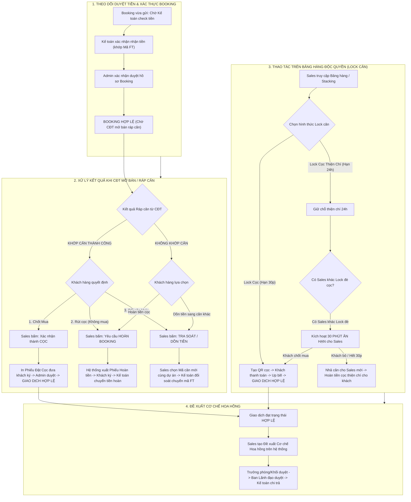

---

## 2. ĐẶC TẢ CHỨC NĂNG & GIAO DIỆN (FUNCTIONAL SPECIFICATIONS & UI)

---

### 2.1. DASHBOARD QUẢN LÝ BOOKING CỦA SALES

#### A. Giao diện Mockup — Danh sách Booking cá nhân

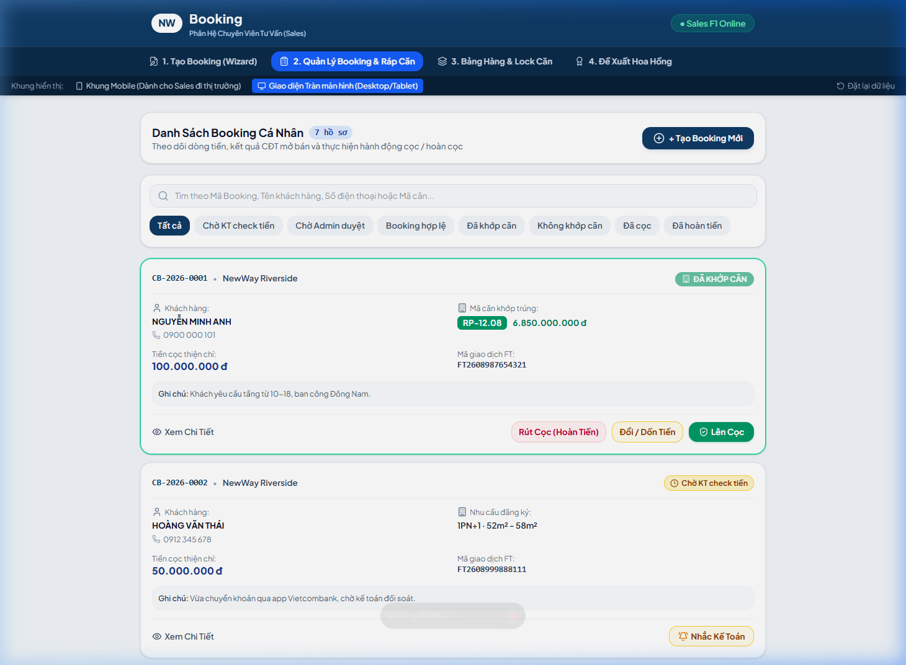

*Hình 2.1a: Màn hình quản lý danh sách Booking cá nhân — Hiển thị tổng hợp với các filter trạng thái (Tất cả / Chờ KT duyệt / Chờ Admin duyệt / Đã khớp căn / Chưa khớp căn / Đã cọc / Đã hoàn tiền), thanh tìm kiếm, và các nút hành động theo trạng thái.*

#### B. Giao diện Mockup — Modal Xem Chi Tiết Hồ Sơ Booking

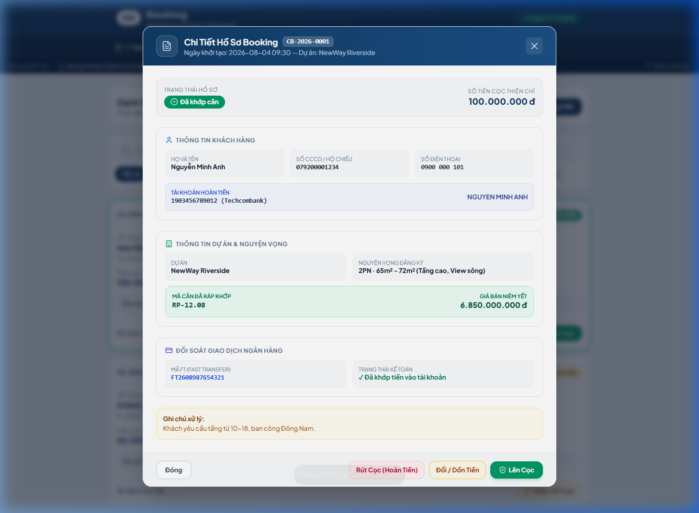

*Hình 2.1b: Modal chi tiết hồ sơ Booking — Hiển thị đầy đủ Thông tin khách hàng (CCCD, SĐT, Tài khoản hoàn tiền), Thông tin dự án & nguyện vọng, Đối soát giao dịch ngân hàng (Mã FT) và Ghi chú xử lý.*

#### C. Giao diện Mockup — Modal Bổ Sung Chứng Từ (Trạng thái: Chờ Admin duyệt)

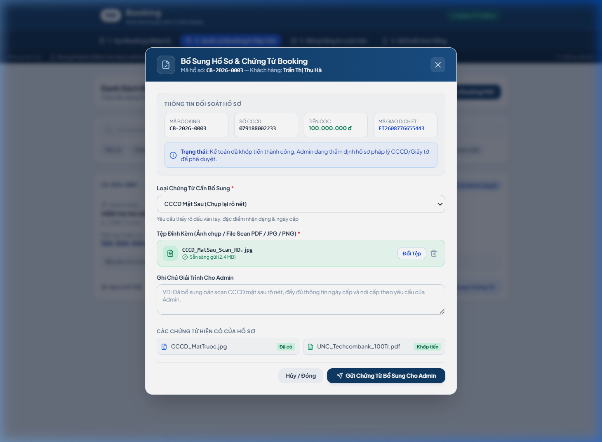

*Hình 2.1c: Modal Bổ Sung Hồ Sơ & Chứng Từ — Sales chọn loại chứng từ cần bổ sung (CCCD mặt sau, UNC, Giấy ủy quyền...), upload tệp đính kèm, ghi chú giải trình cho Admin.*

#### D. Danh mục trạng thái Booking & Timeline Hành Trình Hoàn Cọc trên Dashboard

| Trạng thái                         |   Mã hiển thị   | Ý nghĩa nghiệp vụ                                              | Hành động khả dụng của Sales                          |
| :----------------------------------- | :-----------------: | :----------------------------------------------------------------- | :---------------------------------------------------------- |
| **Chờ Kế toán check tiền** | `PENDING_PAYMENT` | Vừa gửi, đang đợi kế toán đối soát biến động số dư. | Xem chi tiết, Nhắc Kế toán.                             |
| **Chờ Admin duyệt**          |  `PENDING_ADMIN`  | Kế toán đã khớp mã FT, chờ Admin duyệt hồ sơ.            | Xem chi tiết, Bổ sung ảnh nếu yêu cầu.                |
| **Booking hợp lệ**           |  `BOOKING_VALID`  | Hồ sơ và tiền đã duyệt, sẵn sàng ráp căn.               | In Phiếu cọc thiện chí cho khách ký.                  |
| **Đã khớp căn**            |     `MATCHED`     | CĐT đã ráp trúng mã căn cụ thể cho khách.                | Chọn: *Lên Cọc* / *Hoàn tiền* / *Dồn tiền*.     |
| **Không khớp căn**          |    `UNMATCHED`    | Không trúng căn trong đợt mở bán.                           | Chọn: *Yêu cầu Hoàn tiền* / *Dồn sang căn khác*. |
| **Đã cọc hợp lệ**         | `DEPOSITED_VALID` | Khách đã ký cọc mua căn thành công.                        | Bấm Tạo đề xuất Cơ chế hoa hồng.                    |
| **Chờ Admin thẩm định hoàn** | `REFUND_PENDING_ADMIN` | Sales vừa nộp đơn hủy lock/hoàn cọc, chờ Admin kiểm tra. | Xem chi tiết đơn hoàn, Chờ xử lý. |
| **Chờ Sếp phê duyệt hoàn** | `REFUND_PENDING_BOSS` | Admin đã thẩm định, chờ Sếp chỉ định bấm xác nhận hoàn cọc. | Theo dõi tiến độ duyệt của Sếp. |
| **Chờ chi (Có ETA tiền về)** | `REFUND_PROCESSING` | Sếp đã duyệt hoàn, Kế toán đang xếp lịch chi (Có ngày ETA). | Thông báo ngày tiền về cho khách hàng. |
| **Đã hoàn tiền thành công** |    `REFUNDED`    | Kế toán đã chuyển tiền trả khách hoàn tất (kèm Mã FT & UNC). | Xem UNC hoàn tiền, Đóng hồ sơ. |

---

### 2.2. XỬ LÝ KẾT QUẢ MỞ BÁN & HÀNH TRÌNH HỦY LOCK HOÀN CỌC

#### A. Hành trình Hủy Lock Căn & Đề Nghị Hoàn Cọc (Cancel Lock & Refund Journey)

1. **Sales Khởi Tạo Yêu Cầu Hoàn Cọc**:
   - Trên màn hình Quản lý Booking hoặc Bảng hàng Matrix, Sales bấm **"Đề Nghị Hoàn Cọc / Hủy Lock"**.
   - Mở Modal Hoàn Cọc: Sales nhập **Lý do hoàn cọc** và **Thông tin tài khoản ngân hàng của khách** (Tên ngân hàng, Số tài khoản, Tên chủ tài khoản in hoa, Chi nhánh).
   - Hệ thống xuất **Phiếu Đề Nghị Hủy Lock & Hoàn Cọc (PDF)** $\rightarrow$ Khách ký $\rightarrow$ Sales nộp lên hệ thống.
   - Trạng thái hồ sơ: `Chờ Admin thẩm định`.
2. **Admin Thẩm Định & Chỉ Định Sếp**:
   - Admin kiểm tra hồ sơ $\rightarrow$ Bấm **"Duyệt & Trình Sếp"** $\rightarrow$ Chọn Sếp chỉ định (GĐ Khối / P.TGĐ).
   - Trạng thái hồ sơ: `Chờ Sếp [Tên Sếp] phê duyệt`.
3. **Sếp Phê Duyệt & Tự Động Nhả Lock Căn**:
   - Sếp xem chi tiết đơn và bấm **"Xác Nhận Hoàn Cọc"**.
   - Căn hộ tự động **Nhả Lock $\rightarrow$ Chuyển về "Trống (Sẵn sàng)"** trên Bảng hàng cho các Sales khác bán.
   - Trạng thái hồ sơ: `Đã duyệt hoàn - Chờ Kế toán chi tiền`.
4. **Kế toán Cập Nhật ETA & Thực Hiện Lệnh Chi**:
   - Kế toán tiếp nhận lệnh chi, cập nhật **Ngày & Giờ dự kiến tiền về tài khoản khách (ETA Date/Time)** (VD: *Dự kiến 15:00 ngày 29/08/2026*).
   - Trạng thái hồ sơ trên máy Sales: `Chờ chi tiền (Dự kiến tiền về: 15:00 29/08/2026)`.
   - Kế toán chuyển khoản thành công, nộp UNC và điền Mã FT $\rightarrow$ Trạng thái chuyển thành `ĐÃ HOÀN TIỀN THÀNH CÔNG`.
5. **Sales Theo Dõi Toàn Diện (Timeline Tracking)**:
   - Sales luôn nắm rõ: Căn có được duyệt hoàn cọc hay không, ai đang giữ duyệt và chính xác khi nào tiền sẽ về tài khoản khách để chủ động phản hồi khách hàng.

##### Mockup: Modal Yêu Cầu Hủy Lock & Hoàn Tiền (Nhập Lý do & STK Khách)

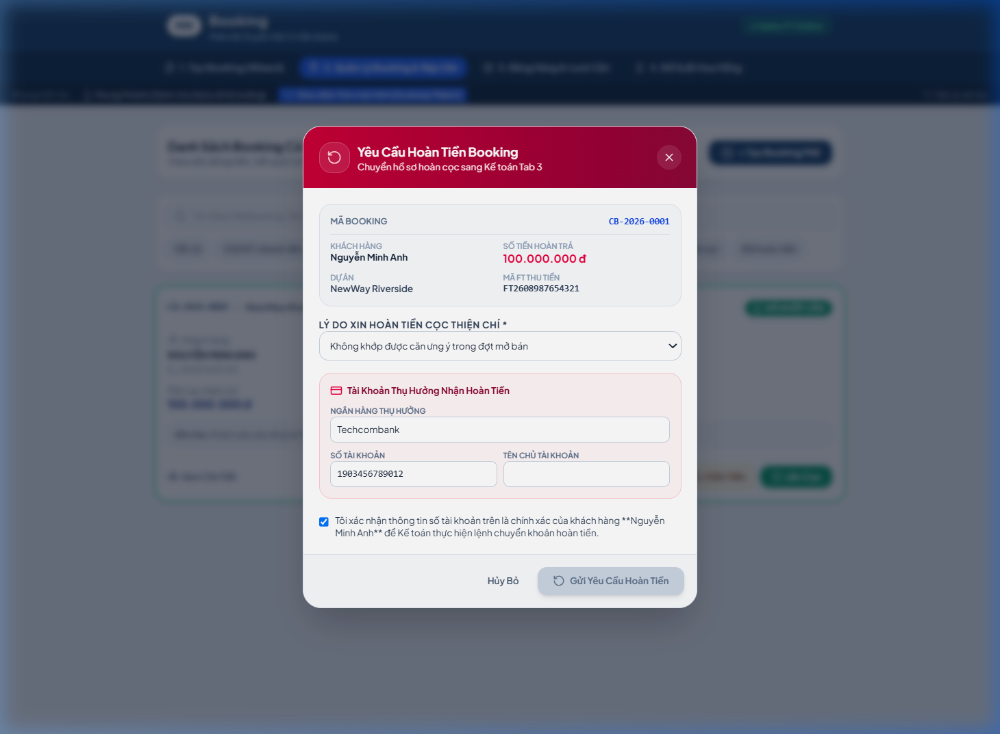

*Hình 2.2b: Sales nhập thông tin STK ngân hàng thụ hưởng của khách hàng, lý do hoàn cọc và nộp hồ sơ xin duyệt hoàn 2 cấp (Admin + Sếp).*

#### B. Kịch bản Không khớp căn (Unmatched)

- Sales liên hệ khách hàng để chọn 1 trong 2 nút: **"Yêu cầu Hoàn Tiền"** hoặc **"Dồn sang căn khác"** đang trống.

##### Mockup: Modal Dồn Tiền Sang Căn Khác (Unmatched → Đổi căn)

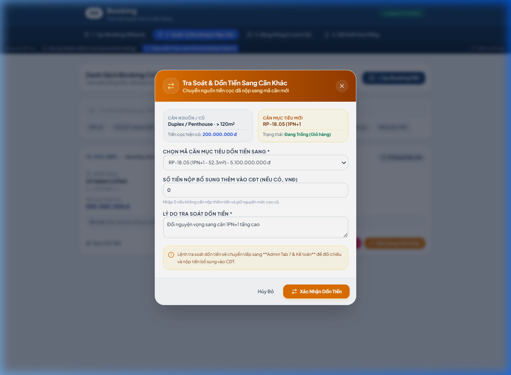

*Hình 2.2c: Sales yêu cầu tra soát dồn tiền sang mã căn mới cùng dự án — Chọn căn mục tiêu và ghi chú cho Kế toán.*

---

### 2.3. THAO TÁC TRÊN GIỎ HÀNG ĐỘC QUYỀN (LOCK CĂN & STACKING)

#### A. Bộ Lọc Đa Tiêu Chí Bảng Hàng Stacking

Hệ thống cung cấp thanh điều khiển lọc động đa cấp độ giúp Sales tra cứu giỏ hàng nhanh chóng:

1. **Dự án**: Chọn theo Dự án mục tiêu (`NewWay Riverside`, `LUMIÈRE Riverside`, `Masteri Centre Point`, `Tất cả dự án`).
2. **Phân khu**: Chọn Phân khu tương ứng (`Phân khu The Park`, `Phân khu The Oasis`, `Phân khu The West`, `Tất cả phân khu`).
3. **Toà / Tháp**: Chọn Toà tháp theo phân khu (`Tháp Park 1`, `Tháp Park 2`, `Tháp West 1`, `Tháp Oasis 1`, `Tất cả toà`).
4. **Khoảng tầng (Cao tầng / Thấp tầng)**:
   - `Tất cả khoảng tầng`: Hiển thị toàn bộ các tầng trong toà.
   - `Cao tầng`: Tầng $\ge 15$ (Ví dụ: Tầng 18, 19, 20, 22, 23, 24, 25...).
   - `Thấp tầng`: Tầng $< 15$ (Ví dụ: Tầng 03, 05, 06, 07, 08, 09...).
5. **Bộ lọc phụ trợ**: Tìm kiếm mã căn (RP-25.01), Lọc trạng thái (`Trống`, `Cọc 30p`, `Thiện chí 24h`, `Ân hạn`, `Đã bán`), Lọc số phòng ngủ (`1PN`, `2PN`, `3PN`).

#### B. Giao diện Mockup — Sơ đồ Stacking Phân Tầng & Bộ Lọc 4 Tiêu Chí

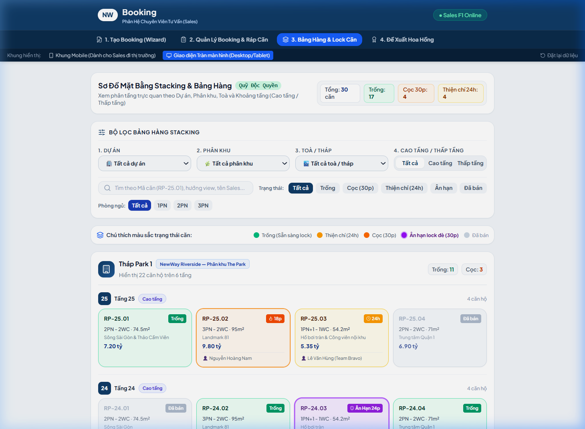

*Hình 2.3a: Tổng quan Bảng hàng Stacking — Bộ lọc 4 tiêu chí (Dự án, Phân khu, Toà, Cao tầng / Thấp tầng), chú thích màu sắc trạng thái, và phân tầng căn hộ theo từng toà.*

##### Mockup: Lọc Cao Tầng (Tầng ≥ 15)

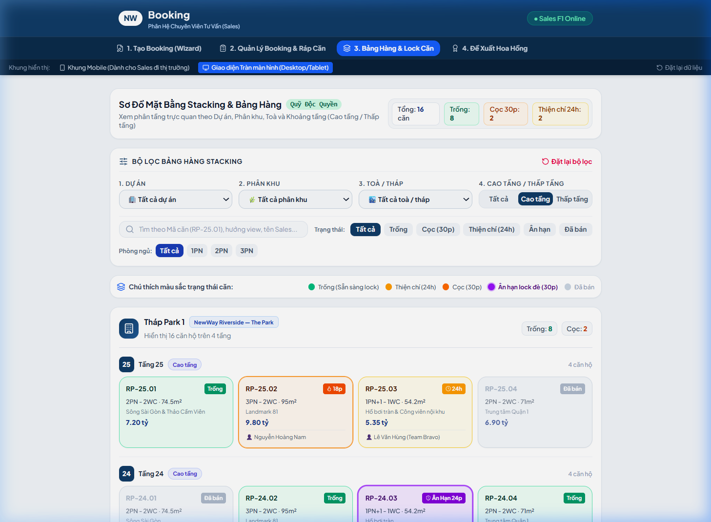

*Hình 2.3b: Kết quả lọc "Cao tầng" — Chỉ hiển thị Tầng 22–25 của Tháp Park 1 (NewWay Riverside — Phân khu The Park).*

##### Mockup: Lọc theo Dự Án (LUMIÈRE Riverside)

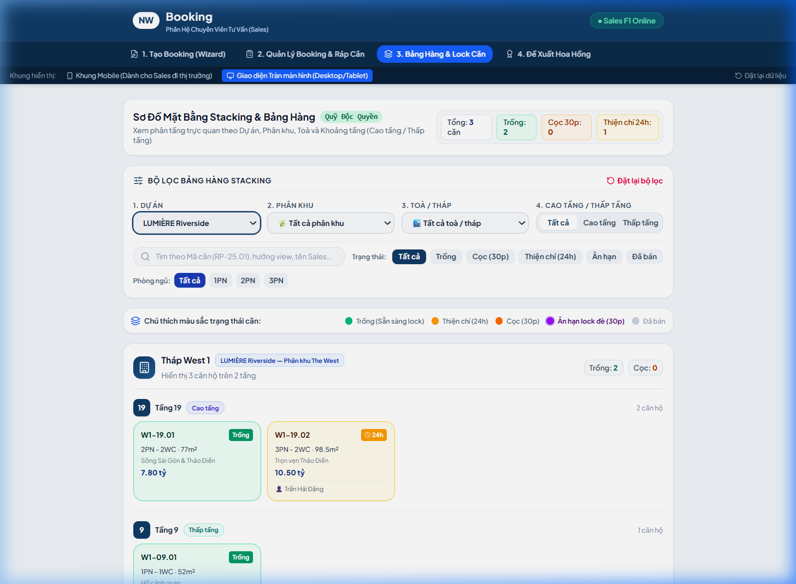

*Hình 2.3c: Kết quả lọc Dự án "LUMIÈRE Riverside" — Hiển thị Tháp West 1 (Phân khu The West) gồm Tầng 19 (Cao tầng) và Tầng 9 (Thấp tầng).*

#### C. Hai hình thức Lock căn

- **Hình thức 1: Lock Cọc (Hạn 30 phút)**:
  - Khách mua $\rightarrow$ Sales bấm Lock $\rightarrow$ Đếm ngược 30 phút $\rightarrow$ Khách nộp tiền $\rightarrow$ Kế toán khớp mã FT $\rightarrow$ Sales up UNC $\rightarrow$ Giao dịch hợp lệ.
- **Hình thức 2: Lock Cọc Thiện Chí (Hạn 24 giờ)**:
  - Khách giữ căn $\rightarrow$ Sales bấm Lock Thiện Chí $\rightarrow$ Giữ căn trong 24 giờ.

##### Mockup: Modal Lock Cọc (30 phút) khi chọn căn Trống

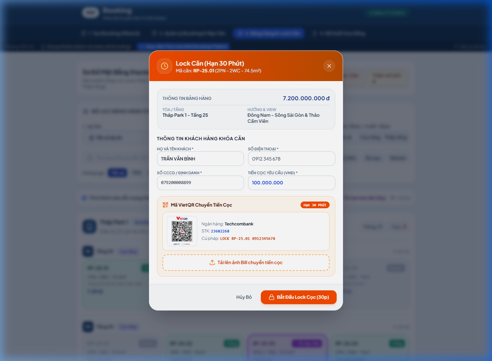

*Hình 2.3d: Sales bấm vào căn Trống → Modal Lock Cọc hiện ra — Chọn hình thức Lock (Cọc 30p hoặc Thiện chí 24h), nhập thông tin khách hàng và ghi chú.*

#### D. Quy trình Xử lý Ân hạn 30 phút khi bị Lock đè (Conflict Resolution)

- Căn đang bị Lock Thiện Chí bởi **Sales A** mà có **Sales B** muốn Lock Cọc:
  - Hệ thống kích hoạt **30 phút Ân hạn** cho Sales A.
  - Trong 30 phút:
    * Nếu Sales A bấm **"Chuyển Cọc"** $\rightarrow$ Quyền ưu tiên thuộc về Sales A.
    * Nếu Sales A bấm **"Hoàn cọc"** hoặc hết 30p $\rightarrow$ Căn tự động chuyển cho Sales B; hệ thống tự xuất hợp đồng hoàn tiền cọc thiện chí cho khách của Sales A.

##### Mockup: Modal Xử lý Ân hạn khi căn bị Lock đè

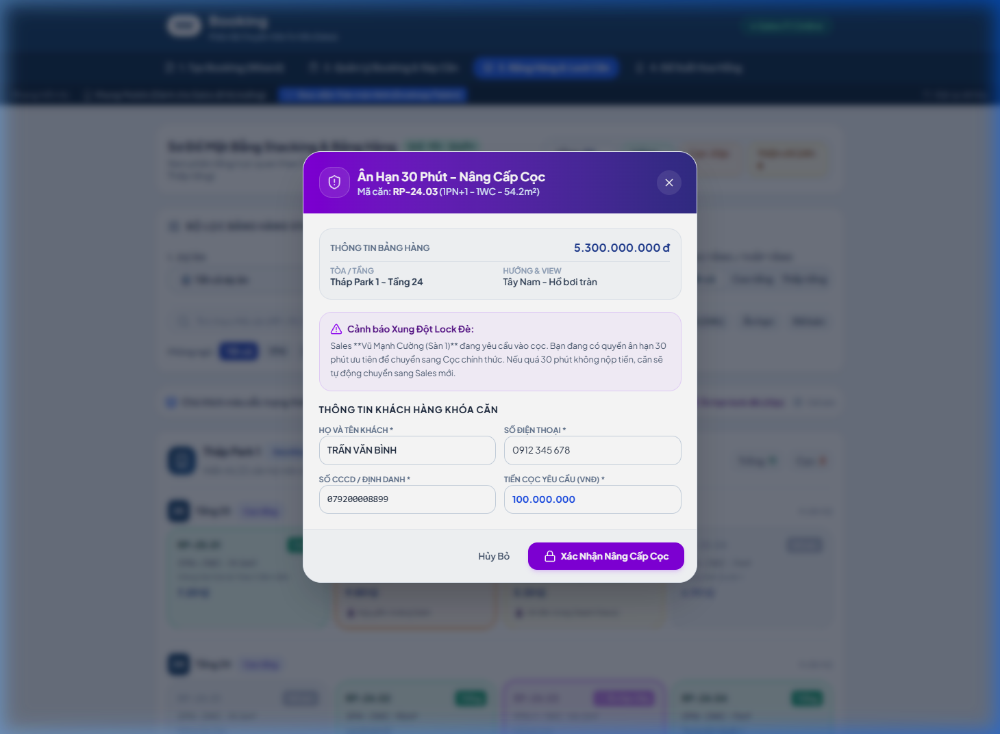

*Hình 2.3e: Căn hộ đang trong trạng thái Ân hạn (30p) — Sales có thể nâng cấp cọc để giữ quyền ưu tiên hoặc từ bỏ.*

---

### 2.4. ĐỀ XUẤT CƠ CHẾ HOA HỒNG (COMMISSION SUBMISSION)

#### A. Giao diện Mockup — Danh sách Đề Xuất Hoa Hồng & Form Tạo Đề Xuất

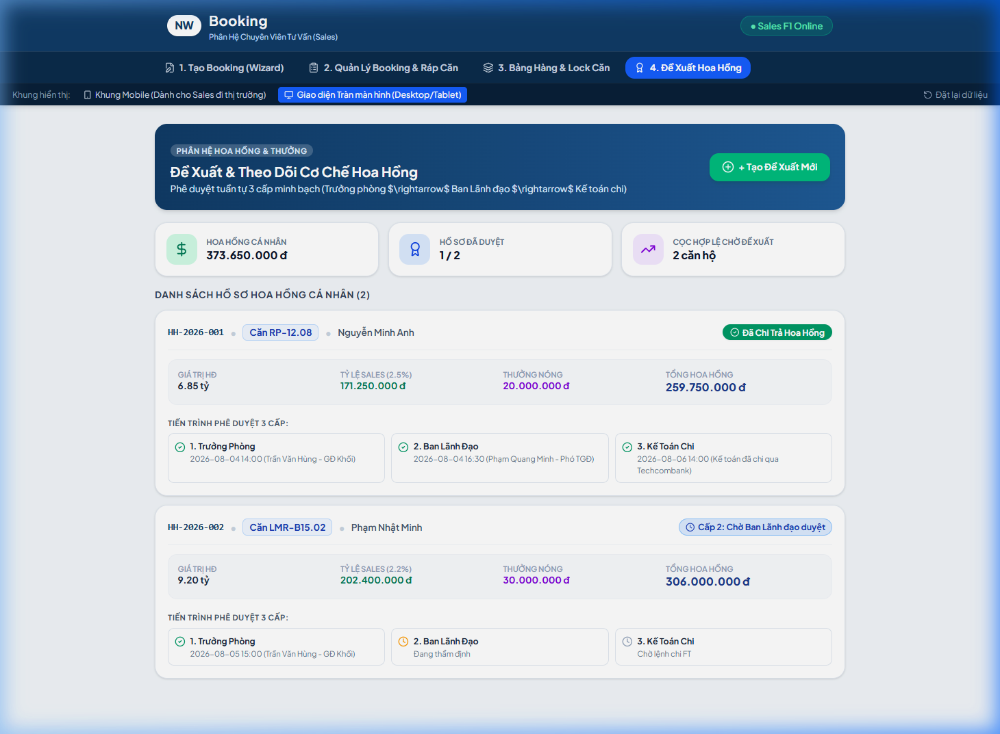

*Hình 2.4a: Danh sách đề xuất cơ chế hoa hồng — Hiển thị bảng theo dõi toàn bộ đề xuất đã gửi với trạng thái phê duyệt 3 cấp (Trưởng phòng → Ban Lãnh đạo → Kế toán chi trả), tỷ lệ hoa hồng, số tiền ước tính và lịch sử thao tác.*

---

## 3. QUY TẮC NGHIỆP VỤ (BUSINESS RULES & VALIDATIONS)

### 3.1. Các quy tắc xử lý nghiệp vụ (Business Rules - BR)

- **BR-S04 (Thời hạn giữ Lock Cọc)**: Thời gian giữ thanh toán là 30 phút. Quá 30 phút không có xác nhận nhận tiền từ Kế toán, căn tự động nhả về trạng thái Trống.
- **BR-S05 (Quy tắc Ưu tiên Cọc)**: Giao dịch Cọc luôn được ưu tiên hơn Cọc Thiện Chí. Khi có xung đột, thời gian ân hạn tối đa cho Sales cũ là 30 phút.
- **BR-S06 (Điều kiện Khởi tạo Hoa hồng)**: Sales chỉ được tạo Đề xuất Hoa hồng khi căn hộ đạt trạng thái **`Giao dịch hợp lệ`**.

### 3.2. Ma trận Validation Rules & Cảnh báo

| Hành động                   | Điều kiện kiểm tra (Validation Rules)                               | Cảnh báo / Xử lý hệ thống                                                                              |
| :----------------------------- | :---------------------------------------------------------------------- | :----------------------------------------------------------------------------------------------------------- |
| **Lock Cọc**            | Đếm ngược 30 phút thanh toán.                                     | Còn 5 phút: Bắn cảnh báo đỏ. Hết 30p: Căn tự động mở lại.                                      |
| **Bị Lock Đè**        | Căn thiện chí có yêu cầu cọc đè.                               | Thông báo đỏ:*"Căn của bạn đang bị yêu cầu cọc đè. Bạn có 30 phút để nâng cấp cọc."* |
| **Đề xuất Hoa hồng** | Tổng tỷ lệ phân bổ chia sẻ không vượt quá trần chính sách. | *"Tổng tỷ lệ phân chia hoa hồng vượt quá mức quy định cho phép."*                              |

---

## 4. ĐẶC TẢ API & TÍCH HỢP (API SPECIFICATION)

### 4.1. Bảng tổng hợp các API sử dụng

| STT |  Method  | Endpoint URI                                     | Mục đích nghiệp vụ                                         |
| :-: | :------: | :----------------------------------------------- | :-------------------------------------------------------------- |
|  1  | `GET` | `/api/v1/sales/bookings/my-list`               | Lấy danh sách booking cá nhân của Sales kèm trạng thái. |
|  2  | `POST` | `/api/v1/sales/bookings/{id}/convert-deposit`  | Xác nhận chuyển từ Booking sang Cọc khi khớp căn.        |
|  3  | `POST` | `/api/v1/sales/bookings/{id}/request-refund`   | Gửi yêu cầu hoàn tiền booking khi không mua.              |
|  4  | `POST` | `/api/v1/sales/bookings/{id}/request-transfer` | Yêu cầu tra soát dồn tiền sang căn khác.                 |
|  5  | `POST` | `/api/v1/sales/inventory/units/{unitId}/lock`  | Thực hiện Lock Cọc (30p) hoặc Lock Cọc Thiện Chí (24h).  |
|  6  | `POST` | `/api/v1/sales/commissions/propose`            | Khởi tạo đề xuất cơ chế hoa hồng gửi duyệt 3 cấp.    |

---

### 4.2. Chi tiết Request Payload & Response JSON Schemas

#### A. `POST /api/v1/sales/inventory/units/{unitId}/lock` (Lock căn trên Bảng hàng)

* **Request Payload (JSON)**:
  ```json
  {
    "lock_type": "DEPOSIT_HOLD", // hoặc "GOODWILL_HOLD"
    "customer_name": "TRẦN VĂN BÌNH",
    "customer_phone": "0912345678",
    "deposit_amount": 100000000,
    "notes": "Khách chốt mua cọc căn RP-12.08"
  }
  ```
* **Response Payload (JSON - `200 OK`)**:
  ```json
  {
    "success": true,
    "code": 200,
    "message": "Lock căn thành công. Thời gian giữ căn là 30 phút.",
    "data": {
      "unit_id": "unit_rp_1208",
      "unit_code": "RP-12.08",
      "lock_status": "LOCK_DEPOSIT_HOLD",
      "expires_at": "2026-08-21T15:30:00Z",
      "qr_payment_url": "https://api.vietqr.io/image/970407-23682268-compact.png?amount=100000000"
    }
  }
  ```

#### B. `POST /api/v1/sales/commissions/propose` (Đề xuất Cơ chế Hoa hồng)

* **Request Payload (JSON)**:
  ```json
  {
    "transaction_id": "tx_98234723",
    "unit_id": "unit_rp_1208",
    "policy_id": "policy_rvs_open_dot1",
    "main_sales_rate": 2.0,
    "supporting_sales": [
      { "sales_id": "sales_108", "sales_name": "Trần Thị Hoa", "rate": 0.5 }
    ],
    "bonus_amount": 10000000,
    "notes": "Đề xuất cơ chế thưởng nóng đợt mở bán."
  }
  ```
* **Response Payload (JSON - `201 Created`)**:
  ```json
  {
    "success": true,
    "code": 201,
    "message": "Gửi đề xuất cơ chế hoa hồng thành công. Hồ sơ đã chuyển đến Trưởng phòng duyệt."
  }
  ```

---

*Tài liệu BA chuẩn hóa theo đúng cấu trúc 4 phần: Tổng quan -> Đặc tả chức năng & giao diện -> Quy tắc nghiệp vụ -> Đặc tả API.*
